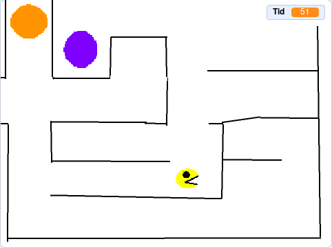
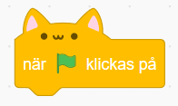
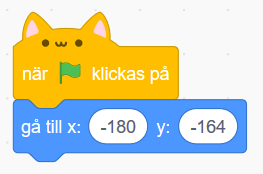
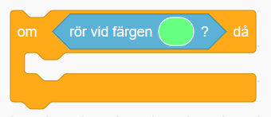
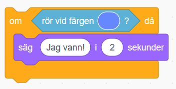
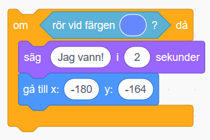
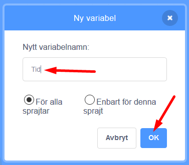
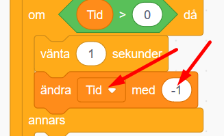

# Labyrinten

Det här är ett spel där du ska försöka ta dig igenom en labyrint utan att röra väggarna och hinder - för då blir du Game Over! Du kan även utmana dig och skapa nya banor för att komma till nästa nivå i spelet. Det är ett roligt spel för dig som vill hitta på och rita mycket själv! Du kommer att få lära dig att använda variabler och funktioner.

En labyrint kan se ut på många olika sätt och du kan rita din som du vill. Här visar vi två exempel på hur ett labyrintspel skulle kunna se ut, beroende på vilken form labyrintens väggar har:

> **HUR KODAR JAG?** 
 
Följ denna instruktion steg för steg och koda ditt projekt i verktyget Scratch. <a href="https://scratch.mit.edu" target="_blank"> Klicka här för att öppna Scratch i en ny flik.</a> I Scratch klickar du på **Skapa** för att börja. Logga gärna in på Scratch så kan du även spara och dela ditt projekt. Det är gratis att skaffa ett konto.
 

Hur vill du att din labyrint ska se ut? Dax att börja koda! 
Klicka nedan på nästa kapitel för att gå vidare.

## 1 – Byt till ny spelfigur
Först ska du lägga till en ny figur som ska kunna styras genom labyrinten utan att röra väggarna. Det blir din spelhjälte.
<video src="./BugRacedel1_nytt.mp4" autoplay loop muted height=480 width=640 />

>**VAD SKA JAG GÖRA?**

Se i videon ovan hur du ska:
- Ta bort kattfiguren
- Välj ny sprajt
- Minska storleken på sprajten

 
 
 
**INSTRUKTION HUR JAG GÖR STEG-FÖR-STEG:**

1. Ta bort katt-sprajten genom att trycka på den krysset eller den lilla soptunnan vid den kattfiguren under scenen.

21. Tryck på den lilla blå ikonen med en vit katt på längst ned till höger, så blir den grön - tryck nu på den gröna. Då kommer du till ett sprajtbibliotek, där du kan välja **en ny sprajt**. Tryck på en sprajt du gillar för att lägga till den i ditt projekt. 

   
  
> **Tänk på!** Välj en sprajt som inte är för bred eller lång, annars kan den vara svår att styra utan att stöta i väggarna.

3. Sprajten är ganska stor, så **ändra storleken** på sprajten. Just nu är den 100% full storlek. Du ändrar det i rutan som heter **Storlek** som finns under SCENEN med ditt spel. Skriv förslagsvis 30 istället. Det brukar vara ganska lagom.

   

> **Tips!** Om du vill rita din egen sprajt, så gör du såhär: Håll muspekaren över (utan att klicka) på ikonen för **Ny Sprajt** i nedre högra hörnet så att fler val kommer fram. Välj **Måla** som ser ut som en liten pensel. Rita din egen sprajtfigur, men tänk på att den inte ska vara för stor, bred eller lång, då blir den svår att svänga i labyrintens hörn. Var noga med att sprajten ritas med **andra färger** än din bakgrund och labyrintens väggar.

Nu har vi en spelfigur, men vi behöver rita labyrinten. Vi bläddrar vidare!

## 2 – Rita din labyrint
Du väljer själv hur du vill rita din labyrint, men du måste följa vissa **regler** för att spelet sen ska fungera. Labyrintens väggar måste alla vara i samma färg. Start och mål ska ha varsin färg och de får inte ha samma färger som väggarna eller bakgrunden har. 
<video src="./BugRacedel1_nytt.mp4" autoplay loop muted height=480 width=640 />

>**VAD SKA JAG GÖRA?**

Se i videon ovan hur du ska:
- Fyll scenen med en bakgrundsfärg
- Rita en enkel bana med väggar i en annan färg
- Rita startpunkt och målpunkt i två olika färger
- Sätt sprajtfiguren på startpunkten och minska storleken på sprajten

 
 
 
**INSTRUKTION HUR JAG GÖR STEG-FÖR-STEG:**

Nu ska du skapa din labyrint med en **bakgrundsfärg, labyrintväggar, start och mål**. Viktigt att du ger varje del en egen färg för att spelet sen fungera. 

En enkel labyrint kan se ut såhär, men du ritar din som du vill. Tips är att skapa en enkel, bred bana utan för många väggar och svängar.

  

1. Klicka på den vita lilla rutan där det står SCEN nere till höger och klicka sen på fliken för BAKGRUNDER längst uppe till vänster. 

          

 

2. Klicka först på den blå knappen under målarytan som det står **Gör till bitmap** på. 

3. Välj en ny **färg** du gillar. Klicka på färgverktyget och dra i färgväljarens inställningar tills du är nöjd med din färg.

4. Välj sen verktyget som ser ut som en liten **hink** och tryck på den stora vita rutan bredvid så fylls den med din nya färg.  

5. Nu ska du rita din labyrints väggar med en **annan färg än bakgrunden**. Välj ett verktyg att måla med och en väggfärg du vill ha. Om du vill ha raka streck kan du välja LINJE-verktyget. Rita väggarna så att sprajten kan gå emellan och svänga utan att stöta i väggarna.

> **Tänk på!** Det är viktigt att **alla väggarna har samma färg** genom hela labyrinten och att avståndet mellan väggarna ska vara lagom stort så sprajten kommer emellan.

4. Rita sen in en **startpunkt** och en **målpunkt** i din labyrint. Start och mål ska **ha olika färger** och kan inte ha samma färger som väggarna eller bakgrundsfärgen. Du kan till exempel göra fyllda färgcirklar med PENSEL-verktyget.

BILD!!!

  
  
3. Dra sprajten till din labyrints startpunkt och **ändra eventuellt storleken** på sprajten om den verkar vara för stor eller för liten för att passa mellan väggarna i din labyrint. Den behöver lite svängrum omkring sig för att inte stöta i väggen. Du ändrar storleken i rutan som heter **Storlek** under SCENEN med ditt spel. 
  
Nu är labyrinten klar. Tryck på fliken **KOD** längst upp i vänstra hörnet, så kommer du ut ur ritläget.

Det är dax att börja koda sprajtens rörelse!

## 3 - Koda sprajtens rörelse

Din sprajt ska kunna röra sig igenom labyrinten och ta sig i mål. Sprajten ska styras med piltangenterna på datorns tangentbord. 
<video src="./BugRacedel1_nytt.mp4" autoplay loop muted height=480 width=640 />

>**VAD SKA JAG GÖRA?**

Se i videon ovan hur du ska:
- Lägga till ett block för piltangent uppåt. 
- Lägga till block för att sprajten ska peka uppåt.
- Lägga till block för att sprajten ska röra sig när du trycker på piltangenten.
- Gör sen tre likadana skript till så sprajten kan röra sig i alla riktningar (uppåt, nedåt, höger och vänster).

 
 
 
**INSTRUKTION HUR JAG GÖR STEG-FÖR-STEG:**

Dax att koda sprajtens rörelser. Den ska röra sig framåt i olika riktningar och styras med hjälp av piltangenterna på datorns tangentbord.

1. Från tema HÄNDELSER drar du ut blocket **när mellanslagstangenten trycks ned**. Lägg blocket någonstans på sprajtens tomma skriptyta.

2. Klicka på lilla pilen bredvid ordet **mellanslagstangenten** i blocket. Välj **uppåtpil** istället. 

  

3. Från tema RÖRELSE drar du ut blocket **peka i 90 grader**. Lägg blocket direkt under det andra på skriptytan, så de sitter ihop.

4. Klicka på siffran 90 i blocket och ändra till 0 (så att riktningen är rakt uppåt), eller dra i vita pilen så den hamnar i rätt vinkel för din labyrintbana.

  

5. Från tema RÖRELSE drar du ut blocket **gå 10 steg**. Lägg blocket direkt under de andra på skriptytan, så att de alla sitter ihop.

6. Ändra siffran 10 till förslagsvis 5 i rörelseblocket. Då rör sig sprajten en kortare sträcka framåt varje gång du trycker på piltangenten.

  

>**Testa koden**: Vad händer när du trycker på piltangenten uppåt? Rör sig sprajten uppåt?

7. Skapa nu tre till likadana skript, så du kan styra genom labyrinten åt alla håll med tangentbordets fyra piltangenter. Ändra piltangentknapp och riktningen sprajten pekar för att styra **vänster**, **höger** och **nedåt**.

>**Tips!** Du kan kopiera kodblock och hela skript med kod genom att högerklicka på det översta blocket i skriptet du vill kopiera och välja **Kopiera** i menyn som kommer fram. Klicka sedan på den vita skriptytan bredvid så fastnar en kopia där. Sedan kan du bara ändra lite i koden i kopian.   

>**Testa koden!** Kan du röra din sprajt åt alla håll? Rör sig sprajten lagom långt när du trycker på piltangenterna? 

## 4 - Ge sprajten en startposition och riktning

För att slippa dra tillbaka sprajten till startplatsen hela tiden, ska du lägga till en startposition. Vi lägger även till en startriktning, så att sprajten tittar åt rätt håll när den startar.
<video src="./BugRacedel1_nytt.mp4" autoplay loop muted height=480 width=640 />

>**VAD SKA JAG GÖRA?**

Se i videon ovan hur du ska:
- Lägga till ett startblock med grön flagga
- Lägga till ett block för sprajtens startposition
- Lägga till ett block för sprajtens startriktning

 
 
 
**INSTRUKTION HUR JAG GÖR STEG-FÖR-STEG:**

1. Under tema HÄNDELSER drar du in blocket **när GRÖN FLAGGA klickas på**. Lägg det fritt på skriptytan för din sprajt. Detta är ett startblock och är kodblocket som styr vad som händer när du sen klickar på den gröna flaggan ovanför ditt spel - som en PLAY-knapp.

   

2. Nu ska du lägga till sprajtens startposition. Dra först sprajten så den står på mitten av startplattan i din labyrint. Under tema RÖRELSE drar du in blocket **gå till x:__  y:__**. (det står siffror med koordinater för x och y i blocket). Lägg blocket direkt under kodblocket **när GRÖN FLAGGA klickas på**. Nu startar sprajten på samma ställe varje gång du startar spelet med den gröna flaggan ovanför ditt spel.

   

3. Det är bra om sprajten tittar i en bestämd riktning när spelet ska börja. Under tema RÖRELSE finns blocket **peka i riktning 90**. Dra in blocket och lägg det direkt under blocket för **gå till x:__ y:__** i  skriptet.

   

15. Om sprajten inte tittar åt rätt håll när du startar med gröna flaggan, så klicka på på siffran 90 i kodblocket på skriptytan och ändra riktningen åt det håll som passar din labyrint bäst genom att dra runt i den vita riktningspilen som kommer fram.
  
>**Testa koden!** Går sprajten i lagom hastighet? Startar den på rätt ställe? Pekar den i rätt riktning när den startar? Ändra i variablerna om du inte är nöjd.

Dax att koda så sprajten kan vinna eller förlora i spelet.

## 5 – Vinna eller förlora

Här ska du programmera in **villkor** i koden som skapar olika händelser. Exempel:  **OM** sprajten rör vid en vägg i labyrinten, **DÅ** blir spelet Game Over och hamnar tillbaka på startpunkten. **OM** sprajten rör vid målpunkten - **DÅ** vinner du. Vi ska koda så att sprajten **känner av vilken färg den rör vid**, så den vet vart den befiner sig.
<video src="./BugRacedel1_nytt.mp4" autoplay loop muted height=480 width=640 />

>**VAD SKA JAG GÖRA?**

Se i videon ovan hur du ska:
- Skapa ett villkor som känner av målfärgen och säger "Jag vann!"
- Skapa ett villkor som känner av väggfärgen i labyrinten och säger "Game Over!" och flyttar sprajten till startpunkten.
- Lägg till en loop och lägg in villkoren i loopen
- Sätt ihop skriptet med startflaggans skript

 
 
 
**INSTRUKTION HUR JAG GÖR STEG-FÖR-STEG:**
1. Först lägger vi till ett kodblock som styr vad som ska hända om sprajten rör vid en speciell färg. Under tema KONTROLL finns kodblocket med ett kantigt hål på som heter **Om < > Då... Annars**. Dra in blocket och lägg den fritt på skriptytan.

   

Nu ska du koda så att sprajten hela tiden **känner av** ifall den rör vid färgen för mål eller en vägg. Vi börjar med målet för att vinna:

2. Under tema KÄNNA AV finns kodblocket **rör vid färgen__**. Dra in biten och lägg den inuti det kantiga hålet mellan **Om < > Då**, så det ser ut såhär:

   

3. Nu ska vi ställa in rätt färg för just din målpunkt. Tryck på färgcirkeln i kodbiten **rör vid färgen**. Välj lilla pimpett-verktyget i menyn längst ned och tryck sen på färgen på labyrintens mål-markering. Färgen ändras då till den rätta målfärgen i blocket **rör vid färgen**.

      
 
Om sprajten rör vid målet i labyrinten, ska du vinna spelet och sprajten ska säga "Jag vann!" och hamna tillbaka på start-markeringen igen, redo för att spelas på nytt. Koden ska då också stoppas. Gör såhär: 

4. Från tema UTSEENDE drar du in kodblocket **säg Hej! i 2 sekunder**. Lägg blocket inuti din villkors-loop, så det ser ut såhär: 

   

5. Tryck på texten "Hej!" i kodblocket och skriv istället "Jag vann!"

   

6. Se till att din sprajt står på mitten av start-markeringen i labyrinten. Från tema RÖRELSE drar du in kodblocket **gå till x__ y__** och lägger in den i villkorsblocket direkt under **säg Jag vann! i 2 sekunder**. 

   

7. När du kommit i mål i spelet ska allt stoppas - och koden sluta köras. Från tema KONTROLL drar du in blocket **stoppa alla**. Lägg in den direkt under **gå till X... Y...** i din villkors-loop.

   

9. Nu ska du koda ett till skript med villkor som gör att **OM** sprajten **känner av vägg-färgen**, **DÅ** ska spelet bli **Game Over och stoppa**. När du är klar ska detta villkors-skript för väggfärgen se ut såhär. 

   

10. För att sprajten alltid, om och om igen, ska kontrollera om den rör vid en vägg eller målpunkten, behöver vi skapa en loop i skriptet. Från tema KONTROLL drar du in kodblocket **för alltid**. Det är en loop. Sätt fast loopen direkt under koden med sprajtens startposition och riktning, i skriptet med **när GRÖN FLAGGA klickas på**. Så det ser ut såhär:

   

11. Lägg nu in dina två villkor inom **för alltid**-loopen, det ena under det andra, så att ditt skript ser ut såhär när du är klar:

   

>**Testa koden!** Klicka på START-flaggan. Går sprajten åt rätt håll och med en hastighet som känns bra? Säger den "Game Over!" när du nuddar en vägg? Går den tillbaka till startpunkten. Säger den "Du vann!" när du nuddar målpunkten? 

>**Tips!** Tryck på symbolen med fyra pilar som pekar utåt, som finns överst i högra hörnet ovanför SCENEN, så kan du spela labyrintspelet i större fönster - det är lättare.

Nu har du ett spel som fungerar! Dax att göra det lite roligare med hinder!

## 6 - En tidräknare

Dags att göra spelet lite svårare! Vi lägger till en tidräknare! Du ska se till att spelaren har en viss tid på sig att ta sig igenom labyrinten. Om man inte är i mål när tiden är slut förlorar man! 
<video src="./BugRacedel1_nytt.mp4" autoplay loop muted height=480 width=640 />

>**VAD SKA JAG GÖRA?**

Se i videon ovan hur du ska:
- Skapa en variabel för tid
- 

 
 
 
**INSTRUKTION HUR JAG GÖR STEG-FÖR-STEG:**

För att skapa en tidräknare behöver du först skapa en ny variabel som ska heta "Tid". En variabel är lite som en låda som håller reda på saker som sker i spelet, så som hur mycket tid som gått eller hur många poäng som sprajten fått. Gör såhär:

1. Under tema VARIABLER finns en ruta som det står **skapa en variabel** på. Tryck på rutan och skriv in **Tid** som namn i textrutan som kommer fram och tryck sedan OK. Nu har du skapat en variabel som heter **Tid**, och flera nya kodblock för variabler har dykt upp under temat VARIABLER. Du kan också se en tidräknaren överst i ditt spel på SCENEN. 

   
   

Variabeln "Tid" måste kodas för att fungera som vi vill. Den ska räkna ned tiden i sekunder från 60 till 0. Gör såhär:

2. Vi gör ett nytt skript bredvid det första Från tema HÄNDELSER drar du ut blocket **när GRÖN FLAGGA klickas på**. Lägg det fritt på skriptytan för din sprajt.

3. Under tema VARIABLER drar du ut blocket **sätt min variabel till 0**. Sätt blocket direkt under **när GRÖN FLAGGA klickas på**. 

   

4. Klicka på lilla pilen bredvid **min variabel** i blocket och byt till **Tid**. Ändra variabel-siffran **0** till **60** (eller till den tid du vill ha på dig i ditt spel).

   
  
5. Under tema KONTROLL drar du ut en **för alltid**-loop. Sätt in det i skriptet direkt under de andra blocken, så det se ut såhär:

   
  
Nu ska vi koda in ett villkor som säger att om tiden är större än 60 så ska den räkna ned en sekund i taget, och när den är på 0 blir spelet Game Over. Gör såhär:

6. Under tema KONTROLL drar du in villkors-blocket som heter **om...då...annars**. Sätt det inuti skriptets **för alltid**-loop.

   
  
6. Nu ska vi lägga in en **operator**. Operatorer gör beräkningar av olika värden i koden. Under tema OPERATORER drar du ut blocket **__ > 50**. (Tecknet > betyder större än.) Lägg operator-blocket inuti det kantiga hålet mellan **om...då...** i villkoret, så det ser ut såhär:

   
  
7. Under VARIABLER drar du in det lilla ovala kodblocket **Tid**, alltså variabeln du skapade tidigare. Lägg blocket i den första tomma vita cirkeln i det gröna operatorblocket. Ändra även siffran **50** till **0**. Nu står det alltså **om Tid större än 0**, alltså att det finns tid kvar i tidräknaren.

  
  
8. Vi vill ändra tiden med en sekund i taget. Därför lägger vi in att räknaren ska vänta 1 sekund mellan varje nedräkning av tiden. Från tema KONTROLL drar du in blocket **vänta 1 sekunder**. Lägg det inuti ditt villkor, såhär:

  
  
9. Nu lägger vi in block som söger hur mycket tid som ska räknas ned varje sekund. Från tema VARIABLER drar du in blocket **ändra min variabel med 1**. Klicka på lilla pilen bredvid **min variabel* och ändra till **Tid**. Klicka på siffran **1** och skriv istället **-1**. Nu ser skriptet ut såhär:

  
  
10. När tiden tagit slut och blivit 0, och spelaren fortfarande inte kommit i mål i labyrinten, då vill vi att spelet ska bli Game Over. Från tema UTSEENDE drar du in kodblocket **säg Hej! i 2 sekunder**. Lägg det inuti villkoret under **..annars** och ändra **Hej!** till **Game Over!**.

  
  
11. När tiden tagit slut ska även koden för spelet stoppas. Under tema KONTROLL drar du in blocket **stoppa alla**. Lägg det inuti villkoret direkt under **säg Game Over! i 2 sekunder**. 

  

När du är färdig ska hela skriptet för Tidräknaren se ut såhär:

  

  Nu har du en timer, det vill säga en tidräknare! 

> **Testa koden!** Klicka på START. Räknar tiden ned? Vad händer om du nuddar väggen? Är det enkelt eller svårt att spela? Tänk på att du kan ändra tiden som timern startar med, om du vill.

## Färdig!
Grattis, nu har du gjort klart uppgiften.

**Glöm inte att spara ditt projekt!** Döp det gärna till uppgiftens namn så att du enkelt kan hitta den igen.

> **Testa ditt projekt**  
Visa gärna någon det som du har gjort och låt dem testa. Tryck på DELA för att andra ska kunna hitta spelet på Scratch. Gå ut till projektsidan och låt någon annan testa spelet!

## Utmaningar
Har du tid över och bygga mer på spelet. Då kan du lägga till en timer som räknar ned speltiden opch fler banor och nivåer. Här kommer några förslag på hur du kan skapa detta. 

## Lägg till ett hinder 
Det behöver inte bara vara väggarna i labyrinten som gör dig Game Over. Du kan hitta på andra hinder eller motståndare som din sprajt måste ta sig förbi på väg till mål. 

Kanske hindren blir att ta sig förbi stenar, och om man rör vid stenarna blir man Game over, precis som om man rör väggarna. Exempelvis såhär:

   

<video src="./BugRacedel1_nytt.mp4" autoplay loop muted height=480 width=640 />

>**VAD SKA JAG GÖRA?**

Se i videon ovan hur du ska:
- Lägg till nya sprajtar som hinder
- Koda så att om spelfigurens sprajt rör vid en sprajt som är ett hinder, då ska spelet bli Game Over
- Koda så att hindren kan röra sig för att göra spelet svårare

 
 
 
**INSTRUKTION HUR JAG GÖR STEG-FÖR-STEG:**

> Kan du klura ut hur du ska koda hindren? Tips är att kika på hur du löste koden med labyrintens väggar. 

Tänk på att:

* Du kan välja att hindret ska vara en färdig sprajt som du lägger till i projektet - eller rita ett eget hinder, exempelvis en sten.

* Om du ritar eget hinder, tänk på att ge den en annan färg än vägg- och mål-färgen.

* Välj om du vill att hindret ska röra sig eller om det ska stå stilla. 

* Se till så att det faktiskt är möjligt för sprajten att ta sig förbi hindret. Ibalnd kan man behöva flytta på det tills det funkar.

* Lägg till kod i skriptet för spelfigurens sprajt så att den känner av hindren på samma sätt som väggen, och att spelet då kan bli Game over. 

## Fler banor

Som spelet ser ut nu händer ingenting när du vinner. Det ska du ändra på nu! Du ska få göra så att du kommer till en ny bana, en ny nivå, när du tagit dig genom labyrinten.

1. Gå till fliken BAKGRUNDER i övre vänstra hörnet. På vänster sida finns en liten bild av din nuvarande bakgrund. Tryck på lilla bakgrundsbilden en lite längre stund och släpp, så får du upp valet **kopiera**. Tryck på kopiera, så får du en ny kopia av din bakgrund. Se till att du har din kopia av bakgrunden vald. Välj nu verktyget som ser ut som ett litet suddgummi och sudda sen bort allt i din labyrint **förutom startpunkten** 
  
  

2. Du kan nu rita en ny labyrint precis som du vill ha den, men kom ihåg att använda **samma färger på väggarna och på målpunkten som i förra labyrinten**. 

> Tips! För att få exakt samma färg på vägg och mål på den nya banan, kan du trycka på färgväljaren och sen på det lilla pimpettverktyget längst ned i färgväljarens meny. Gå sedan till den första bakgrunden och klicka på väggfärgen eller målfärgen så väljs just den färgen. Gå sen tillbaka till din nya bakgrund och måla väggar och mål.

3. Nu behöver du se till att den nya labyrintbanan kommer fram när du har gått i mål och vunnit den första. Det gör du genom att lägga till ett block som sänder ut ett **meddelande** när du **nuddar målpunkten**. Skapa meddelandet från tema HÄNDELSER och använd pusselbiten **skicka meddelande1**. Tryck på texten **meddelande 1** så får du upp en meny och kan välja **Nytt meddelande**. Ge nya meddelandet namnet **NästaNivå**.

  

  

4. Lägg sedan till ett nytt skript för SCENEN (med den första bakgrundsbilden) som säger:

  * När sprajten **tar emot meddelandet NästaNivå**

  * Byt till **nästa bakgrund** 
  
    

5. Slutligen behöver du sätta in kod som gör att första bakgrundsbilden alltid visas när du sätter igång spelet, så det inte blir fel bakgrund och labyrintbana i början. Under tema UTSEENDE finns pusselbiten **Växla till bakgrund 1**. Lägg in denna kod till sprajten direkt in under översta koden **När GRÖN FLAGGA klickas på**. Då börjar spelet alltid med Bakgrund 1. 

> Testa ditt projekt! Klicka på START. Vad händer när du har klarat den första banan?
Har du tid över? Här kommer ett par utmaningar för dig som vill fortsätta.

## Fler nivåer
Du kan lägga till ännu fler nivåer genom att rita nya **bakgrunder** som följer reglerna:

  * Samma position på startpunkten

  * Samma färg på väggarna

  * Samma färg på målpunkten

  * Att det inte finns andra saker med samma färg som väggen eller målpunkten
  
> Tips! Du kan även göra nivåerna svårare genom att skapa svårare banor, lägga till kluriga hinder eller minska spelets tid för varje nivå. Testa dig fram och skapa ditt spel som du vill.

## Frågeställningar

* Var kan du hitta de nuvarande koordinaterna för en sprajt?

* Vad är en variabel?

* Vad händer om start och mål har samma färg?

* Vad måste du tänka på när du skapar flera banor?
