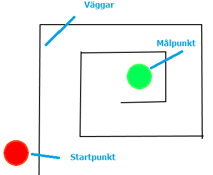

# Labyrinten (anpassad för surfplatta)

Det här är ett spel där du ska försöka ta dig igenom en labyrint utan att röra väggarna och hinder - för då blir du Game Over! Du kan även utmana dig och skapa nya banor fär att komma till nästa nivå i spelet. Det är ett roligt spel för dig som vill hitta på och rita mycket själv! Du kommer att få lära dig att använda variabler och funktioner.

> Bläddra dig fram genom denna guide, steg för steg. <a href="https://scratch.mit.edu" target="_blank">
  Öppna även kodarverktyget Scratch genom att klicka på länken bredvid katt-figuren ovan eller via www.scratch.mit.edu</a>. Här kodar och skapar du själva spelet utifrån instruktionerna nedan. 

En labyrint kan se ut på många olika sätt och du kan rita din som du vill. Här visar vi två exempel på hur ett labyrintspel skulle kunna se ut, beroende på vilken form labyrintens väggar har:

* <a href="https://scratch.mit.edu/projects/52105140/" target="_blank">Exempel 1</a>

* <a href="https://scratch.mit.edu/projects/34921466/" target="_blank">Exempel 2</a>

Hur vill du att din labyrint ska se ut? Dax att börja koda! 
Klicka nedan på nästa kapitel för att gå vidare.

## 1 – Rita din labyrint

Du väljer själv hur du vill rita din labyrint, men du måste följa vissa **regler** för att spelet ska fungera. Labyrintens väggar måste alla vara i samma färg. Start och mål ska ha varsin färg, som inte får vara samma färg som väggar eller bakgrund har. 

Då börjar vi skapa!

1. Skapa först ett nytt projekt i Scratch. Ta bort katt-sprajten genom att trycka på krysset på den.

2. Tryck på SCEN nere till höger och tryck sen på fliken för BAKGRUNDER uppe till vänster. 

          

3. Nu ska du skapa din layrint med en **bakgrundsfärg, labyrintväggar, start och mål**. Viktigt att du ger varje del en egen färg för att spelet sen ska fungera. 

Börja med att fylla med en ny **bakgrundsfärg** till labyrinten. För att detta ska fungera, behöver du först trycka på blå knappen under målarytan som det står **Gör till bitmap** på. 

Välj en ny **färg** du gillar. Klicka på färgverktyget och dra i färgväljarens inställningar tills du är nöjd med din färg.

Välj sen verktyget som ser ut som en liten **hink** och tryck på den stora vita rutan bredvid, så fylls den med din nya färg.  

4. Nu ska du rita din labyrints väggar med **annan färg än bakgrunden**. Det är viktigt att alla väggarna har **samma färg** i hela labyrinten. Låt det vara ganska stort mellanrum mellan väggarna så att spelkaraktären kan ta sig fram utan att stöta i. 

Välj ett vertyg att måla med och en färg du vill ha. Om du vill ha raka streck kan du använd LINJE-verktyget, men du kan även använda PENSEL eller andra verktyg för olika former. 

5. Rita nu en **startpunkt** för spelet och en **målpunkt i slutet av din labyrint**. Start och mål kan se ut hur som helst, men de kan **inte ha samma färg** som väggarna eller bakgrundsfärgen - elelr varandra. Alltså en färg för start och en annan för mål. Du kan till exempel göra cirkelar med CIRKEL-verktyget.

  
  
  Exempelvis kan det se ut såhär, men du ritar som du vill att din labyrint ska se ut.

  

## 2 – Lägg till sprajt som spelfigur

Nu ska du lägga till en sprajt eller figur som ska kunna styras genom labyrinten, utan att röra väggarna. Det kan vara din spelhjälte. Gör såhär:

6. Klicka på lilla blå ikonen med en vit katt på längst ned till höger, så kan du välja att **lägga till en ny sprajt**. Välj ut en figur du gillar bland alla som finns i Scratchbiblioteket och klicka på den för att lägga till den i ditt projekt. Det är bra om du inte väljer en figur som är speciellt bred eller lång, den kan vara svår att svänga i labyrintens hörn.
  
7. Dra sen sprajten du gjort till din labyrints startpunkt på scenen.
  
8. **Ändra storleken** på din sprajt så den passar in mellan labyrintens väggar, från 100% full storlek till lägre procenttal. Det gör du i rutan där det står **Storlek** under din scen med labyrinten och sprajten. Prova dig fram tills sprajten är lagom stor. 

   

>>Tips! Om du vill rita din egen sprajt istället, så gör du såhär: Välj **Ny Sprajt** och klicka sen på **Måla** som ser ut som en liten pensel. Rita din egen sprajt-figur hur du vill, men tänk på att den ska kunna styras genom labyrinten och enkelt svänga i banans hörn och kanter, så den får inte vara för bred eller lång. Var noga med att sprajten ritas med **andra färger** än din bakgrund och labyrintens väggar. **Efter** att du ritat färdigt din sprajt kan du förminska den så att **den blir tillräcklig liten** för att få plats att ta sig enkelt genom labyrinten.

   

  _Exempel på en sprajt._

## 3 - Koda sprajtens rörelse

Din sprajt ska kunna röra sig igenom labyrinten och ta sig i mål, utan att stöta i väggarna, för då blir du Game Over. Den ska styras genom att följa efter ditt finger när du drar den genom labyrinten. Ditt finger blir samma sak som om du skulle ha en datormus och sprajten följer muspekaren genom labyrinten. Dax att koda sprajtens rörelser - gör såhär:

9. Under temat HÄNDELSER finns pusselbiten som heter **Starta när mellanslag-tangenten trycks ned**. Dra ut denna bit och lägg någonstans på sprajtens tomma manusyta. 

10. Under tema RÖRELSE finns pusselbiten **Peka i riktning 90**  Dra ut denna bit och sätt ihop den med den första gula pusselbitan på manusytan, så den sitter fast in under.

11. Under tema RÖRELSE finns **Gå 10 steg**. Dra in denna bit och sätt den under de andra två pusselbitarna. 

BILD PÅ KODEN

Nu har du skapat grunden för ditt första skript med kod för att styra sprajten med piltangenterna. Nu behöver du ändra lite i skriptet så att det blir rätt tangent och riktning. 

12. Klicka på den lilla vita pilen bredvid ordet **mellanslag** på den översta pusselbiten. Då får du upp fler val. Välj **uppåtpil**. Nu står det **Starta när uppåtpil-tangenten trycks ned** istället. 

13. Ändra riktning så att sprajten tittar uppåt, genom att klicka på siffran med variablen **90**, och skriva **0** istället. Då står det **Peka i riktning 0** på pusselbiten, och sprajten tittar uppåt.

14. Nu testar vi koden. Klicka på gröna flaggan över scenen och testa piltangenten. Rör sig sprajten för fort? Ändra hastigheten genom att klicka på på siffran i kodblocket **Gå 10 steg** och skriv en lägre siffra. Testa hastigheten tills du är nöjd. 

15. Gör nu tre till likadana skript, fast ändra i dem så att de styr **vänster**, **höger** och **nedåt**. Då kan sprajten gå i alla olika riktningar i labyrinten.

> Testa ditt projekt! Klicka på START. Kan du röra din sprajt åt alla håll? Går den i lagom hastighet? Nu kan du använda piltangenterna för att styra sprajten, men du skulle också kunna välja helt andra tangenter från tangentbordet.

GAMMALT  .....

7. Gör ett skript för din sprajt som säger:

  * Starta när **uppåtpil**-tangenten trycks ned

  * Då ska sprajten först **peka uppåt** (Peka i riktning 0 grader)

  * Sedan **röra sig** ett par steg

8. Gör tre till likadana skript, fast för att styra **vänster**, **höger** och **nedåt**.

  

  _Tänk på att ha olika riktningar i de olika skripten_

> Testa ditt projekt! Klicka på START. Kan du röra din sprajt åt alla håll? Går den i lagom hastighet? Nu kan du använda piltangenterna för att styra sprajten, men du skulle också kunna välja helt andra tangenter.

**Tips:** Du kan själv ändra hastigheten genom att ändra hur många steg sprajten tar när den rör sig.

## 3 – Vinna eller förlora

Dags att göra det här till ett spel! Du behöver se till så att varje gång din sprajt rör väggen i labyrinten, förlorar du och hamnar tillbaka på startpunkten. Men nuddar sprajten målpunkten så vinner du.

9. Ta först reda på var din startpunkt är. Dra din sprajt till mitten på **startpunkten** på SCENEN. Titta på vad din sprajt har för KOORDINATER (alltså vilken position på scen-ytan med X och y). Kom ihåg eller skriv upp dem!

  

  Nu behöver du uppdatera alla skript för **rörelser** så att sprajten hela tiden **känner av** ifall den är i mål eller nuddar en vägg.

1. Börja med skriptet för **uppåt** och ändra så att det säger:

  * Starta när **uppåtpil**-knappen på datorns tangentbord trycks ned

  * **Känn av om** sprajten har nuddat en vägg (alltså den färg som din vägg har)

    * **Då** ska sprajten **säga "Du dog"** och **gå tillbaka till** startpunkten

  * **Känn av om** sprajten har nuddat målpunkten (alltså dess färg)

    * **Då** ska sprajten **säga "Du vann"**

  * **Annars** ska sprajten **röra sig** som förut (peka uppåt och gå ett par steg framåt)

  

  **Tips:** Förstår du hur sprajten ska kunna **känna av** väggen, startpunkten och målpunkten? Kom ihåg att de har olika **färg**! Förstår du hur sprajten ska kunna **veta var startpunkten är**, när den ska gå tillbaka dit? Tänk på att du har tagit fram dess KOORDINATER tidigare. Minns du?

11. Gör nu samma ändringar för alla skripten. Kom ihåg att du fortfarande måste ha rätt riktning och tangent för varje skript.

> Testa ditt projekt! Klicka på START. Går sprajten åt rätt håll och med en hastighet som känns bra? Säger den att "Du dog!" när du nuddar en vägg? Går den tillbaka till startpunkten. Säger den "Du vann!" när du nuddar målpunkten? 

## 4: En timer

Dags att göra spelet lite svårare! Du ska se till att spelaren har en viss tid på sig att ta sig igenom labyrinten. Om du inte är i mål när tiden är slut förlorar du! Nu ska du skapa en timer, alltså en tidräknare.

1. Skapa en VARIABEL som heter **Tid**. Den ska vara **synlig** på scenen.

2. Gör ett nytt skript för sprajten som säger:

  * Starta när START klickas på

  * **Gå till** startpunkten

  * **Sätt Tid** till 60 sekunder (eller välj själv antal sekunder)

  * **För alltid om Tid > 60**

    * **Då** ska sprajten **vänta** 1 sekund

    * **Ändra Tid** med -1

    * Annars **säg "Game over"** och **stoppa** alla skript

  

  Nu har du en timer, det vill säga en tidräknare! Men för att göra det ännu svårare ska du nu säga åt sprajten att den förlorar extra mycket tid om den nuddar väggen.

3. Lägg till ett block som **ändrar Tid med -10** på alla dina skript som kollar om sprajten har nuddat väggen (alltså den färg din vägg har). Kommer du ihåg vilka skript det är?

  

  _Så här ska alla skript se ut som kollar om sprajten nuddar väggen_

> Testa ditt projekt! Klicka på START. Räknar tiden ned? Vad händer om du nuddar väggen? Är det enkelt eller svårt att spela? Tänk på att du kan ändra tiden som timern startar med, om du vill.

## 5 – Flera banor

Som spelet ser ut nu händer ingenting när du vinner. Det ska du ändra på nu! Du ska få göra så att du kommer till en ny bana, en ny nivå, när du tagit dig genom labyrinten.

14. Klicka på SCEN i nedre högra hörnet. Kopiera din bakgrund med labyrintbanan, genom att högerklicka på den lilla bilden som visar din bagrund och välj kopiera, så får du två likadana bakgrunder. Klicka på den nya andra bakgrunden så den blir aktiverad och sudda sen bort allt **förutom startpunkten** med verktyget som ser ut som ett suddgummi.

  
  
  

15. Du kan nu rita en ny labyrint precis som du vill ha den, men kom ihåg att använda **samma färger på väggarna och på målpunkten som i förra labyrinten**.

16. Nu behöver du se till att den nya banan kommer fram när du har gått i mål och vunnit den första. Det gör du genom att lägga till ett block som sänder ut ett **meddelande** när du **nuddar målpunkten**. Kalla meddelandet för **NästaNivå**.

  

17. Lägg sedan till ett nytt skript för scenen som säger:

  * När sprajten **tar emot meddelandet NästaNivå**

  * Byt till **nästa klädsel**

> Testa ditt projekt! Klicka på START. Vad händer när du har klarat den första banan?

## Färdig!
Grattis, nu har du gjort klart uppgiften.

**Glöm inte att spara ditt projekt!** Döp det gärna till uppgiftens namn så att du enkelt kan hitta den igen.

> **Testa ditt projekt**  
Visa gärna någon det som du har gjort och låt dem testa. Tryck på DELA för att andra ska kunna hitta spelet på Scratch. Gå ut till projektsidan och låt någon annan testa spelet!

## Utmaningar
Har du tid över? Här kommer ett par utmaningar för dig som vill fortsätta.

### Fler nivåer
Du kan lägga till ännu fler nivåer genom att rita nya **bakgrunder** som följer reglerna:

  * Samma position på startpunkten

  * Samma färg på väggarna

  * Samma färg på målpunkten

  * Att det inte finns andra saker med samma färg som väggen eller målpunkten

### Lägg till hinder
Det behöver inte vara väggarna i labyrinten som skickar tillbaka dig till startpunkten. Du kan hitta på egna monster eller andra slags hinder som du måste ta dig förbi på väg till mål.

* Tänk på vilken färg hindren har, så att de inte har samma färg som vägg eller målpunkt

* Välj själv om du vill att hindren rör sig eller om de ska stå stilla

* Se till så att det faktiskt är möjligt för sprajten att ta sig förbi hindren

* Ändra skriptet för sprajten så att den känner av hindren på samma sätt som väggen

* Kan du ändra i skriptet för din sprajt så att den kan krocka mot väggen utan att gå tillbaka till startpunkten, men att väggen fortfarande är ogenomtränglig?

## Frågeställningar

* Var kan du hitta de nuvarande koordinaterna för en sprajt?

* Vad är en variabel?

* Vad händer om start och mål har samma färg?

* Vad måste du tänka på när du skapar flera banor?
