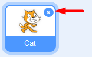

# Labyrinten (anpassad för surfplatta)

Det här är ett spel där du ska försöka ta dig igenom en labyrint utan att röra väggarna och hinder - för då blir du Game Over! Du kan även utmana dig och skapa nya banor fär att komma till nästa nivå i spelet. Det är ett roligt spel för dig som vill hitta på och rita mycket själv! Du kommer att få lära dig att använda variabler och funktioner.

> Bläddra dig fram genom denna guide, steg för steg. <a href="https://scratch.mit.edu" target="_blank">
  Öppna även kodarverktyget Scratch genom att klicka på länken bredvid katt-figuren ovan eller via www.scratch.mit.edu</a>. Här kodar och skapar du själva spelet utifrån instruktionerna nedan. 

En labyrint kan se ut på många olika sätt och du kan rita din som du vill. Här visar vi två exempel på hur ett labyrintspel skulle kunna se ut, beroende på vilken form labyrintens väggar har. Här finns några exempel på olika labyrinter:

Hur vill du att din labyrint ska se ut? Dax att börja koda! 
Klicka nedan på nästa kapitel för att gå vidare.

## 1 – Rita din labyrint

Du väljer själv hur du vill rita din labyrint, men du måste följa vissa **regler** för att spelet ska fungera. Labyrintens väggar måste alla vara i samma färg. Start och mål ska ha varsin färg, som inte får vara samma färg som väggar eller bakgrund har. 

Då börjar vi skapa!

1. Skapa först ett nytt projekt i Scratch. Ta bort katt-sprajten genom att trycka på krysset på den.

2. Tryck på SCEN nere till höger och tryck sen på fliken för BAKGRUNDER uppe till vänster. 

          

 

3. Nu ska du skapa din layrint med en **bakgrundsfärg, labyrintväggar, start och mål**. Viktigt att du ger varje del en egen färg för att spelet sen fungera. 

  En enkel labyrint kan se ut såhär, men du ritar din som du vill. Tips är att skapa en enkel, bred bana utan för många väggar och svängar.

  

Börja med att fylla med en ny **bakgrundsfärg** till labyrinten. För att detta ska fungera, behöver du först trycka på blå knappen under målarytan som det står **Gör till bitmap** på. 

Välj en ny **färg** du gillar. Klicka på färgverktyget och dra i färgväljarens inställningar tills du är nöjd med din färg.

Välj sen verktyget som ser ut som en liten **hink** och tryck på den stora vita rutan bredvid, så fylls den med din nya färg.  

4. Nu ska du rita din labyrints väggar med **annan färg än bakgrunden**. Välj ett verktyg att måla med och välj en färg du vill ha. Om du vill ha raka streck kan du välja LINJE-verktyget.

>> **Tänk på!** Det är viktigt att **alla väggarna har samma färg** genom hela labyrinten och att avståndet mellan väggarna ska vara ganska stort så sprajten kommer emellan.

5. Rita nu en **startpunkt** och en **målpunkt** i din labyrint. Start och mål kan se ut hur som helst, men de kan **inte ha samma färg** som väggarna eller bakgrundsfärgen - eller varandra. Alltså en färg för start och en annan för mål. Du kan till exempel göra fyllda färgcirklar med CIRKEL-verktyget.

  
  
Nu är labyrinten klar. Tryck på fliken KOD längst upp i vänstra hörnet, så kommer du ut ur ritläget.

Dax att lägga till en spelfigur - spelets hjälte.

## 2 – Lägg till en spelfigur

Nu ska du lägga till en sprajt eller figur som ska kunna styras genom labyrinten utan att röra väggarna. Det blir din spelhjälte. Gör såhär:

6. Tryck på den lilla blå ikonen med en vit katt på längst ned till höger, så blir den grön - tryck nu på den gröna. Då kommer du till ett sprajtbibliotek, där du kan välja **en ny sprajt**. Tryck på en sprajt du gillar för att lägga till den i ditt projekt. 

   
  
>>**Tänk på!** Välj en sprajt som inte är för bred eller lång, annars kan den vara svår att styra utan att stöta i väggarna.
  
7. Dra sprajten till din labyrints startpunkt och **ändra storleken** på sprajten så den passar in mellan labyrintens väggar, från 100% full storlek till lägre procenttal. Det gör du i rutan som heter **Storlek** som finns under SCENEN. Prova dig fram tills sprajten känns lagom stor, den ska få ordentligt med plats mellan labyrintens väggar.

   

>>**Tips!** Om du vill rita din egen sprajt, så gör du såhär: Håll fingret på ikonen för **Ny Sprajt** i nedre högra hörnet så att fler val kommer fram.  Välj **Måla** som ser ut som en liten pensel. Rita din egen sprajtfigur, men tänk på att den inte ska vara för stor, bred eller lång, då blir den svår att svänga i labyrintens hörn. Var noga med att sprajten ritas med **andra färger** än din bakgrund och labyrintens väggar.

## 3 - Koda sprajtens rörelse

Din sprajt ska kunna röra sig igenom labyrinten och ta sig i mål, utan att stöta i väggarna, för då blir du Game Over. Den ska styras genom att följa efter ditt finger när du drar den genom labyrinten. Ditt finger blir samma sak som om du skulle ha en datormus och sprajten följer muspekaren genom labyrinten. 

Dax att koda sprajtens rörelser - vi börjar med att få sprajten att gå:

8. Under temat HÄNDELSER finns pusselbiten som heter **När "GRÖN FLAGGA" klickas på** (den som har en grön flagga på sig). Dra ut denna bit och lägg på sprajtens tomma manusyta i mitten. Denna pusselbit är kopplad till den gröna START-flaggan som finns över ditt spel på SCENEN - alltså en **startknapp för ditt spel**.

   

9. Under tema RÖRELSE finns pusselbiten **Gå 10 steg**. Dra in denna bit och sätt den under det första kodblocket med den gröna flaggan. 

   

Testa koden genom att trycka några gånger på den gröna flaggan över ditt spel. Sprajten rör sig framåt en bit varje gång du trycker på startflaggan. Men vi vill ju att den ska röra sig hela tiden efter att vi tryckt på start. Vi behöver kontrollera koden med en LOOP.

10. Under tema KONTROLL finns pusselbiten **För alltid**. Dra in den och lägg den runt om den blå pusselbiten **Gå 10 steg**, så den blå hamnar inuti den gula. Det ser det ut såhär.

   

Testa koden igen! Se, nu springer sprajten hela tiden. 
Stoppa koden med den röda STOPP-knappen över SCENEN med spelet och dra tillbaka sprajten till spelets startpunkt. 

## 4 - Koda styrning och position

Sprajten ska styras genom labyrinten genom att du drar ditt finger genom labyrinten och sprajten följer efter ditt finger. Fingret på en surfplatta motsvarar muspekaren på en dator. Gör såhär för att koda denna styrning av sprajten:

11. Under tema RÖRELSE finns pusselbiten **Peka mot muspekare**. Dra in biten och lägg den direkt ovanför kodblocket med **Gå 10 steg**. Då ser det ut såhär:

   

Testa koden! Nu ska sprajten följa ditt finger i labyrinten. Men det går lite snabbt. Bra om vi sänker hastigheten och fördröjer starten lite - gör såhär:

12. Klicka på siffran 10 i pusselbiten **Gå 10 steg**. Detta är en variabel som kan ändras till lägre och högre siffra, för att sprajten ska gå långsammare eller snabbare. Ändra förslagsvis till 1. 

13. Under tema KONTROLL finns pusselbiten **Vänta 1 sekunder**. Dra in biten och lägg den direkt under pusselbiten **När GRÖN FLAGGA klickas på**. Då väntar sprajten 1 sekund innan den börjar springa iväg. 

   

För att slippa dra tillbaka sprajten till startplatsen hela tiden, ska du lägga till sprajtens startposition och även startriktning. Då går den åt rätt håll från början. Vi börjar med riktningen.

14. Dra sprajten till labyrintens startplatta. Under tema RÖRELSE finns pusselbiten **Peka i riktning 90**. Dra in biten och lägg det direkt under kodblocket **När GRÖN FLAGGA klickas på**. 

15. Om sprajten inte tittar åt rätt håll nu, så tryck på siffran 90 i kodblocket och ändra riktningen åt det håll som passar din labyrint bäst genom att dra i blå pilen tills du är nöjd med sprajtens riktning. 

   

16. Nu lägger du till sprajtens startposition. Se först till att sprajten står på start-markeringen, där du vill att den ska starta när spelet börja. Under tema RÖRELSE finns pusselbiten **Gå till X:__ och Y:__**. (det står siffror med koordinater för X och Y). Dra in denna pusselbit och lägg in den direkt under kodblocket **När GRÖN FLAGGA klickas på**. Nu startar sprajten på samma ställe varje gång du startar spelet.

   
  
>>Testa koden! Går sprajten i lagom hastighet? Startar den på rätt ställe? Ändra i variablerna om du inte är nöjd.

Nu ska vi koda så sprajten kan känna av olika färger - och vinna eller förlora.

## 5 – Vinna eller förlora

Dags att koda det här till ett spel! Här ska du programmera in **villkor** i koden som skapar olika händelser - om en sak händer, då ska något annat hända. Till exempel: OM sprajten rör vid en vägg i labyrinten, DÅ blir spelet Game Over och sprajten hamnar tillbaka på startpunkten. OM sprajten nuddar vid målpunkten - DÅ vinner du.

Men hur ska sprajten veta vad den rör vid? Jo, vi ska koda så att den **känner av vilken färg den rör vid**; labyrintens väggfärg eller målpunktens färg. Det är därför de alla måste ha olika färger så sprajten kan hålla ordning. 
Dax att koda!

17. Först lägger vi till en pusselbit som kontrollerar om sprajten rör vid en speciell färg. Under tema KONTROLL finns en stor pusselbit med ett kantigt hål på som heter **Oå < > Då... Annars**. Dra in biten och lägg den fritt på skriptytan. Såhär ser pusselbiten ut:

   

Nu ska du koda så att sprajten hela tiden **känner av** ifall den rör vid färgen för mål eller en vägg. Vi börjar med Mål!

18. Under tema **Känna av** finns pusselbiten **Rör vid färgen ...**. Dra in biten och lägg den inuti det kantiga hålet mellan **Om < > Då**, så det ser ut såhär:

   

19. Nu ska vi ställa in rätt färg. Tryck på färgcirkeln i kodbiten **Rör vid färgen ...**. Välj lilla pimpett-verktyget i menyn längst ned, och tryck sen på labyrintens mål-markering på SCENEN, så blir färgen för målet vald. Färgen ändras då i pusselbiten **Rör vid färgen ...**.

   

20. Om sprajten rör vid målet i labyrinten, ska du vinna spelet och sprajten ska säga "Jag vann!" och hamna tillbaka på start-markeringen igen, redo för att spelas på nytt. Koden ska då också stoppas. Koda nu så att sprajten kan säga "Jag vann!" när den går i mål: Under tema UTSEENDE finns pusselbiten **Säg Hej! i 2 sekunder**. Dra in biten och lägg den inuti din villkorsloop, så det ser ut såhär. 

   

21. Tryck på texten "Hej!" i pusselbiten och skriv istället "Jag vann!"

232. Om sprajten går i mål, ska den flyttas tillbaka till start-positionen igen. Då kodar vi in det: Dra din sprajt till start-markeringen i labyrinten. Under tema RÖRELSE finns pusselbiten **Gå till X... och Y...**. Dra in biten och lägg den direkt under kodblocket **Säg Jag vann! i 2 sekunder**. 

23. När det blir Game Over ska spelet stoppas - och koden sluta köras. Under tema KONTROLL finns pusselbiten **Stoppa alla**. Lägg in det direkt under **Gå till X... Y...** i din villkors-loop.

24. När sprajten **inte** rör vid mål-färgen, ska den för alltid fortsätta gå framåt. Lägg därför ett rörelseblock med **Gå 10 steg** in under där det står **annars** i sin gula villkor-loop. Ändra siffran 10 till ett lägre tal, 1 kan vara lagom. 

   

25. Nu ska du koda ett likadant skript till, men byt färg så att sprajten känner av labyrintens väggar istället, och att den säger "Game Over!" om den nuddar väggfärgen istället för "Jag vann!" om den nuddar målets färg.

26. Till sist ska du **lägga in båda dessa skript under varandra inuti det första skriptets För alltid-loop**. Då har du kodat ett skript som **för alltid** - gång på gång under hela spelet - känner av om sprajten rör vid väggar eller målet - och om inte går den annars vidare framåt. Ditt skript ska se ut såhär när du är klar.

   

>> Testa ditt projekt! Klicka på START-flaggan. Går sprajten åt rätt håll och med en hastighet som känns bra? Säger den "Game Over!" när du nuddar en vägg? Går den tillbaka till startpunkten. Säger den "Du vann!" när du nuddar målpunkten? Tips: Tryck på symbolen med fyra pilar som pekar utåt, som finns överst i högra hörnet ovanför SCENEN, så kan du spela labyrintspelet i större fönster - det är lättare.

## 6 - Lägg till ett hinder 
Det behöver inte bara vara väggarna i labyrinten som gör dig Game Over. Du kan hitta på andra hinder eller motståndare som din sprajt måste ta sig förbi på väg till mål. 

Kanske hindren är att ta sig förbi stenar, och om man rör dem blir man Game over, precis som om man rör väggarna. Exempelvis såhär:

   

>> Kan du klura ut hur du ska koda hindren? Tips är att kika på hur du löste koden med labyrintens väggar. 

Tänk på att:

* Du kan välja att hindret ska vara en färdig sprajt som du lägger till i projektet - eller rita ett eget hinder, exempelvis en sten.

* Om du ritar eget hinder, tänk på att ge den en annan färg än vägg- och mål-färgen.

* Välj om du vill att hindret ska röra sig eller om det ska stå stilla. 

* Se till så att det faktiskt är möjligt för sprajten att ta sig förbi hindret. Ibalnd kan man behöva flytta på det tills det funkar.

* Lägg till kod i skriptet för sprajten så att den känner av hindren på samma sätt som väggen, och blir Game over.

## Färdig!
Grattis, nu har du gjort klart uppgiften.

**Glöm inte att spara ditt projekt!** Döp det gärna till uppgiftens namn så att du enkelt kan hitta den igen.

> **Testa ditt projekt**  
Visa gärna någon det som du har gjort och låt dem testa. Tryck på DELA för att andra ska kunna hitta spelet på Scratch. Gå ut till projektsidan och låt någon annan testa spelet!

## Utmaningar
Har du tid över och bygga mer på spelet. Då kan du lägga till en timer som räknar ned speltiden opch fler banor och nivåer. Här kommer några förslag på hur du kan skapa detta. 

## En timer

Dags att göra spelet lite svårare! Du ska se till att spelaren har en viss tid på sig att ta sig igenom labyrinten. Om du inte är i mål när tiden är slut förlorar du! Nu ska du skapa en timer, alltså en tidräknare.

1. Skapa en VARIABEL som heter **Tid**. Den ska vara **synlig** på scenen.

2. Gör ett nytt skript för sprajten som säger:

  * Starta när START klickas på

  * **Gå till** startpunkten

  * **Sätt Tid** till 60 sekunder (eller välj själv antal sekunder)

  * **För alltid om Tid > 60**

    * **Då** ska sprajten **vänta** 1 sekund

    * **Ändra Tid** med -1

    * Annars **säg "Game over"** och **stoppa** alla skript

  

  Nu har du en timer, det vill säga en tidräknare! Men för att göra det ännu svårare ska du nu säga åt sprajten att den förlorar extra mycket tid om den nuddar väggen.

3. Lägg till ett block som **ändrar Tid med -10** på alla dina skript som kollar om sprajten har nuddat väggen (alltså den färg din vägg har). Kommer du ihåg vilka skript det är?

  

  _Så här ska alla skript se ut som kollar om sprajten nuddar väggen_

> Testa ditt projekt! Klicka på START. Räknar tiden ned? Vad händer om du nuddar väggen? Är det enkelt eller svårt att spela? Tänk på att du kan ändra tiden som timern startar med, om du vill.

## Fler banor

Som spelet ser ut nu händer ingenting när du vinner. Det ska du ändra på nu! Du ska få göra så att du kommer till en ny bana, en ny nivå, när du tagit dig genom labyrinten.

14. Klicka på SCEN i nedre högra hörnet. Kopiera din bakgrund med labyrintbanan, genom att högerklicka på den lilla bilden som visar din bagrund och välj kopiera, så får du två likadana bakgrunder. Klicka på den nya andra bakgrunden så den blir aktiverad och sudda sen bort allt **förutom startpunkten** med verktyget som ser ut som ett suddgummi.

  
  
  

1. Du kan nu rita en ny labyrint precis som du vill ha den, men kom ihåg att använda **samma färger på väggarna och på målpunkten som i förra labyrinten**.

2. Nu behöver du se till att den nya banan kommer fram när du har gått i mål och vunnit den första. Det gör du genom att lägga till ett block som sänder ut ett **meddelande** när du **nuddar målpunkten**. Kalla meddelandet för **NästaNivå**.

  

3. Lägg sedan till ett nytt skript för scenen som säger:

  * När sprajten **tar emot meddelandet NästaNivå**

  * Byt till **nästa klädsel**

> Testa ditt projekt! Klicka på START. Vad händer när du har klarat den första banan?
Har du tid över? Här kommer ett par utmaningar för dig som vill fortsätta.

### Fler nivåer
Du kan lägga till ännu fler nivåer genom att rita nya **bakgrunder** som följer reglerna:

  * Samma position på startpunkten

  * Samma färg på väggarna

  * Samma färg på målpunkten

  * Att det inte finns andra saker med samma färg som väggen eller målpunkten

## Frågeställningar

* Var kan du hitta de nuvarande koordinaterna för en sprajt?

* Vad är en variabel?

* Vad händer om start och mål har samma färg?

* Vad måste du tänka på när du skapar flera banor?
