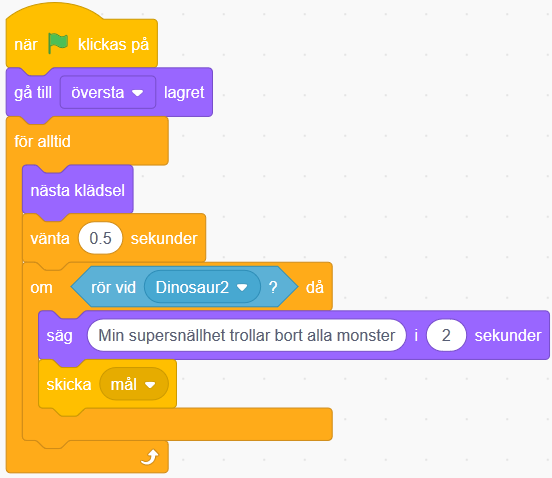

# Min hjälte

Här kan du skapa en animerad berättelse om en hjälte i Scratch! Vem är din hjälte? Låt fantasin flöda.

> Bläddra dig fram genom denna guide, steg för steg. <a href="https://scratch.mit.edu" target="_blank">
  Öppna även kodarverktyget Scratch genom att klicka på länken bredvid katt-figuren ovan eller via www.scratch.mit.edu</a>. Här kodar och skapar du själva spelet utifrån instruktionerna nedan. 

Den här berättelsen bygger på den röda tråden: Vem, Var, Vad, Hur, Mål. Det handlar alltså om en hjälte som ska nå ett mål men som möter en motståndare eller ett hinder på vägen som behöver övervinnas för att komma till målet. För att planera din berättelse och vad den ska handla om passar övningen <a href="https://www.kodboken.se/start/skapa-berattelser/lekar-och-ovningar/en-rod-trad" target="_blank">**En Röd Tråd**</a>. Där bestämmer du vad de olika delarna ska vara för **Vem, Var, Vad, Hur, Mål.** Sen kan du koda med det du planerat som grund.

Ett exempel på hur en berättelse om en hjälte kan se ut <a href="https://scratch.mit.edu/projects/149517033/" target="_blank">hittar du här</a>. Den handlar om en hjälte som är ute i naturen. Motståndaren är ett monster som hjälten trollar bort med supersnällhet. När monstret är borta vågar fjärilar sig fram och dyker upp i träden!

Är du redo att koda? Då börjar vi!

## 1 – "VAR" - Byt bakgrund på scenen

Först ska du få välja**VAR** din berättelse utspelar sig. Välj bakgrund i din berättelse genom att klicka på den blå lilla symbolen längst ner till höger, som finns under rubriken **Scen** under den stora scen-ytan. Här väljer du en bakgrund från Scratch bibliotek eller så kan du rita en egen bakgrund.

1. Gå in i **Välj en bakgrund** och ta en bild från Scratch bild-biblioteket eller välj **Måla** och rita din egen bakgrund istället.
2. Eftersom du vill att det att se ut som att bakgrunden rör sig, behöver du en bakgrund som inte avslöjar att den egentligen står stilla! Därmed krävs en enkel bakgrund utan träd eller saker på marken och med mycket "himmel" eller tomrum överst. I biblioteket kan du till exempel välja mellan bakgrunden ”Blue sky” eller ”Wall 1”. Om du ritar själv kan du till exempel göra en färgad bakgrund med en låg rektangel längst ned i annan färg som platt mark.

## 2 – "VEM" och "VAD" - Välj sprajtar

Nu ska du välja de karaktärer (sprajtar) som ska vara med i berättelsen: hjälten (VEM) och motståndare/hinder (VAD). Under den stora scenen hittar du dina sprajtar. Här får du välja sprajtar i Scratch bibliotek som du tycker passar. Välj även en sprajt som fungerar som rekvisita, alltså som en del av bakgrunden.

Om en stund kommer du kunna rita själv och ändra sprajterna så att de ser ut precis som du vill ha dem, men först vill vi komma igång och koda!

1. Ta bort sprajt-Katten genom att **klicka på krysset** på den lilla bilden av katt-sprajten som finns längst ned under stora scenen.

2. Välj en **sprajt som din hjälte** från Scratch bibliotek. Om du vill att din hjälte ska se ut att kunna röra på benen för att gå eller springa, så välj en sprajt som rör på sig i biblioteket när du pekar på den med muspekaren.
2. Välj en till **sprajt som Motståndare/Hinder** från Scratch bibliotek.
3. Välj också en **sprajt som rekvisita**, alltså något som kan vara en del av bakgrunden. Till exempel en måne om det är natt eller ett träd om hjälten går i naturen.

## 3 – Få bakgrunden att röra på sig!

Nu är det dags att börja koda! Det första du ska göra är att animera (skapa rörelse) med dina sprajtar så att det **ser ut som** att hjälten rör sig utan att egentligen förflytta sig över scenen på riktigt. Låter det konstigt? Knepetär att koda så att bakgrunden kommer närmare istället! Gör såhär:

1. Sätt **hjälte-sprajten** mitt på, eller aningen till vänster, på scenen.
2. Sätt **rekvisita-sprajten** längst till höger på scenen.
3. Gå in på **KOD-fliken** för din rekvisita-sprajt. Välj från HÄNDELSER: **när START-flaggan klickas på**. Nu ska du koda vad som händer när berättelsen startar!
4. Välj från KONTROLL: **för alltid** och fäst under startblocket med flaggan. Det här blocket är en loop som upprepar din kod om och om igen. I den bestämmer du vad sprajten ska göra för att få bakgrunden att röra på sig.
5. I loopen sätter du att sprajten ska börja på en speciell plats längst ut till höger. Välj från RÖRELSER: **sätt x till 0**. Ändra nollan så att det står **250** istället.
6. Välj en till loop från KONTROLL: **Repetera 0**. Ändra nollan så att det står **250**. Inom den här loopen sätter du in från RÖRELSE: **ändra X med 0**. Här får du testa dig fram vad du vill byta ut nollan mot, beroende på hur snabbt du vill att sprajten ska röra sig. I exemplet har vi skrivit in siffran -2.

**Testa din kod! Tryck på START-flaggan och se vad som händer!** Ser det ut som att bakgrunden rör sig? Känns det som att din hjälte rör sig framåt fastän den står still mitt på scenen?

## 4 – Få Hjälten att röra på benen!

Om du har en hjälte som flyger kan det du redan kodat räcka för att den ska se ut att röra sig. Men om du har en hjälte som ska gå eller springa - och som har flera olika klädslar för det - behöver du animera sprajten. Det gör du så här:

1. Markera din hjälte-sprajt och gå in på **KOD-fliken**. Välj från HÄNDELSER: **när START-flaggan klickas på**.
2. Även här behöver du en loop, välj från KONTROLL: **för alltid** och fäst den under startblocket.
3. I loopen ska du välja att sprajten byter "klädsel". Det gör du med UTSEENDE: **nästa klädsel**.
4. Nu byter sprajten klädsel jättesnabbt! Sätt en liten paus mellan bytena med KONTROLL: **vänta 1 sekunder**. Ändra till 0,5 sekunder eller det du tycker ser bra ut. Prova dig fram.
5. Om du inte vill att hjälten ska förvinna bakom rekvisitan (alltså trädet med mera), kan du lägga till en UTSEENDE: **gå till översta lagret** och lägga in den före loopen. Då är hjälten alltid placerad längst fram i bilden och döljs inte av de andra sprajtarna i rekvisitan.

**Testa din kod! Tryck på START-flaggan och se vad som händer!** Ser det ut som att hjälten rör sig nu? Byter den klädsel lagom fort?

## 5 – "HUR" – Vad händer när hjälten möter motståndaren?

Nu ska du koda vad som händer när hjälten möter motståndaren. Vad gör hjälten och vad gör motståndaren? HUR kan hjälten övervinna motståndaren? Det ska du koda med hjälp av VILLKOR, det vill säga att OM hjälten möter motståndaren, DÅ händer något. Alltså att något som händer, får något annat att sättas igång.

1. Markera din motståndare-sprajt. Sätt den längst till höger på scenen.
2. Gå in på KOD-fliken. Välj från HÄNDELSER: **när START-flaggan klickas på**.
3. Välj KONTROLL: **för alltid** och fäst loopen under startblocket.
4. I loopen ska du styra så att motståndaren går framåt mot hjälten. Det gör du med RÖRELSE: **gå 10 steg**. Ändra antalet steg till hur fort du vill att den ska gå – och i vilken riktning. I exemplet har vi använt -5 för att inte motståndaren ska springa åt fel håll!
5. Om du inte vill att motståndaren ska försvinna bakom rekvisitan (trädet med mera), kan du lägga till en UTSEENDE: **gå till översta lagret** innan loopen. Nu är alltid motståndaren längst fram i bilden, precis som hjälten.
6. För att motståndaren ska starta på samma ställe varje gång du trycker på START-flaggan (alltså startar din animation), behöver du ge den en startposition. Det gör du genom att sätta motståndar-sprajten där du vill att den ska starta till höger på scenen. Välj blocket för RÖRELSE: **gå till x: y:** och lägg det innan för-alltid-loopen i ditt skript. Om du ställt din motståndare där du vill att den ska starta, så står automatiskt rätt värden för x och y-koordinater i blocket! Du kan även ändra dem och skriva andra siffror om sprajten står lite fel.

**Testa din kod! Tryck på START-flaggan och se vad som händer!** Startar motståndaren på rätt plats? Går motståndaren mot hjälten? Går den lagom fort? Du kan ändra hastighet genom att byta ut värdet i gå-blocket!

## 6 - Motståndaren trollas bort med superkraft

Nu fortsätter motståndaren bara att gå förbi hjälten och ut ur scenen! Det ska vi ändra på. När hjälten möter motståndaren ska något hända – här i exemplet kommer motståndaren att försvinna när den möter hjälten. Dags att använda villkoret igen - OM hjälten möter motståndaren DÅ händer något!

1. Markera din hjälte-sprajt och gå in på KOD-fliken. Inuti för alltid-loopen ska du nu lägga in ett block från KONTROLL: **om _ då**.
2. Mellan **om** och **då** finns en ruta där du kan välja vad sprajten ska känna av. Där lägger du ett block från KÄNNA AV: **rör vid _ ?**. Välj från rullistan så att det står **om rör vid (motståndar-sprajten) då**.
3. Vad vill du ska hända när hjälten nuddar motståndaren? Här i exemplet börjar vi med att hjälten får säga vad den gör för att övervinna motståndaren. Från UTSEENDE tar vi blocket **säg _ i _ sekunder** och skriver in att hjälten säger ”Min supersnällhet trollar bort alla monster!” i 2 sekunder. (Eller vad du vill att den ska säga för att vinna över motståndaren.)

4. Sedan vill vi att något ska hända med motståndar-sprajten! Markera motståndarsprajten och gå in på KOD-fliken. Gör ett likadant skript som för hjälten: **om rör (hjälte-sprajten) då**.
5. Vad vill du ska hända med motståndaren? I vårt exempel säger motståndar-sprajten ”Hjälp! Supersnällkraften!” i 1 sekund och sedan trollas motståndaren bort. Det gör vi med blocken UTSEENDE: **säg_ i _sekunder** och UTSEENDE: **göm**.
6. För att motståndar-sprajten ska synas i början av berättelsen, behöver du nu lägga till blocket UTSEENDE: **visa** innan för alltid-loopen. I vårt exempel har vi valt att sprajten först är gömd, väntar 2 sekunder, och sedan visar sig för att dyka upp i berättelsen!

**Testa din kod! Tryck på START-flaggan och se vad som händer!** Vad händer nu när hjälten och motståndaren möts? Övervinner hjälten motståndaren?

Om du vill att något annat ska hända kan du självklart använda andra skriptblock och sprajtar!

Här kommer några tips:

1. Du kan **animera motståndar-sprajtens klädslar** för att den till exempel ska ändra ansiktsuttryck, falla ned till marken eller vad du vill att den ska göra.
2. Du kan **animera hjälte-sprajtens klädslar** om du vill att den till exempel ska krama motståndaren, använda ett trollspö eller hur den nu ska övervinna motståndaren. Rita dit saker på din sprajt om hjälten ska hålla i något som den använder!
3. Motståndar-sprajten kan **ändra storlek eller färgeffekt** för att till exempel krympa eller bli förtrollad.
4. Hjälten kan **hoppa på motståndaren för att övervinna den**, eller **hoppa upp och ned** av glädje efteråt. Använd RÖRELSE-blocken för det, till exempel **ändra x** eller **ändra y**.
5. Låt hjälten och motståndaren säga fler saker om det behövs för att förklara berättelsens handling!

**Testa din kod! Tryck på START-flaggan och se vad som händer!**

## 7 – "MÅL" – Hjälten övervinner motståndaren!

Till sist behöver du koda slutet på berättelsen, när hjälten har övervunnit motståndaren. Vad ska hända då? Vad är målet med berättelsen? Här behöver du koda det som behövs för just din berättelse – du hittar tips för olika skript-idéer längst ned i denna del.

I vårt exempel byter rekvisita-sprajten (trädet) klädsel och fjärilar dyker upp i trädet! Här behöver sprajtarna ”prata” med varandra för att rekvisita-sprajten ska veta när hjälten har övervunnit motståndaren och den ska byta klädsel. Det gör vi med MEDDELANDEN, så att **hjälte-sprajten skickar ett meddelande till rekvisita-sprajten**. Vill du koda detta så gör du såhär:

1. Markera din hjälte-sprajt och gå in på KOD-fliken. Dra in blocket HÄNDELSER: **skicka _**. Välj ”nytt meddelande” i rullistan och hitta på ett namn till meddelandet, till exempel ”Mål”.
2. Lägg blocket **skicka Mål** sist inuti skriptet **om rör (motståndar-sprajten) då**.

3. Markera nu din rekvisita-sprajt och gå in på KOD-fliken. Välj blocket **när jag tar emot Mål** från HÄNDELSER och lägg det fritt på skriptytan.
4. Välj vad som ska hända när rekvisita-sprajten får meddelandet om att hjälten vunnit över motståndaren! I vårt exempel har vi skapat en ny klädsel till vår rekvisita-sprajt, där trädet får fullt med fjärilar omkring sig. Sedan har vi använt blocket **byt klädsel till (klädsel 2)** från UTSEENDE och lagt det till skriptet **när jag tar emot Mål**.

**Testa din kod! Tryck på START-flaggan och se vad som händer!** Efter att hjälten har övervunnit motståndaren, byter rekvisita-sprajten sin klädsel?

Om du vill att något annat ska hända kan du självklart använda andra skriptblock eller finurliga idéer

Här kommer några tips på idéer:

1. Du kan byta bakgrund på scenen om du vill ändra miljön, till exempel att natt förvandlas till dag eller att regnväder förvandlas till solsken.
2. Du kan animera hjälte-sprajtens klädslar eller ändra storlek eller färgeffekt på sprajten om du vill att hjälten ska ändra utseende i slutet av berättelsen.
3. Du kan lägga till fler sprajtar som visas i slutet av berättelsen, så att de dyker upp när motståndaren är borta.
4. Du kan lägga till fler sprajtar som är med i berättelsen hela tiden och som byter klädsel i slutet på berättelsen.
5. Låt hjälten eller andra sprajtar säga fler saker om det behövs för att förklara hur berättelsen slutar!

## GRATTIS – Du har en färdig berättelse!

**Glöm inte att spara ditt projekt!** Döp det gärna till uppgiftens namn så att du enkelt kan hitta den igen.

**Testa! Visa gärna någon det som du har gjort och låt dem testa.** 
Tryck på **DELA-knappen** för att andra ska kunna hitta berättelsen på Scratch.

Om du har tid över kan du nu fortsätta bygga vidare på din berättelse och göra om din hjälte och din motståndare som du vill.

<a href="https://scratch.mit.edu/projects/148451864/" target="_blank">Här kan du se ett annat hjälte-projekt där vi använder fler sprajtar och bakgrunder.
</a>

Här kommer några fler idéer om du behöver inspiration:

1. Ändra din Hjälte eller annan sprajt så som du vill att den ska se ut! Klicka på den sprajt du vill ändra på och markera fliken för **KLÄDSLAR**. Använd ritverktygen för att måla om din sprajt. Använd till exempel penseln för att rita eller färgburken för att ändra färg på exempelvis kläder eller hår. 
2. Du kan även lägga till och skapa nya klädslar som du sedan kan växla mellan i koden, genom att kopiera en sprajts klädsel, så det skapas flera. (Tänk på att radera eventuell kod som följer med från den klädsel du kopierat.) Ändra sedan något i den ena klädseln så kan du animera mellan de olika! Vissa sprajtar har redan flera klädslar att animera mellan, till exempel så att hjälten rör på benen, ändrar ansiktsuttryck eller skickar ut blixtar.
4. Om du vill att fler saker ska hända i berättelsen, så kan du nu lägga till fler sprajtar och koda dem. Testa dig fram och se vad som händer!
5. Du kan ha fler bakgrunder till scenen och animera dem om du vill att berättelsen ska byta miljö.
6. Du kan lägga till en bakgrund som inleder berättelsen och i ritverktyget skriva en text som förklarar berättelsen, till exempel börja med ”Det var en gång…”. 
7. Du kan också lägga till en bakgrund som avslutar berättelsen och skriva en text som förklarar vad som händer sedan, till exempel ”Så levde de lyckliga i alla sina dagar. Snipp snapp slut så var sagan slut!”. 

> Tips: Om du vill lägga till inledning och avslutning, kom ihåg att pausa sprajtarna i början och slutet på berättelsen, så att berättelsetexten hinner visas. Använd blocket **vänta tills_** eller **vänta 1 sekunder** som finns under KONTROLL.

## Frågeställningar

* Vad är en sprajt?
* Vad är en variabel?
* Vad är ett villkor?

