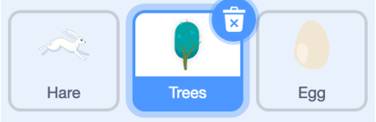
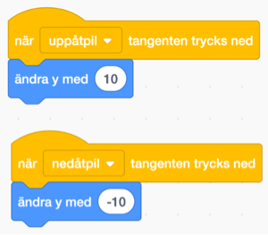
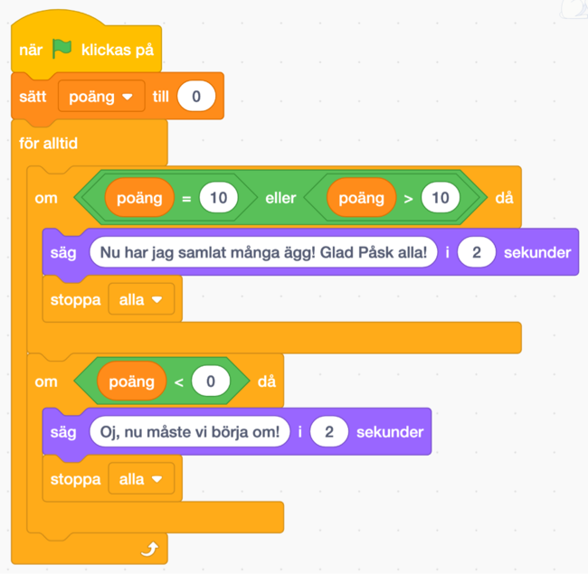

# Påskjakt Platformer

Här kan du bygga en klassikt “platformer”-spel om påskharen som är på jakt efter ägg! Vi har valt det som tema till spelet, men tänk på att du kan själv välja att ersätta med en egen karaktär och andra objekt som kan ge eller ta bort poäng.

Bläddra dig fram genom denna guide, steg för steg. Öppna även kodarverktyget Scratch genom att klicka på länken bredvid katt-figuren ovan eller via www.scratch.mit.edu. Här kodar och skapar du själva spelet utifrån instruktionerna nedan.

Testa ett exempelspel här <a href="https://scratch.mit.edu/projects/382828127/" target="_blank">https://scratch.mit.edu/projects/382828127/</a>

Är du redo att koda? Då börjar vi!

## 1: Färglägg bakgrunden

Du ska nu få färglägga spelets bakgrund och rita en bana som haren kan springa på.

1. För att ändra på bakgrunden trycker du först på den vita lilla rutan längst ner till
höger där det står **SCEN**, så den blir markerad. Klicka sedan på fliken **BAKGRUNDER** som du finner högst upp till vänster.


2. Välj sen **en färg** du gillar genom att klicka på den lilla färgade rutan ovanför och ställ in färgen du vill ha, genom att dra eller klicka på de olika reglagen tills du är nöjd.

3. Rita sen banan genom att klicka på verktyget **Rektangel** och sen dra upp en rektangel på den stora vita rutan. Gör rektangeln 3/4 delar av den vita rutan.

## 2: Välj dina sprajtar
I verktyget Scratch skapar du projekt med så kallade sprajtar. En **sprajt** är en figur eller andra saker du väljer att lägga in i ditt spel eller projekt. Sprajtar kan se ut hur som helst, kanske som en katt, en påskhare, eller annat du har ritat själv. Alla sprajtar kan påverkas och styras med den kod du lägger till. Koden i Scratch ser ut som små pusselbitar. När du byggt ihop olika kod-pusselbitar kallas det för att du bygget ett **skript** - det är ditt kodade program som styr ditt projekt och alla dina sprajtar.
När du öppnar nytt projekt i Scratch visas först en katt som sprajt på en vit bakgrund. Nu ska vi byta ut katten mot en hare, så börja med att ta bort katten och välja en ny sprajt istället.

Gör så här:
1. Tryck på **krysset på lilla rutan med kattfiguren** så försvinner den - du har nu tagit bort den ur projektet.


2. Nu vill du lägga till en hare istället. Tryck på knappen för **NY SPRAJT** som finns inunder den vita bakgrunden:



En katalog med massa figurer dyker upp. I menyn till vänster finns en kategori som heter **"Djur"**, tryck på den. Bland alla djurbilder hittar du haren. Tryck på den så har du lagt till en ny sprajt i ditt projekt.
3. Tryck igen på knappen för **NY SPRAJT** och lägg till ett **ägg** och ett **träd**.

Nu har du alla dina sprajtar och det är dags att animera dem! Klicka dig vidare.


## 3: Få bakgrunden att röra på sig!

Nu är det dags att börja koda! Det första du ska göra är att animera (skapa rörelse) med dina sprajtar så att det **ser ut** som att hjälten rör sig utan att egentligen förflytta sig över scenen på riktigt. Låter det konstigt? Knepet är att koda så att bakgrunden kommer närmare istället!

Gör så här:

1. Sätt **träd-sprajten** längst till höger på scenen.

2. Gå in på **KOD-fliken** för din träd-sprajt. Välj från HÄNDELSER: **när START-flaggan klickas på.**

3. Välj från KONTROLL: **för alltid** och fäst under startblocket med flaggan. Det här blocket är en loop som upprepar din kod om och om igen. I den bestämmer du vad sprajten ska göra för att få bakgrunden att röra på sig.

4. I loopen sätter du att sprajten ska börja på en speciell plats längst ut till höger. Välj
från RÖRELSER: sätt **x till 0.** Ändra nollan så att det står **100** istället.

5. Välj en till loop från KONTROLL: **Repetera tills**. I den lägg från KÄNNA AV: **Rör vid** och välj **kant**.

6. Inom den här loopen sätter du in från RÖRELSE: **ändra X med 0**. Här får du testa dig fram vad du vill byta ut nollan mot, beroende på hur snabbt du vill att sprajten ska röra sig. I exemplet har vi skrivit in siffran -2.

> **Testa din kod!** Tryck på START-flaggan och se vad som händer! Ser det ut som att bakgrunden rör sig? Känns det som att din hjälte rör sig framåt fastän den står still mitt på scenen?

## 4: Få haren att röra på benen!

Nu ska vi få haren att röra på sig. Det gör du så här:

1. Markera din **hare-sprajt** och gå in på **KLÄDSLAR-fliken**. Ta bort första klädseln.

2. Gå in på **KOD-fliken**. Välj från HÄNDELSER: **när START-flaggan klickas på**.

3. Även här behöver du en loop, välj från KONTROLL: **för alltid** och fäst den under startblocket.

4. I loopen ska du välja att sprajten byter "klädsel". Det gör du med UTSEENDE: **nästa klädsel**.

5. Nu byter sprajten klädsel jättesnabbt! Sätt en liten paus mellan bytena med KONTROLL: **vänta 0.5 sekunder**. Ändra till 1 sekund eller det du tycker ser bra ut. Prova dig fram.

6. Om du inte vill att hjälten ska förvinna bakom äggen, kan du lägga till en UTSEENDE: **gå till översta lagret** och lägga in den före loopen. Då är hjälten alltid placerad längst fram i bilden och döljs inte av de andra sprajtarna i rekvisitan.

För att haren ska kunna gå upp och ner på scenen, lägg in följande skript:

1. När **uppåtpil** tangenten trycks ned, ändra y med 10

2. När **nedåtpil** tangenten trycks ned, ändra y med -10

> **Testa din kod!** Tryck på START-flaggan och se vad som händer! Ser det ut som att haren rör sig nu? Byter den klädsel lagom fort? Kan du gå upp och ner med tangenten?


## 5: Få äggen att röra på sig
Nu behöver du få äggen att visa sig längst till höger på scenen och röra sig mot haren. För att skapa flera ägg kommer du att säga åt sprajten att KLONA sig själv. Då gör den en kopia av sig själv, så att du själv inte behöver skapa flera sprajtar med samma skript.

1. Skapa en ny VARIABEL, som heter **poäng**. Den ska visas på scenen.

2. Du behöver ett skript för sprajten **Egg** som skapar en klon av sig själv varje sekund tills timern har blivit 0, då spelet avslutas. Skapa ett nytt skript som säger:
* Starta när START klickas på
* **Göm**
* För alltid:
  * **Skapa en klon av sig själv**
  * Vänta 3 sekunder

3. Nu behöver du ett skript som kontrollerar vad varje klon gör! På ägg sprajtens kod-yta, hämta alla dessa block:



4. Skapa ett skript som säger:

* Starta när den **startar som klon**
* Gå till **x: 220** och **y: (ett slumptal mellan -150 till 30) - 10**
* **Visa** dig
* För alltid:
  * **Gå -5 steg**
  * Kolla om den **rör Hare**
    * **Då** ska den **ändra poäng med -1** och **radera klonen**
  * Kolla om den **rör vid kant**
    * **Då** ska den **radera klonen**

> **Testa ditt projekt!** Klicka på START. Rör sig ägget från höger till vänster? Försvinner de när de träffar haren eller kanten? Ändras det poäng-räknaren?

## 6: Två typer av ägg: som ger poäng och som tar
Vi kommer behöva två typer av ägg: en som ger poäng och en som tar när haren rör dem. För att göra det, kommer vi duplicera vårt ägg sprajt och sen måla sprajtarna i två olika färger: gula ägg ger poäng och röda tar. Du får välja andra färger såklart!

1. Välj ägg-sprajten och tryck höger klick. Välj **kopiera**. Ett till ägg ska nu finnas med bland dina sprajtar.

2. Ändra **storlek** på båda äggen till **70**.

3. Välj **Egg2-sprajten** och gå in på **KLÄDSLAR-fliken**. Välj **Fyll-hinken**, välj en **gul** färg och sen färga om **ägget**

4. För att de gula äggen ska inte överlappa med de röda när de visas på scenen, måste du gå in på **KOD-fliken** för **Egg2** och ändra följande värden:

* Ändra **X: 120**, istället för **220**
* Ta bort en av operatorn och behåll bara den med **slumptal**.
* **Ändra poäng med 1**, istället för **-1**

4. Välj sen **Egg-sprajten** (det andra ägget) och gå in på **KLÄDSLAR-fliken**. Välj **Fyll-hinken**, välj en **röd färg** och sen färga om **ägget**

> **Testa koden!** Klicka på START. Kommer det upp två typer av ägg nu? Ändras poäng- räknaren med 1 när haren träffar gula ägg? Ändras poäng-räknaren med -1 när haren träffar röda ägg?

## 7: Räkna poäng
Nu ska vi lägga in villkor som bestämmer om man vinner eller förlorar.

1. Välj **Hare-sprajten** och samla alla dessa blocka på **KOD-ytan**.

2. Skapa ett skript som säger:

* Starta när START klickas på
* Sätt **poäng** till 0
* För alltid:
  * **Om (poäng = 10) eller (poäng > 10)** då
    * **Säg** “Nu har jag samlat många ägg! Glad Påsk alla!” i **2 sekunder**
    * **Stoppa alla** skript
  * **Om poäng < 0** då
    * **Säg** “Oj nu måste vi börja om!” i **2 sekunder**
    * **Stoppa alla** skript

## Färdig!
Grattis, nu har du gjort klart uppgiften.

**Glöm inte att spara ditt projekt!** Döp det gärna till uppgiftens namn så att du enkelt kan hitta den igen.

> **Testa ditt projekt**  
  Visa gärna någon det som du har gjort och låt dem testa. Tryck på DELA för att andra ska kunna hitta spelet på Scratch. Gå ut till projektsidan och låt någon annan testa spelet!

## Frågeställningar
* Vad är en variabel?
* Vad är en klon?
* Varför kan det vara bra att skapa kloner i stället för att bara kopiera en sprajt flera gånger?
* Hur kan du bygga animerade bakgrunder?
