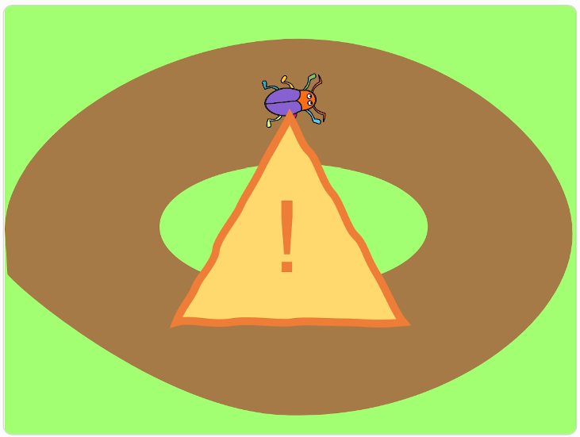
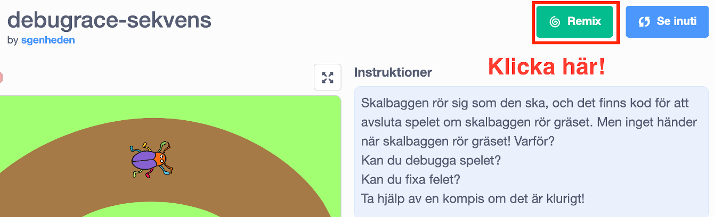
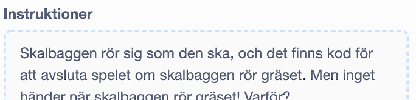

# Debuggning

I denna uppgiften ska du hitta fel i koden för några enklare spel och åtgärda dem. Detta kallas att *debugga*. Du kommer att få öva dig på felsökning och repetera begrepp som du lärt dig tidigare i Kodstugan.

Alla projekt som du ska debugga är olika Bugrace spel med olika slags fel i.

## 1 - Remixa projekt

För att lösa denna uppgift behöver vi första remixa existerande projekt. Vi har alltså skapat ett färdigt Bugrace spel som du ska få debugga och fixa. Det finns 5 projekt:

* <a href="https://scratch.mit.edu/projects/295593809/" target="_blank">Projekt 1</a>
* <a href="https://scratch.mit.edu/projects/324438635/" target="_blank">Projekt 2</a>
* <a href="https://scratch.mit.edu/projects/324438961/" target="_blank">Projekt 3</a>
* <a href="https://scratch.mit.edu/projects/324439741/" target="_blank">Projekt 4</a>
* <a href="https://scratch.mit.edu/projects/334262729/" target="_blank">Projekt 5</a>

För att remixa ett projekt gör följande steg:

1. Öppna din webbläsare och gå till sidan för ett av projekten ovan. Börja med "Projekt 1"

2. Klicka på knappen **"Remix"** så får du en egen version av spelet.

	

	När du har remixat spelet så öppnas Scratch-studion. Du har också fått ett nytt namn på projektet.

3. Döp om till något roligare

	

## 2 - Debugga

Börja med att testa projektet. *Klicka på den gröna flaggan!*

Alla projekten ska fungera på samma sätt: du ska kunna styra skalbaggen över banan och om den rör det gröna gräset ska spelet vara över. I projekt 5 ska skalbaggen däremot börja om från början om den rör gräset.

> Försök förstå varför spelet inte fungerar som det ska:

1. Om du klickar på **Se projektsidan** högt upp i Scratch-studion.

2. Så finns det lite instruktioner för varje projekt:

---

*När du har klarat av att debugga och fixat ett projekt går du vidare till nästa. När du klarat av alla fem är du klara med uppgiften!*

> Du kan hitta ledtrådar om du går vidare till steg 3 i denna uppgift

## 3 - Ledtrådar

Här är några ledtrådar till de fem olika projekten:

**Projekt 1**: det är något fel på **sekvensen** i koden. Tänk på att de olika blocken i ett program behöver köras i rätt ordning.

**Projekt 2**: det är något fel på ett **villkor** i koden. Kom ihåg att ett om-block används för att utföra en del kod när ett villkor är uppfyllt.

**Projekt 3**: det är något fel på en **loop** i koden. Kom ihåg att ett det finns olika typer av loopar som upprepar kod.

**Projekt 4**: det är något fel på **sekvensen** i koden. Försök läsa koden som du läser en bok - uppifrån och ned. Hur fungerar sekvensen? Vad är det för fel på den?

**Projekt 5**: det är något fel på **meddelandena** i koden. När behöver vi skicka meddelanden?
