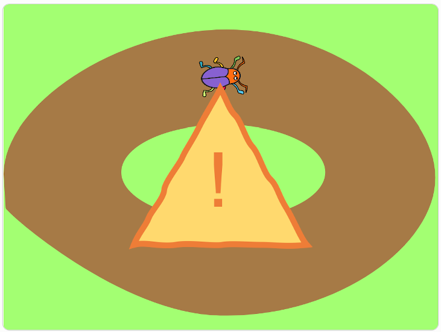
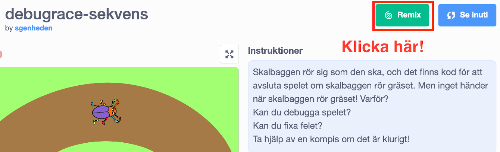

# Debuggning

I denna uppgiften ska du hitta fel i koden för några enklare spel och åtgärda dem. Detta kallas att *debugga*. Du kommer att få öva dig på felsökning och repetera begrepp som du lärt dig tidigare i Kodstugan.

Alla projekt som du ska debugga är olika Bugrace spel med olika slags fel i.

## 1 - Första projektet

För att lösa denna uppgift behöver vi första remixa ett existerande projekt. Vi har alltså skapat ett färdigt Bugrace spel som du ska få debugga och fixa.

1. Öppna din webbläsare och gå till:

	<a href="https://scratch.mit.edu/projects/295593809/" target="_blank">https://scratch.mit.edu/projects/295593809/</a>

2. Klicka på knappen **"Remix"** så får du en egen version av spelet.

	

	När du har remixat spelet så öppnas Scratch-studion. Du har också fått ett nytt namn på projektet.

3. Döp om till något roligare

	

Nu är det upp till dig att debugga programmet och få det att fungera som Bugrace ska fungera.

> Testa programmet: Klicka på den gröna flaggan!

Skalbaggen rör sig som den ska, och det finns kod för att avsluta spelet om skalbaggen rör gräset. Men inget händer när skalbaggen rör gräset! Varför?

> Ledtråd: det är något fel på **sekvensen** i koden. Tänk på att de olika blocken i ett program behöver köras i rätt ordning.

När du har fixat felet så kan du gå vidare till nästa uppgift.

## 2 - Andra projektet  

1. Öppna din webbläsare och gå till:

	<a href="https://scratch.mit.edu/projects/324438635/" target="_blank">https://scratch.mit.edu/projects/324438635/</a>

2. Klicka på knappen **"Remix"** så får du en egen version av spelet.

	När du har remixat spelet så öppnas Scratch-studion. Du har också fått ett nytt namn på projektet.

3. Döp om till något roligare

> Testa programmet: Klicka på den gröna flaggan!

Skalbaggen rör sig som den ska, och det finns kod för att avsluta spelet om skalbaggen rör gräset. Men inget händer när skalbaggen rör gräset! Varför?

> Ledtråd: det är något fel på ett **villkor** i koden. Kom ihåg att ett om-block används för att utföra en del kod när ett villkor är uppfyllt.

När du har fixat felet så kan du gå vidare till nästa uppgift.

## 3 - Tredje projektet

1. Öppna din webbläsare och gå till:

	<a href="https://scratch.mit.edu/projects/324438961/" target="_blank">https://scratch.mit.edu/projects/324438961/</a>

2. Klicka på knappen **"Remix"** så får du en egen version av spelet.

	När du har remixat spelet så öppnas Scratch-studion. Du har också fått ett nytt namn på projektet.

3. Döp om till något roligare

> Testa programmet: Klicka på den gröna flaggan!

Skalbaggen rör sig som den ska när du trycker på den gröna flaggan. Men snart stannar skalbaggen! Varför?

> Ledtråd: det är något fel på en **loop** i koden. Kom ihåg att ett det finns olika typer av loopar som upprepar kod.

När du har fixat felet så kan du gå vidare till nästa uppgift.

## 4 - Fjärde projektet  

1. Öppna din webbläsare och gå till:

 <a href="https://scratch.mit.edu/projects/324439741/" target="_blank">https://scratch.mit.edu/projects/324439741/</a>

2. Klicka på knappen **"Remix"** så får du en egen version av spelet.

 När du har remixat spelet så öppnas Scratch-studion. Du har också fått ett nytt namn på projektet.

3. Döp om till något roligare

> Testa programmet: Klicka på den gröna flaggan!

Samma spel som vanligt: skalbaggen ska röra sig över banan och spelet ska avslutas när den rör gräset. Men här har lite andra block använts och spelet fungerar inte som det är tänkt!

> Ledtråd: det är något fel på **sekvensen** i koden. Försök läsa koden som du läser en bok - uppifrån och ned. Hur fungerar sekvensen? Vad är det för fel på den?

När du har fixat felet så kan du gå vidare till nästa uppgift.

## 5 - Femte projektet

1. Öppna din webbläsare och gå till:

 <a href="https://scratch.mit.edu/projects/334262729/" target="_blank">https://scratch.mit.edu/projects/334262729/</a>

2. Klicka på knappen **"Remix"** så får du en egen version av spelet.

 När du har remixat spelet så öppnas Scratch-studion. Du har också fått ett nytt namn på projektet.

3. Döp om till något roligare

> Testa programmet: Klicka på den gröna flaggan!

Nu tänker vi oss att skalbaggen ska börja om från början när den rör gräset istället för att avsluta spelet.
Vi har börjat på spelet men det fungerar in som det ska!

> Ledtråd: det är något fel på **meddelandena** i koden. När behöver vi skicka meddelanden?

När du har fixat felet så är du klar med uppgiften!
