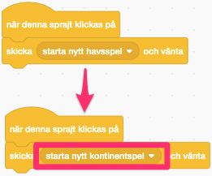

# Hav och kontinenter

I denna uppgift ska du få skapa en prototyp till frågesport som du till exempel kan använda i skolan. Först ska du få koda ett spel som går ut på att gissa var olika hav ligger. Om du vill, kommer du att få utöka programmet med frågor om var olika kontinenter ligger. Även om det i detta exempel är ett geografispel, kan frågesporten också göras på helt andra teman, allt från att gissa djur till ABC-spel eller matematikfrågor! I uppgiften kommer du få använda dig av många funktioner och sprajtar.

  

Ett exempel på hur  spelet kan se ut ser du här: <a href="https://scratch.mit.edu/projects/301691594/" target="_blank">https://scratch.mit.edu/projects/301691594/</a>

## 1: Bakgrund och två sprajtar

1.	Skapa ett nytt projekt och ta bort katten.

2.	Som bakgrund behöver du en världskarta. En sådan kan du hitta genom att söka på nätet eller så kan du välja en från  <a href="https://commons.wikimedia.org/wiki/Category:Blank_maps_of_the_world" target="_blank">Wikimedia</a>. Spara bilden på din dator och ladda upp den som bakgrund i ditt Scratch projekt.

  > **_Kan jag använda bilder som jag hittar på nätet?_**
*Om du vill använda bilder från nätet, tänk på att det måste vara en bild som du har tillåtelse att använda för personen som skapat den. De flesta bilder på nätet är* ***_upphovsrättsskyddade_***, *vilket innebär att du inte får använda dem utan att fråga om lov först. Men det finns bilder som är ok att använda, till exempel om du söker med* <a href="http://search.creativecommons.org/" target="_blank"> *Creative Commons sökmotor.* </a>

3.	Nu behöver du en knapp för att starta frågesporten. Sätt den i ett hörn av spelplanen.
    Här har jag använt mig av en knapp från biblioteket som jag skrivit en text på.

4. Sätt namnet på sprajten till **Hav_knapp**

5.	Rita en ny sprajt och gör den till en ganska liten cirkel. Det är denna sprajt som du ska klicka på för att **gissa på olika hav** så till att den är **fylld**. Dra sprajten så att den ligger i **”Indiska oceanen”** på kartan.

## 2: En variabel och en lista

1.	Skapa en variabel för alla sprajter som heter **”poäng”**. Variabler hittar du under kategorin som heter **Variabler**.

Denna variabel kommer du använda för att hålla reda på hur många poäng du har.

2.	Skapa en lista för all sprajter som heter **”alternativ”**. Listor hittar du också under kategorin **Variabler**

  > En **lista** är en speciell typ av variabler som kan innehålla flera värden. Om du tänker dig att en variabel är som en låda för ett värde eller en sak, så är en lista en låda som det får plats flera olika saker i.

 Här kommer vi använda listan för att hålla reda på de olika sakerna som spelaren kan gissa på. Först kommer vi se till att det finns olika hav i listan.

## 3: Starta spelet

Nu ska du få koda vad som händer om du klickar på knappen **Hav_knapp**!

1.	Skapa ett skript för sprajten **Hav_knapp** som säger:

  * Startar när sprajten klickas på

  * Skicka meddelandet **”starta nytt havsspel”**

  

2. Skapa ett till skript för sprajten som startar när den tar emot meddelandet **”starta nytt havsspel”**:

  * Sätt **"poäng"** till **0**

  * **ta bort alla** i listan **”alternativ”**

  * **Lägg** till **Indiska oceanen** i **"alternativ"**

  * **Lägg** till **Atlanten** i **"alternativ"**

  * **Lägg** till **Stilla havet** i **"alternativ"**

  * **Skicka** meddelandet **"fråga hav"**

  

> Testa spelet! Läggs det till olika hav i listan när du klickar på sprajten?

## 4: Ställ en fråga

Nu ska du få programmera vad som händer när meddelandet **"fråga hav"** skickas.

9.	Skapa en variabel som heter **”rätt svar”**. Den ska inte visas på skärmen.

Denna variabel ska peka på det svarsalternativ som är rätt. Det vill säga den plats i listan **"alternativ"** som är rätt.

10.	Skapa ett nytt som skript för **Hav_knapp**  som startar när den tar emot meddelandet **"fråga hav"**:

  *	Sätt **”rätt svar”** till ett **slumptal** mellan **1** och **längden på ”gissningar”** 

  *	Säg **”Var ligger ”** + **objekt ”rätt svar” i "alternativ"** + **”?”**.   

  

> Testa spelet! Får du en fråga när du klickar på Hav_knappen?

## 5: Svara med ett klick

Nu ska du göra så att du eller någon annan kan gissa på olika hav genom att klicka på hav-prickar.

Du skapade en sådan sprajt ovan och det ska bli enkelt att skapa fler sådana prickar utan för mycket kod. Först kommer du koda en prick, och sen kommer du kopiera den pricken så du får tre olika prickar.

1.	Skapa en variabel för alla sprajter som heter **”svar”**. Den ska inte visas på skärmen.

2. Skapa ett skript för sprajten **Sprajt1** (cirkeln du ritade) som säger:

    * När START klickas på

    * **Göm**

3. Skapa et till skript för  **Sprajt1** som säger:

    * När **meddelandet "start nytt havsspel** tas emot

    * **Visa**

    

3.	Skapa ett tredje skript för **Sprajt1** som säger:

  * Startar när den klickas på

  * Sätt **"svar”** till **1**

  * Skickar meddelandet **”rätta hav”**

  * Säg **objekt 1** i **”alternativ”** i 2 sekunder.

  

> Du använder dig av **1** här eftersom pricken är placerad i Indiska oceanen och det är den plats i listan som just det här havet har.

Nu kan du skapa fler prickar!

6.	Kopiera **Sprajt1** och placera kopian på **"Atlanten"** på kartan.

7.	**Ändra skriptet** som körs när sprajten klickas på. *Se till att **1:orna** byts ut mot **2:or***

8.	Repetera punkterna 6 och 7 men placera den tredje pricken i Stilla havet och byt ut **1:orna** till **3:or**.

> Vad händer nu om du klickar på de olika prickarna? Visar de rätt namn?

## 6: Rätta gissningen

Nu fattas bara att du kontrollerar så att spelaren klickar på rätt prick.

1.	Skapa ett skript för **Hav_knapp** som säger

  * Startar när den tar emot meddelandet **”rätta hav”**

  * Om **"svar"** = **"rätt svar"** då:

    * Öka **"poäng"** med **1**

    * Skicka **meddelandet "fråga hav"**

  * Annars:

    * Tänk **"Tyvärr det var fel.  Ny fråga kommer snart...”** i 2 sekunder

    * Skicka meddelandet **”starta nytt havsspel”**

  > Nu ska du ha en första fungerande version av spelet. Testa! Ökar poängen om du gissar på rätt hav? Nollställs poängen om du gissar fel?

## 7: Kontinenter - knappen

Nu ska du få utöka programmet med ett spel som går ut på att gissa kontinenter. Du kommer att kopiera mycket kod från sprajtar du redan kodat. Detta är något programmerare gör ofta eftersom det är enklare än att skapa samma kod igen.

1.	Kopiera sprajten **Hav_knapp** och placera den i ett annat hörn. Rita om knappen så att den ser annorlunda ut

2.  Döp den nya sprajten till **Kontinent_knapp**

2.	Ändra i den nya sprajten **Kontinent_knapp** så att den skickar meddelandet **”starta nytt kontinentspel”** i stället för **”starta nytt havsspel”** när den klickas på.

3.	Ändra också på andra stället så att den kör kod när den tar emot **”starta nytt kontinentspel”**.

4.	Ta bort insättningarna av **haven** i listan och sätt istället in 5 **kontinenter**

5.  Ändra så att meddelandet **"fråga kontinent"** skickas

6.	Ändra så att den kör kod för att rätta spelet när den tar emot meddelandet **”rätta kontinent”** istället för **”rätta hav”**.

> Nu ska knappen fungera. Vad händer om du klickar på den? Frågar den efter en kontinent?

## 8: Kontinenter - svara

Nästa steg är att lägga till prickar för de olika kontinenterna.

6.	**Kopiera** en av **hav-prickarna**. Rita om klädseln så att den har en annan färg.

7.	Ändra **”rätta hav”** till **”rätta kontinent”** så att rätt meddelandet skickas

8.	Ändra i skriptet att **svar** ändras till rätt siffra.

9.	**Kopiera** denna prick **5 gånger** och placera ut dem på de olika kontinenterna

## Färdig!
Grattis, nu har du gjort klart uppgiften.

**Glöm inte att spara ditt projekt!** Döp det gärna till uppgiftens namn så att du enkelt kan hitta den igen.

> **Testa ditt projekt**  
  Visa gärna någon det som du har gjort och låt dem testa. Tryck på DELA för att andra ska kunna hitta spelet på Scratch. Gå ut till projektsidan och låt någon annan testa spelet!

## Utmaningar

### Göm och visa prickar

Det är väldigt många prickar på spelplanen. Det vore bra om hav-prickarna försvinner när du gissar på kontinent och att kontinent-prickarna försvinner när du gissar på hav. Kan du fixa det?

### Gissa flera gånger

Nu förlorar du genast alla poäng om du gissar fel. Ett alternativ är att du får fler chanser. Kan du koda det?

**Tips:** Ändra i koden för **Hav_knapp** som körs när den tar emot meddelandet **"rätta hav"**.

En annan idé är att hålla reda på vilka hav eller kontinenter användaren har gissat på. Då får spelaren bara en chans per hav eller kontinent och så avslutas spelet när hen har gissat på alla. Du kan till exempel avsluta med meddelandet "Du klarade 2 av 3 hav"!

**Tips:** Använd en lista för att spara vilka värden  variabeln **"rätt svar"** har haft. Då kan du se till att dessa inte slumpas fram igen genom att använda ett **"innerhåller"**-block.

### Lägg till ett nytt spel

Du kan till exempel lägga till ett spel går ut på att gissa länder.

## Frågeställningar

* Varför var det bra att koda en svar-sprajt först och sedan kopiera den?

* Vad är en lista?

* Varför var det viktigt att hålla reda på vilken siffra du skrev in i skripten för de olika svar-sprajtarna?
