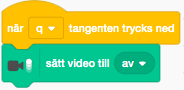
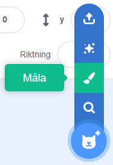
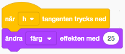

# Photo Booth

Nu kommer du att få skapa en Photo Booth-app där du kan ändra din egen bild från webbkameran till att bli det som du drömmer om att vara. Det är din fantasi som styr vad ditt program ska innehålla, här får du tips på hur du kan byta frisyr, sätta dit solglasögon eller kanske en stilig mustasch!

Här kan du titta på exempel på
 <a href="https://scratch.mit.edu/projects/98186215/" target="_blank">Photo Booth</a> och en <a href="https://scratch.mit.edu/projects/103740293/" target="_blank">Disco-version</a> på Scratch.

## 1: Få igång webbkameran

Det första du ska göra är att programmera ett skript som sätter igång webbkameran och visar dig i bild så fort du startar ditt Photo Booth-program.

1. Skapa ett nytt Scratch-projekt och ta bort katten.

2. Klicka på **Lägg till ett tillägg** längst ner till vänster på skärmen.

    

3. I fönstret som dyker upp väljer du tillägget **Video - känna av**

    

Nu har du fått en rad nya block som du kan styra din kamera med. Då ska vi koda att kameran ska startas när du trycker igång di Photo Booth. Gör såhär:

4. Klicka på SCEN längst ned till höger och gå in på fliken KOD högst upp till vänster - så du ser Scenens tomma kodyta för skript.

3. Dra ut ett block för **HÄNDELSER**: **"när START (flaggan) klickas på”** till skriptytan. Under den kopplar du fast blocket för **sätt video till på**.

4. Till samma skript fäster du blocket för **”sätt videotransparens till”** och sätt värdet till 0, alltså inte genomskinligt alls.

    
    
Nu ska din kamera komma igång när du trycker på den gröna START-flaggan ovanför Scen.

> Testa ditt projekt. Klicka på START (gröna flaggan). Du kasnke får upp en popup-ruta som frågar ifall du vill att Scratch får tillgång till din webbkamera. Välj "*Tillåt*" eller "*Allow*” på engelska. Ser du dig själv nu i bild? 

## 2 : Kunna stänga av webbkameran

Du ska kunna stänga av din kamera när du vill såklart! Därför lägger vi till ett skript som stänger av kameran när du trycker på Q-tangenten på tangentbordet.  Det skriptet skapar du för scenen, precis som när du startade kameran.

1. Markera SCEN längst ned till vänster och gå in på fliken KOD. Dra ut ett block för **”när trycks ned”** från **HÄNDELSER** till skriptytan. Under den kopplar du fast blocket för **KÄNNA AV**: **”sätt video AV”**.

    

2. Välj vilken tangent som ska tryckas ned för att stänga av kameran. Här i exemplet har vi valt "Q” som i *Quit*.

    

> Testa ditt projekt! Klicka på den gröna START-flaggan för att slå på kameran. Går det sen att stänga av webbkameran med Q-tangenten? Slå på kameran igen med gröna START-flaggan om du vill.

## 3: Ändra utseende med effekter

Då börjar vi skapa en Photo Booth med effekter. I vårt exempel har vi byggt den såhär som i bilden nedan, men du väljer själv hur du vill att din Photobooth ska se ut och vart knapparna för dina effekter ska placeras. 

  

Nu är det dax att skapa exempelvis frisyrer, glasögon, mustascher eller andra effekter som du kan välja att lägga till din bild för att ändra utseende i din Photo Booth. Du skapar dem som SPRAJTAR och väljer om du vill rita själv eller välja ur biblioteket. Börja med att göra 2-3 sprajtar, du kan alltid göra fler senare!

> **_Kan jag använda bilder som jag hittar på nätet?_**
*De flesta bilder på nätet är* ***_upphovsrättsskyddade_***, *vilket innebär att du inte får använda dem utan att fråga om lov först av den som skapat bilden. Men det finns många bilder som är ok att använda, till exempel om du söker bilder genom* <a href="http://search.creativecommons.org/" target="_blank"> *Creative Commons sökmotor.* </a>

1. För att rita egen ny sprajt, håll muspekaren över **Välj en sprajt**, så får du fram fler val. Välj **"Måla”** (penseln). Här får du själv hitta på och prova dig fram för att skapa egna sprajtar som blir dina effekter. Om du hellre vill använda färdiga sprajtar, gå till biblioteket genom att trycka på direkt på knappen för **”Välj en sprajt”**.

    
    

2. Dra sprajtarna dit där du vill ha dem på scenen. Testa med ditt ansikte i bild så att det ser bra ut! Döp gärna sprajtarna till **"Peruk”**, **”Glasögon”** och så vidare efter vad de föreställer.

3. Om du behöver ändra storlek på sprajten, skriv in ett nytt värde i textrutan nedanför scenen tills den är lagom stor.

    

För att din sprajt alltid ska hamna rätt på scenen, behöver du sätta en *startposition*. Alltså en plats där den alltid startar ifrån. Sedan kommer du så klart att kunna dra runt på effekterna i ditt färdiga program, för att passa in på olika ansikten.

4. Gå till fliken för KOD för din effekt, där du kan skapa SKRIPT för din sprajt. Dra ut blocket **"när START (flaggan) klickas på”** från **HÄNDELSER** till skriptytan. Under den kopplar du fast blocket för **RÖRELSE**: **”gå till X  Y ”**.

5. Dra in ett block **Känna av** till **sätt dragläge till dragbar** så att du kan dra blocket på scenen.

    

6. Gör nu ett likadant skript för alla dina sprajtar, med den X- och Y-position som stämmer med där du vill att just den sprajten ska hamna när effekten slås på. **Ett tips**: om du placerar sprajten där du vill att den ska starta på Scen *innan* du drar ut blocket från RÖRELSE: ”gå till X  Y ”., så sätts positionen för X och Y automatiskt i blocket. 

> Testa ditt projekt! Klicka på START. Startar dina effekter där du vill ha dem i din Photo Booth? Kan du dra runt med effekterna på Scen och passa in dem på ditt ansikte?

## 4: Knappar för att välja effekt

Nästa steg är att skapa en meny med knappar för att välja effekt i ditt Photo Booth. När du startar ditt Photo Booth ska inga effekter vara synliga, utan det blir de först när du trycker på knapparna. Du behöver en knapp för varje effekt du vill använda. De blir som små kopierade bilder av dina olika effekter. Gör såhär:

1. Börja med att göra en sprajt som ska vara menyrad. Välj **"Måla”** (penseln) och använd REKTANGEL för att skapa en menyrad i valfri färg. Tänk på att göra rektangeln tillräckligt stor för alla dina knappar – men inte för stor, du vill ju kunna se dig själv i bild också!

    

*Så här kan en menyrad se ut när du ritar den.*

2. Dra din menyrad dit du vill ha den på Scen: på sidan, nere eller upptill i bild.

Nu behöver du kopiera dina sprajtar som du har gjort för olika effekter, en och en. Gör såhär:

3. Högerklicka på sprajten och välja kopiera.

  
  
 De kopierade sprajtarna ska fungera som knappar för dina olika effekter, att slå dem av och på med.

 4. Döp sprajtarna till **"Knapp ….”** och din effekt. 

 
 
 *Namnet går att ändra under scenen för vardera sprajt i ditt sprajtbibliotek.*

 5. Du behöver förminska knapp-sprajten så att de får plats i din menyrad.

 6. Dra knapp-sprajten till menyraden och lägg alla i en rad så att de får plats.

    

*Så här kan en menyrad med effekternas olika knappar se ut på scen i din Photo Booth.*

7. Sätt rätt *startposition* i menyraden för varje knapp, på samma sätt som du gjorde med dina effekter tidigare. Alltså såhär:

8. Dra ut kod-blocket **"när START (flaggan) klickas på”** från **HÄNDELSER** till skriptytan för varje knapp-sprajt. Under detta kodblock kopplar du fast blocket för **RÖRELSE**: **”gå till X  Y ”**.

9. Dra sen in ett block **KÄNNA AV**: **sätt dragläge till...** och ändra *dragbar* till **inte dragbar** så att knapparna i menyraden inte kan dras över scenen när den är i *fullskärmsläge*. De ska ju alltid vara på sin plats i menyn.

    

## 5: Koppla knapparna till effekt

Nu ska du få göra ett skript som säger åt knappen att **skicka meddelande** till effekten. Det är ett sätt för olika delar i programmet att kunna "prata” med varandra. Du kommer snart att se varför det är bra att ha!

1. Välj en knapp och gå till fliken för KOD. Dra ut ett block för **HÄNDELSER**: **”när denna sprajt klickas på”** till skriptytan.

2. Nu ska du koda så att knappen ska **skicka meddelande** när du klickar på den. I **HÄNDELSER** hittar du blocket **"skicka... ”**, fäst blocket till det ovan och ändra till ett *nytt meddelande* i rullistan. Skriv in namnet på den effekt som knappen ska skicka sitt meddelande till, till exempel *”glasögon”*.

    

Nu måste du se till att sprajten med den rätta effekten kan ta emot knappens skickade meddelande. Gör såhär: 

3. Markera sprajten som föreställer den effekt som knappen ska skicka meddelande till (exempelvis sprajten för effekten *glasögon*). Gå till fliken för KOD och under **HÄNDELSER** drar du ut blocket **”när jag tar emot...”**. Välj rätt meddelandet för just din effekt i rullistan, till exempel meddelandet *”glasögon”*.

4. Fäst blocket för **”visa”** som du hittar under **UTSEENDE**. Nu har du sagt åt din effekt-sprajt att visa sig när den får meddelandet från knappen. Men du behöver också säga åt effekt-sprajten att gömma sig innan knappen har skcikat sitt meddelande, så den inte syns för tidigt.

    

5. Dra ut blocket för **”göm”** som också finns under **UTSEENDE** och fäst det direkt under din startposition, alltså under **”när START (flaggan) klickas på”**. Det gör att när Photo Booth startas är effekt-sprajten alltid gömd tills knappen skickar meddelandet att den ska visa sig.

    

6. Nu behöver du göra likadana skript för alla dina knappar och alla effekter. Du kan kopiera skript genom att högerklicka, välja kopiera och sedan dra det till nästa sprajt. Byt namn på meddelandet för varje knapp-sprajt och effekt-sprajt så att de stämmer överens med vardera knapp/effekt (ex. *peruk*, *mun*...)

**Tips:** Ibland hamnar effekterna på varandra i fel ordning, så att till exempel en hatt hamnar under en peruk istället för tvärtom. Om det händer kan du lägga till **gå till "översta" lagret** eller **”gå ned 1 lager”** från **UTSEENDE** och välja vilken ordning du vill att effekterna ska ligga ovanpå varandra.

> Testa ditt projekt! Klicka på START. Öppna Photo Booth i fullskärms-läge. Är alla effekter gömda när du startar programmet? Ser du dig själv i din Photo Booth med kameran? Händer det något när du trycker på knapparna? Hamnar effekterna i rätt ordning? Kan du flytta runt dina effekter? Sitter dina knappar fast i menyraden?

## Färdig!
Grattis, nu har du ett färdigt program.

**Glöm inte att spara ditt projekt!** Döp ditt projekt i rutan högst upp till vänster så att du enkelt kan hitta det igen.

> **Testa ditt projekt**
Visa gärna någon det som du har gjort och låt dem testa. Tryck på DELA-knappen om du vill att andra ska kunna hitta projektet på Scratch och se och prova det. Gå ut till projektsidan och låt någon testa.

> **Varför kan jag inte ta bilder med mitt Photo Booth för att spara?**
Det finns inget sätt att spara bilden från webbkameran i Scratch. Så ditt Photo Booth kommer inte att kunna spara bilder på dig utan bara vara för att testa olika effekter live.
Det handlar om din ***_integritet på nätet_***. Scratch får inte göra det möjligt för dig eller någon annan att programmera något som sparar bilder eller film på den som använder programmet.

## Utmaningar

Nu är det fritt fram att hitta på dina helt egna funktioner till ditt program – eller fortsätta med någon av våra utmaningar som finns här i instruktionen:

* Ta bort en effekt

* Ändra färg på din effekt

* Ändra storlek på din effekt

* Ramar

### Ta bort en effekt

Det kan vara användbart med en funktion som tar bort effekter allt eftersom du provar dem och väljer ditt utseende. På så sätt kan du ångra dina val. Här får du göra ett skript som gömmer effekten igen om du trycker ned mellanslag-tangenten (Space) samtidigt som du klickar på effektknappen.

1. Gå in på fliken för KOD på en av dina effekter. Dra ut blocket **"om <> då: annars”** som finns under **KONTROLL** och lägg på skriptytan.

2. Under **KÄNNA AV** finns blocket "**tangent nedtryckt?”**. Välj **”mellanslag”** ur rullistan och fäst blocket inuti **<>** på **”om <> då: annars”**.

3. Flytta ditt block **"visa”** som sitter under **”när jag tar emot ”** och fäst det efter **”annars”**. Ta ett nytt block för **”göm”** under **UTSEENDE** och fäst det efter **”om <> då”**.

4. Fäst hela skriptet till händelsen **”när jag tar emot ”** med meddelandet. Nu ska skriptet säga att:

	* När sprajten tar emot meddelandet

	* Om mellanslag är nedtryckt

	* Göm sprajten

	* Annars visa sprajten

	* Välj vilken ordning sprajten ska hamna på scenen, om det behövs

   

5. Gör samma ändringar i skriptet för alla dina effekter!

> Testa ditt projekt! Klicka på START. Visar sig effekterna när du klickar på knapparna? Gömmer de sig igen när du håller ned mellanslag (Space) samtidigt som du klickar på knappen?

### Ändra utseende på dina effekter

Om du har gjort en peruk, ett par läppar eller en mustasch, kanske du vill kunna ändra färg på dem? Eller ändra något annat med effektens utseende, till exempel göra olika sorters mustascher eller frisyrer? Istället för att göra massor av sprajtar, kan du ha flera olika KLÄDSLAR till dina sprajtar.

1. Markera sprajten och gå in på fliken som heter KLÄDSLAR.

2. Kopiera den klädsel som ligger där genom att högerklicka och välja kopiera. Gör så många klädslar som du vill ha olika utseende.

3. Markera varje klädsel och ändra utseendet så som du vill ha det. För att ändra färg, använd FYLL MED FÄRG (färgburken). Du väljer bland färgerna ovanför i paletten. Klicka på klädseln för att fylla i med färgen.

4. Gå till fliken för KOD. För att byta mellan olika klädslar, välj från **HÄNDELSER**: **”när (…) trycks ned”** och välj vilken tangent på tangentbordet som du ska använda för att byta klädsel. Du kan till exempel välja ”H” för hår eller ”M” för mustasch.

5. Fäst blocket för **”nästa klädsel”** från **UTSEENDE** till skriptet.

    

> Testa ditt projekt! Klicka på START. Kan du ändra utseende på din effekt genom att trycka på den tangent som du har angett i skriptet?

**Tips:** Ett annat sätt att byta färg är att använda blocket för att **”ändra färgeffekten”** som finns under **UTSEENDE**. Då behöver du inte skapa olika klädslar.

### Ändra storlek på dina effekter

Du vill kanske också kunna ändra storlek på effekterna, så att de kan passa ansikten som är olika stora i bild. Här får du göra ett skript som låter dig ändra storlek genom att klicka på effekten. Den blir större om du klickar på den, och mindre om du samtidigt håller in mellanslag på tangentbordet.

1. Gå till fliken för KOD. Välj **”när denna sprajt klickas på”** från **HÄNDELSER** och under den sätter du blocket **”om <> då: annars”** som finns under **KONTROLL**.

2. Fäst blocket för **”ändra storlek med ”** från **UTSEENDE** till skriptet, ett under **”då”** och ett under **”annars”**. Testa dig fram med vilket värde du vill ha, alltså hur mycket mindre eller större effekten ska bli. För att förminska effekten ska det vara ett minusvärde. I vårt exempel använder vi -10 och 10 som värden.

    

> Testa ditt projekt! Klicka på START. Kan du göra effekten större genom att klicka på den? Blir den mindre om du håller in mellanslag samtidigt som du klickar på den?

### Ramar

Du kan göra ramar som går att välja till bilden i ditt Photo Booth.  Om du inte har plats i menyraden för en till knapp, kan du låta användaren välja ram med R-tangenten på tangentbordet.

1. Gör en ny sprajt med **"Rita ny sprajt”** (penseln) och använd LINJE eller PENSEL för att rita ramar. Öka linjebredden och titta på scenen så att ramen hamnar rätt.

2. Gå till fliken för SKRIPT och gör ett likadant skript som för alla dina andra effekter. Om du inte gör en ram-knapp i din menyrad, välj **”när  trycks ned”** från **HÄNDELSER** och ange till exempel ”R” som tangent som ska tryckas ned.

3. Vill du kunna växla mellan flera ramar, rita flera KLÄDSLAR och sätt ett skript som säger att **"när denna sprajt klickas på”** då ska sprajten välja **”nästa klädsel”**.

    

> Testa ditt projekt! Klicka på START. Kan du få en ram runt din bild när du trycker på R-tangenten? Går det att byta ram genom att klicka på den?

**Klart!** Nu kan du hitta på egna funktioner eller skapa ännu fler effekter till ditt Photo Booth. Knaske lite effektljud? Lycka till!

## Frågeställningar

* Varför tror du att det inte är möjligt att spara bilder från kameran i Scratch?

* Vad för funktion, som inte är tillgänglig i Scratch, skulle du vilja lägga till i programmet?

* Hur kan du hitta fler bilder för ditt program?
