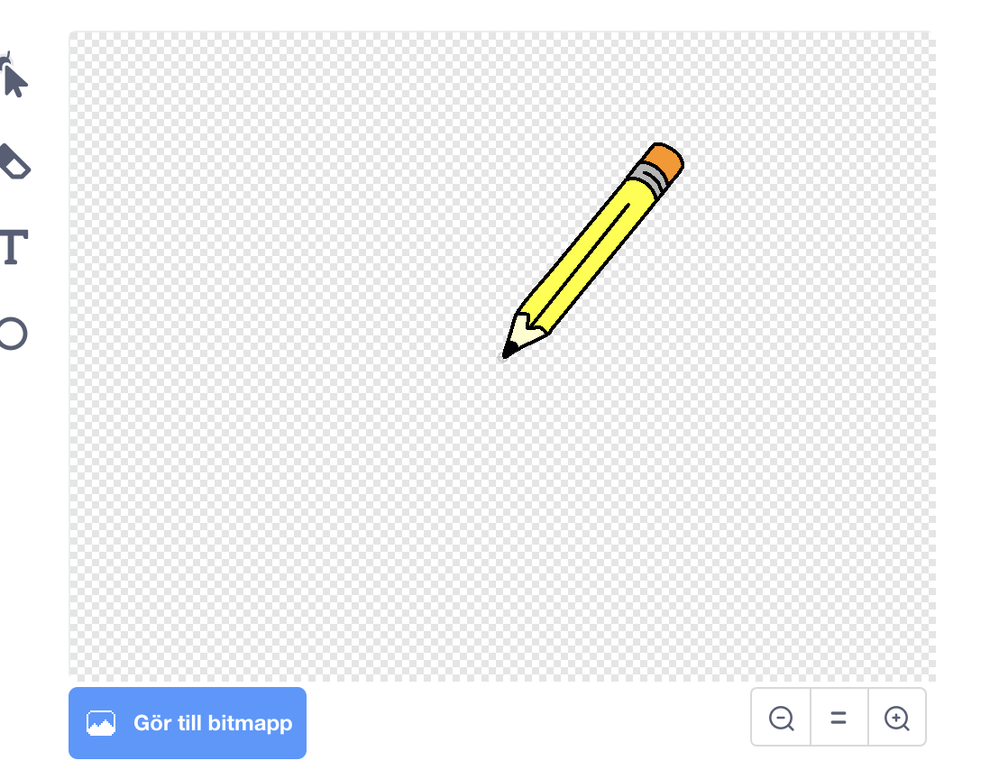
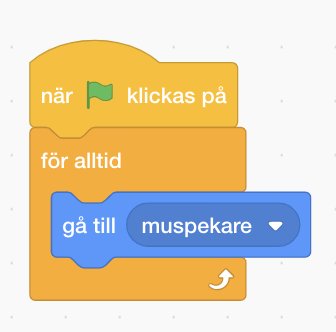
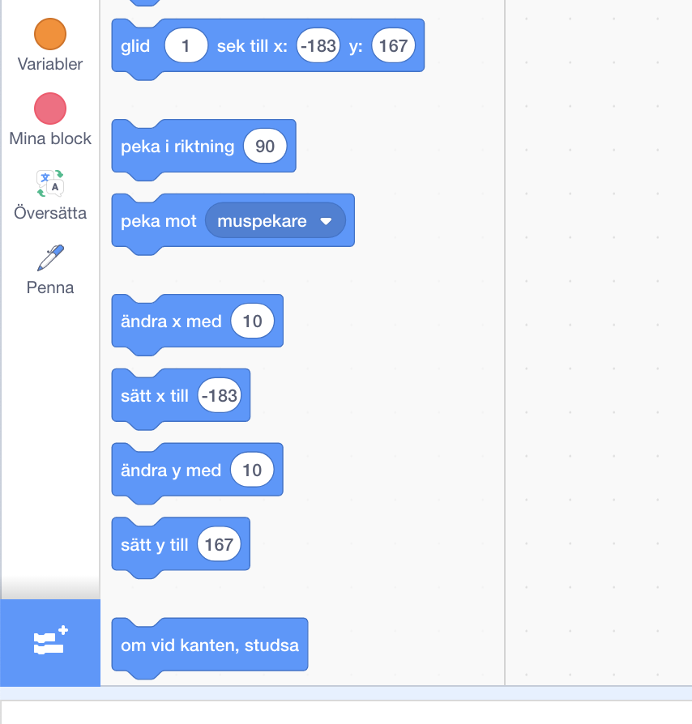
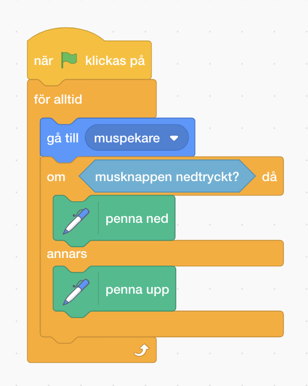
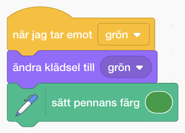
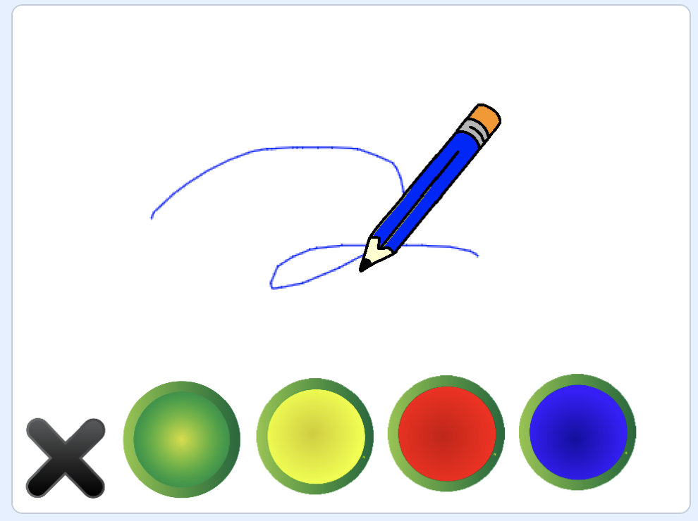
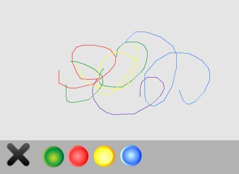
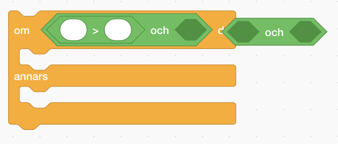
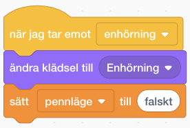
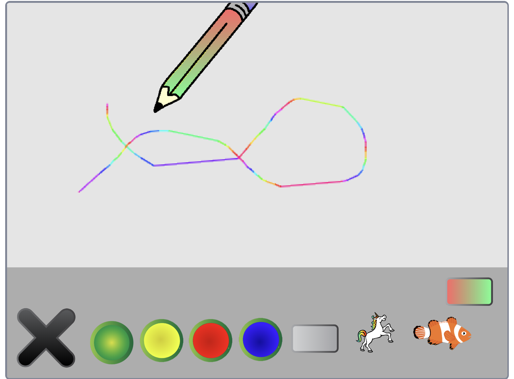

# Ritprogram

Nu kommer du att få skapa ett ritprogram där du sedan kan göra egna konstverk! Programmet låter dig rita med olika färgpennor, sudda med suddgummi och måla med stämplar som du själv väljer.

Du kan se ett exempel på ritprogrammet här: <a href="https://scratch.mit.edu/projects/82515788/" target="_blank">https://scratch.mit.edu/projects/82515788</a>

## 1: En penna som kan rita

Börja med att skapa en penna som ritar när du drar runt den på scenen.

1. Skapa ett nytt Scratch-projekt och ta bort katten. Välj en ny *sprajt*: Sök på *Pencil* och lägg till den.

2. Gå till fliken *Klädslar*. Flytta pennans spets till sprajtens *centrum*, genom att flytta korsets mittpunkt dit. Det är viktigt för att pennan ska kunna rita från spetsen!

  

3. Skapa ett *skript* för pennan som säger:

  * Starta när *Start-flaggan* klickas på
  * **För alltid gå till** muspekaren

  

  Nu vill du kunna använda *sprajten* som en riktig penna, som du kan styra med musen och rita med genom att trycka ned musknappen.
  För att kunna göra det så måste du lägga till ett *tillägg*. Det gör du genom att klicka längst ned till vänster på *Lägg till ett tillägg*

  

  Sedan kan du klicka på kategorin **Penna**, här finns alla block som har att göra med att kunna rita.

4. Skapa ett skript som säger att när musknappen är nedtryckt ska pennan vara nere, och annars ska pennan vara uppe. Lägg ett **KONTROLL** -block i ditt första skript, som säger att:

  * OM **musknappen** är **nedtryckt** ska **penna** vara **ned**

  * ANNARS ska **penna** vara **upp**

  

> Testa ditt projekt! Klicka på START. Följer pennan muspekaren? Vad händer om du håller nere musknappen och flyttar musen? (Tänk inte på vilken färg pennan har, det kommer du till senare!)
> Testa att stänga av och starta programmet på nytt. Märker du att det du har ritat fortsätter att vara kvar? Det behöver du ändra på!

5. Lägg till blocket **radera** (finns under **PENNA**), precis ovanför **för alltid-loopen**. Då raderas allt som blivit ritat när programmet startas på nytt.

> Testa ditt projekt! Klicka på START. Försvinner din teckning när du klickar på den gröna flaggan?

## 2: Radera allt

Nu vill du lägga till en knapp som suddar hela teckningen så att du inte behöver starta och stoppa projektet varje gång. Här i exemplet används ett kryss, men du kan välja att göra en egen knapp.

6. Lägg till *sprajten* **Button5**.  

7. Byt namn på *sprajten* till **"Radera"**. Förminska den så att den inte tar för stor plats på scenen och placera knappen* *där du vill ha den, t ex längst ner till vänster.

8. Skapa ett *skript* som säger att den ska **radera** allt när du **klickar på** *sprajten*. Detta kräver endast två block, kan du lista ut vilka? Titta annars hur du gjorde i skriptet för *sprajten* **"penna"**.

> Testa ditt projekt! Klicka på START och rita något. Kan du sudda hela teckningen genom att klicka på *sprajten* **"radera"**?

## 3: Byta färg på pennan

Än så länge kan du bara rita blåa streck men det ska så klart gå att rita med andra färger! För att göra det behöver du först nya *sprajter* för olika färgade knappar som du ska kunna klicka på för att ändra färg på pennan.

9. Välj en *sprajt* som ser ut som en knapp, t ex **Button1** och ge den namnet **"grön knapp"**. Förminska knappen så att du får plats med flera bredvid varandra, och placera den till exempel längst ned på scenen bredvid **"radera"**-knappen.

10. Skapa ett *skript* för *sprajten* **"grön knapp"** som säger:

  * Starta när *sprajten* **klickas på**

  * **Skicka** meddelandet **"grön"**

  

  Det är allt som knappen behöver göra! Själva jobbet med att byta färg görs av *sprajten* **"penna"**.

11. Klicka på *sprajten* **"penna"** och gå in på *Klädslar*. Här finns två klädslar som båda föreställer gula pennor. Ta bort en av klädslarna. Kopiera den du behållit – en gång för varje färg du vill ha: t ex grön, röd, blå.

12. Markera de kopierade klädslarna, klicka på knappen Konvertera till bitmap och ändra sedan färg på varje klädsel med färgburken. Se till så att alla *klädslar* får olika färg.

13. Byt namn på *klädslarna* så att de heter som sin färg, t ex **"grön"**.

14. Skapa nu ett nytt *skript* för *sprajten* **"penna"** som säger:

  * Starta när den **tar emot** *meddelandet* **"grön"**

  * Då **ändra klädsel till** **"grön"**

  * Sedan **sätt pennans färg till** *grön*

  

**Tips:** Klicka på den färgade rutan i blocket **sätt pennans färg till** och klicka sedan på din gröna knapp på scenen, så får du rätt färg att rita med.

> Klicka på START och rita något. Klicka nu på den gröna knappen och rita igen. Byter pennan klädsel? Ritar den i grönt nu? Ritar den från pennspetsen?

Nu ska du få göra fler knappar för alla olika färger, och skript som ändrar pennans färg när du klickar på knappen.

15. Kopiera *sprajten* **"grön knapp"** så att du har lika många knappar som du vill ha färger. Om du tittar på skript-fliken ser du att även skriptet har kopierats.

16. Börja med att döpa om knapparna till t ex **"gul knapp"**, **"röd knapp"**, **"blå knapp"** och placera dem där du vill ha dem på scenen, förslagsvis i en rad längst ned.

17. Nu behöver du byta färg på knapparna. Gå in under *klädslar*.
Rita en ny cirkel ovanför den förra.

    

**Tips:** Använd tonade färger för att få knapparna att blänka! Det gör du med färghinken efter att du ritat en ny cirkel. Blanda t.ex. mörkblått och blått för att få till en tonad blå knapp. Om knappen ser för ljus ut, som t ex den gula knappen, tona mot en mörkare färg.

Ungefär så här borde din knapprad se ut på scenen:

18. Nu behöver du ändra i *skripten* för varje *sprajt*. De ska **skicka meddelande** för sin färg när de **klickas på**.

19. Gå sedan till *sprajten* **"Pencil"**. Kopiera *skriptet* som **tar emot** *meddelande*, och gör ett sådant skript för varje ny färg. Skripten ska **byta klädsel** och **ändra pennans färg** till den färg som meddelandet anger.

> Testa ditt projekt! Klicka på START och rita något. Klicka nu på de olika knapparna. Fungerar alla färgvalknappar? Byter de pennans *klädsel* till rätt färg? Får de pennan att måla med rätt färg? Ritar alla pennans *klädslar* med pennspetsen?

## 4: Rita inom ramarna

Du har säkert märkt att du kan måla överallt på skärmen, till och med där knapparna sitter. Nu kommer du att få göra en bakgrund till ritprogrammet, och bestämma var pennan ska kunna rita – och inte rita.

20. Börja med att rita en egen bakgrund. Välj *Bakgrund1* och gå till *Bakgrunder*. Välj själv hur du vill att bakgrunden ska se ut!

    

**Tips:** Här i exemplet är knappraden en mörkt grå *Rektangel* som täcker hela nederkanten. För ritytan kan du använda en till rektangel t.ex. vill ha en ljusgrå nyans istället för helt vit.

Nu behöver du ta reda på din ritytas *koordinater*. Hela *Scenen* går mellan -240 och 240 på x-axeln och -180 och 180 på y-axeln, det kan du se om du flyttar pennans spetsen vänster och höger (X), uppåt och nedåt (Y) på under *Scenen* på Sprajtens inställningar. Titta under *Scenen* för att se hur värdena ändras!

21. Ta reda på **koordinaterna för din rityta** genom att dra pennan till scenens kanter. I det här exemplet är ritytan mellan 240 och -240 på x-axeln och 180 och -75 på y-axeln.

2. Gå till *skriptet* för *sprajten* **"penna"** och ändra inuti *loopen*. Nu är det många block som behövs för att det ska bli rätt! Du behöver dels använda **KÄNNA AV** var musen är, dels plocka fram **operatorer** som säger vad som måste stämma för att skriptet ska utföras:

  * **För alltid:**
    * **Om** *sprajten* känner av att
      * **mus y** är *mer* än **-75**
      * och **mus y** är *mindre* än **180**
      * och **mus x** är *mer än* **-240**
      * och mus x är *mindre än* **240**
    * **Då** ska *sprajten* **visas** och fortsätta med *skriptet* som du redan gjort
    * **Annars** ska *sprajten* **gömmas** så att det inte går att rita

Verkar det krångligt? Här är några tips!

**Tips 1**: **och** är en *operator* som säger att allt i skriptet måste stämma för att skriptet ska utföras. Här behöver du pussla in totalt tre block med **och** för att få in alla värden!

**Tips 2**: **Mer än** har symbolen **>**. **Mindre än** har symbolen **<**. De är båda *operatorer*.

**Tips 3:** Tänk på att du ska sätta in **koordinaterna för din rityta**. Här gäller det att få **alla värden rätt**, allt måste stämma för att skriptet ska utföras och pennan visas. Testa dig fram om det blir fel!

> Testa ditt projekt! Klicka på START och rita något. Syns pennan? Vad händer med pennan när du lämnar ritytan? Kan du fortfarande rita inom ritytan? Kan du rita utanför ritytan?

*Så här ser vårt exempel ut, tänk på att du behöver skriva in koordinaterna för din rityta!*

## 5: Suddgummi

Det är kul att kunna rita, men alla gör misstag och då kanske du vill kunna sudda? Nu ska du lägga till ett verktyg som ser ut att sudda, men som egentligen ritar med bakgrundsfärgen.

23. Välj en ny *sprajt* för suddgummi, här i exemplet **Button3**. Förminska den om det behövs och placera i knappraden. Ändra namnet till **"sudd"**.

24. Gör ett *skript* för *sprajten* som säger:

  * Starta när *sprajten* **klickas på**

  * **Skicka** *meddelandet* **"sudda"**

25. Markera *sprajten* **"penna"** och gå till KLÄDSLAR. Lägg till *klädseln* **Saker/Button3** från biblioteket. Ändra namnet till **"sudd"**.

26. Skapa ett nytt *skript* för *sprajten* **"penna"** som säger:

  * Starta när den **tar emot ***meddelandet*** "sudda"**

  * **Byt klädsel** till **"sudd"**.

  * **Sätt pennans färg** till samma färg som bakgrunden

  * **Sätt pennans storlek** till en större storlek – testa dig fram vad som passar för suddet!

27. Lägg nu in block som sätter **pennans storlek** för alla *skript* som byter färg på pennan, annars kommer storleken ändras utifrån suddet. Välj själv hur tjockt pennstreck du vill ha.

**Tips**: Om pennstorleken är väldigt stor kan du behöva ändra koordinaterna för ritytan, annars kan det bli så att du ritar utanför. Samma gäller för suddet, testa så att du inte kan sudda utanför!

> Testa ditt projekt! Klicka på START och rita något, klicka sedan på suddgummit. Suddar den? Fungerar det ända fram till kanten – men inte utanför? Kan du byta mellan penna och sudd?

**Nu har du ett fungerande ritprogram!** För att göra det extra roligt kan du nu lägga till stämplar.

## 6: Stämplar

Nu ska skapa ett stämpelverktyg som du kan använda för att stämpla små bilder på teckningen. Det går att göra flera olika stämplar och du väljer själv hur de ska se ut.

Du kommer att använda *sprajten* **"penna"** även när du stämplar. För att *sprajten* ska veta om den ska rita eller stämpla, behöver du skapa en VARIABEL för **"pennläge"**. Är pennläge _"sant"_ ska *sprajten* rita, är pennläge _"falskt"_ ska den stämpla.

28. Välj en ny *sprajt*. Du kan välja helt fritt, som exempel använder vi en enhörning: **Unicorn 2**.

29. Förminska *sprajten* du skapade och placera den i din knapprad. Om du behöver kan du förminska alla knappar för att få plats med flera stämplar.

  

30. Gör ett *skript* för *sprajten* som säger:

  * Starta när *sprajten* **klickas på**

  * **Skicka** *meddelandet* **"enhörning"** – eller det som din stämpel föreställer

31. Gå till *sprajten* **"penna"** och gå till fliken KLÄDSLAR. Lägg till en ny *klädsel* och välj samma bild som stämpeln, här **Unicorn2**. Döp klädseln till det bilden föreställer, t ex **"enhörning"**.

32. För *sprajten* **"penna"** behöver du nu skapa en VARIABEL som du kallar **"pennläge"** och som bara gäller för den *sprajten*. Gör ett nytt *skript* för *sprajten* **"penna"** som säger:

  * Starta när den **tar emot** *meddelandet* **"enhörning"**

  * **Ändra klädsel till "enhörning"**

  * **Sätt "pennläge" till "falskt"**

  

33. Lägg till ett block för att sätta **pennläge** till **"sant"** i alla dina *skript* som väljer färg på pennan och även den som suddar.

  Nu behöver du se till att variabeln **"pennläge"** kontrolleras **när musknappen är nere**, så att *sprajten* **"penna"** vet om den ska rita eller stämpla.

34. Lägg in ett skript innanför **Om musknappen** är **nedtryckt** som säger:

  * OM **pennläge = "sant"**

    * ska vi använda **penna ned**

  * ANNARS **stämpla**

 

> Testa ditt projekt! Klicka på START och prova stämplarna. Fungerar de som du vill? Vad händer om du byter tillbaka till någon av färgerna – får du tillbaka pennan?

## Färdig!
Grattis, nu har du gjort klart uppgiften.

**Glöm inte att spara ditt projekt!** Döp det gärna till uppgiftens namn så att du enkelt kan hitta den igen.

> **Testa ditt projekt**  
Visa gärna någon det som du har gjort och låt dem testa. Tryck på DELA för att andra ska kunna hitta spelet på Scratch. Gå ut till projektsidan och låt någon annan testa spelet!

## Utmaning
Har du tid över? Här kommer en utmaning för dig som vill fortsätta.

### Regnbågspenna

Du kan lägga till en specialpenna som målar i regnbågens alla färger istället för bara med en färg.

1. Lägg till en *sprajt* eller rita en egen som ska vara knappen för regnbågsfärg. Placera den i din knapprad. Här i exemplet har vi använt **Button3** och ändrat färg på *klädseln*.

  

2. Gör ett skript som säger att den ska **skicka** *meddelandet* **"regnbåge"** när du klickar på den.

3. Gå till *sprajten* **"penna"** och lägg till en *klädsel *för regnbågspennan. Du får själv* *hitta på hur du vill att regnbågspennan ska se ut!

4. Skapa ett *skript* som **för alltid** **ändrar pennans färg** när den **tar emot** *meddelandet* **"regnbåge"**. Färgen ska **ändras med en siffra** för att skapa regnbågseffekten. Testa dig fram för att hitta bra värden!

> Testa ditt projekt! Klicka på START och prova regnbågspennan. Fungerar den som du vill? Vad händer om du byter tillbaka till någon av färgerna – får du tillbaka rätt färg?

Om pennan fortsätter rita med regnbågsfärg även när du trycker på någon annan knapp, beror det på att du inte har sagt åt *sprajten* när den ska **sluta ändra pennans färg**. Det ska du göra nu.

5. Ändra i *loopen* för regnbågs-*skriptet* så att den bara ändrar pennans färg **om** du har valt regnbågsfärg. För det behöver du en *variabel* som du kallar för **"regnbågsfärg"** och **sätter till** **"sant"** när den ska **ändra pennans färg**.

**Tips:** Titta på hur du gjorde för *variabeln* **"pennläge"**. Använd **"sant"** och **"falskt"** på samma sätt för att kontrollera **om** *sprajten* ska rita med regnbågsfärg eller inte. Du behöver använda **sätt "regnbågsfärg" till "falskt"** för varje *skript* där du inte vill att pennan ska rita med regnbågsfärg.

> Testa ditt projekt! Kan du byta mellan regnbågspennan och de andra färgerna?  

## Frågeställningar

* Varför kan det vara viktigt att ändra centrum på en sprajt?

* Vad för trick använder du för att radera det du ritat?

* Vad används en logisk operator, som t.ex. *och*, till?
