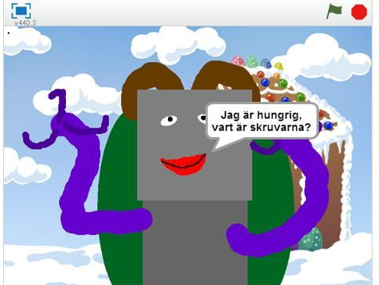
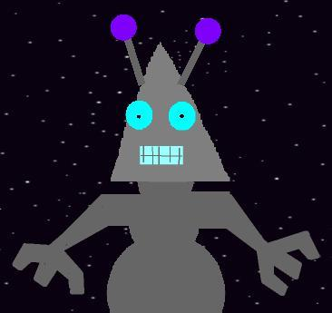
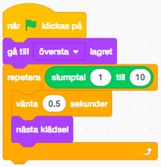
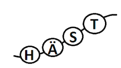
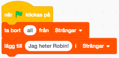
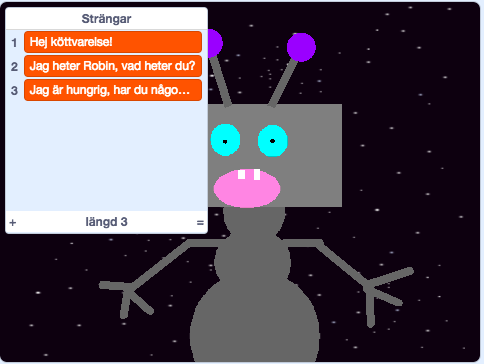

# Robotgenerator

Nu ska du få skapa ett program som sätter ihop olika robotdelar till en slumpmässig robot! Roboten får olika klädslar och säger olika saker varje gång du trycker på start. Programmet kommer även att växla bakgrund för varje ny robot. Du får själv rita robotens delar och bestämma vad den ska säga! Dessutom kommer du att få lära dig att använda strängar och listor.

Ett exempel på Robotgenerator hittar du här: <a href="https://scratch.mit.edu/projects/83059676/" target="_blank">https://scratch.mit.edu/projects/83059676</a>

  

## 1: Skapa robotklädslar

Du börjar med att rita olika *klädslar* som ska föreställa robotens delar. Du kommer att göra flera olika huvuden, armar, munnar, ögon och så vidare så att du sedan kan göra till flera olika kombinationer av robotar!

1. Skapa ett nytt Scratch-projekt och ta bort katten.

2. Klicka på **Rita ny** *_sprajt_*. Klicka igen tills du har totalt sex tomma *sprajtar*. Döp om *sprajtarna* till: **"kropp"**, **"huvud"**, **"armar"**, **"mun"**, **"ögon"**, **"extra"**.

3. Nu får du gå in på varje *sprajt* och rita egna *klädslar* till dem. Börja med att markera *sprajten* **"kropp"**. Gör den första klädseln som är en **stor grå kvadrat**. Välj **Rita ny** _klädsel_ och gör den som en **stor grå cirkel**.

4. Gör nu två till *klädslar* som du väljer helt själv. Hur vill du att en **robots kropp** ska se ut?

  **Tips:** Det är viktigt att alla *klädslar* är centrerade i ritytan, annars kommer *sprajten* att hoppa hit och dit på Scenen!

  

5. Dra sedan *sprajten* **"kropp"** till mitten av *Scenen* och lägg i nederkant så att kroppen sticker upp från nederkanten.

6. Gör på samma sätt med *sprajterna* **"huvud"**, **"armar"**, **"mun"**, **"ögon"**, **"extra"**. Hitta på flera olika klädslar för varje *sprajt*.

7. **"Extra"** kan till exempel vara antenner, en hatt eller ett halsband. Du kan behöva placera just dessa *klädslar* lite olika och **inte centrerat** som för de andra *sprajterna*!

8. Placera alla *sprajter* på Scenen så att alla robotens delar sitter där du vill ha dem.

  

**Tips:** Behöver du inspiration för att hitta på hur en robot kan se ut? Sök på "robot" på nätet och titta på bilder. Tänk på att du kan ge roboten olika känslolägen med glad eller ledsen mun, trötta eller pigga ögon och så vidare.

> Testa ditt projekt! Klicka på START. Hamnar någon del bakom en annan, till exempel ögonen bakom huvudet? Du kommer strax att göra ett *skript* som säger åt delarna att lägga sig i rätt ordning, så att det ser rätt ut.

## 2: Skript som kombinerar robotar

Nu vill du programmera din robotgenerator så att den slumpmässigt väljer olika *klädslar *varje gång du trycker på START. Ungefär som när du drar i spaken på en Enarmad bandit! Du behöver också säga åt programmet att lägga *sprajterna* i rätt ordning, i det LAGER där du vill ha dem.

8. Skapa ett skript för *sprajten* **"ögon"** som säger:

  * Starta när START klickas på
  * Gå till **översta lagret**
  * **Repetera slumptal** 1 till 10:
    * **Vänta **0.5** sekunder**
    * Byt till **nästa klädsel**

9. Kopiera *skriptet* till *sprajten* **"mun"**. Både mun och ögon kan ligga i översta lagret.

  

  > Testa ditt projekt! Klicka på START. Ändras robotens mun och ögon och stannar på en slumpmässigt vald klädsel?

10. Kopiera *skriptet* till **"huvud"**, **"kropp"**, **"armar"** och **"extra"**. Här behöver du flytta bak *sprajterna* till olika lager. **Byt ut** blocket **lägg överst** till **gå ned** 0 **lager**. Sätt olika värden för att bestämma vilken *sprajt* som ska ligga framför den andra.  

  

> Testa ditt projekt! Klicka på START. Ändras alla robotens delar? Stannar de efter en halv sekund på en slumpmässigt vald klädsel? Sitter alla delar där du vill att de ska vara? Är de i rätt lager?

**Tips**: Om det är någon *klädsel* som inte sitter helt rätt, kan du prova att ändra **_klädselns_ centrum** på just den!

## 3: Slumpmässig bakgrund

Nu ska du se till att även din scen byter till en slumpmässig bakgrund varje gång du trycker på START. Du får själv välja olika bakgrundsbilder till *Scenen*.

11. Markera *Scenen* och **välj ny** **_Bakgrund_** **från biblioteket** – välj ut fyra bakgrunder som du vill använda och ta bort den vita bakgrunden som fanns från början.

12. Skapa ett *skript* för *scenen* som gör samma sak som *sprajternas* skript, fast att du byter *bakgrund* istället för *klädsel*. Du behöver inte tänka på lager här.

> Testa ditt projekt! Klicka på START. Ändras bakgrunden nu?

## 4: Vad ska roboten säga?

Nu ska du få hitta på vad roboten ska säga, och som också blir olika varje gång du trycker på START. För att göra det behöver du skapa en LISTA med slumpmässiga STRÄNGAR.

En STRÄNG är en *variabel* som har text istället för siffror som värde. Det är ungefär som ett pärlhalsband med bokstäver eller ord skrivna på pärlorna. En sträng kan innehålla alla bokstäver och andra tecken så som mellanslag och utropstecken.

En LISTA är en *variabel* som innehåller flera andra variabler. Om variabeln är byrålådan så är listan hela byrån med alla lådor. En lista kan innehålla flera olika siffror, eller flera olika strängar.

Nu ska du få göra en lista med strängar för vad roboten ska kunna säga!

13. Välj blocket **Skapa en lista** under **DATA** och kalla den för **"Strängar"**.

14. Markera *Scenen* och skapa ett nytt *skript* som säger:

  * Starta när START klickas på
  * Först **ta bort alla i** listan **"Strängar"**
  * Sedan **lägg till** *"Hej, jag heter Robin!"* **i "Strängar"**

  

15. Välj själv vad roboten ska säga och lägg till flera meningar i **"Strängar"** under varandra i samma *skript*.

  > Testa ditt projekt! Klicka på START. Kan du se dina *strängar* i en *lista* på scenen? Ser du att de är numrerade? *Listan* kan du sedan klicka ur och gömma, men just nu är det bra att du ser den.

  

  Nu ska du programmera roboten att slumpmässigt **välja ett objekt ur listan med strängar** och säga den meningen. För det behöver du skapa en *variabel* som innehåller det slumpmässiga valet.

16. Skapa en *variabel* och kalla den för **"Val"**. I det *skript* som du redan har skapat för *scenen*, lägg till en blockrad som säger:

  * **Sätt "Val" till**
    * Det **post i "strängar"**
    * Som är ett **slumptal** mellan 1 och **längden av listan "Strängar"**

  

17. Nästa steg är att få roboten att säga den valda *strängen*, och samtidigt göra ett robotljud! Gå till *sprajten* **"huvud"** och fliken LJUD. Klicka på **Nytt ljud från bibliotek** och välj ett passande ljud, till exempel **"computer beeps1"**.

18. Fortsätt på ditt *skript* för *sprajten* **"huvud"**. Lägg till att den ska:

  * **Spela** ljudet _"computer beeps 1"_
  * **Säg** innehållet i variabeln **"Sträng"**

**Tips:** Du behöver lägga in variabeln **"Val"** som du har under **DATA**, det räcker alltså inte att skriva ordet "Val" i **Säg**-blocket.

>Testa ditt projekt! Klicka på START. Säger roboten något? Säger den olika saker varje gång du klickar på START? Låter roboten?

**Tips:** Nu kan du klicka ur och **gömma din variabel och din lista** så att de inte syns på scenen!

## Färdig!
Grattis, nu har du gjort klart uppgiften.

**Glöm inte att spara ditt projekt!** Döp det gärna till uppgiftens namn så att du enkelt kan hitta den igen.

> **Testa ditt projekt**  
Visa gärna någon det som du har gjort och låt dem testa. Tryck på DELA för att andra ska kunna hitta spelet på Scratch. Gå ut till projektsidan och låt någon annan testa spelet!

## Utmaning
Har du tid över? Här kommer en utmaning för dig som vill fortsätta.

### Uppgraderingar av roboten

Om du vill uppgradera din robot med fler funktioner så kan du göra det. Du kan lägga till fler *klädslar* för de olika robotdelarna eller ge den ben eller rullband att röra sig med!

Du kan också skapa interaktiva moment till din robotgenerator: Kanske kan roboten ha knappar som du kan trycka på för att få den att utföra olika saker? Fundera på vad du skulle vilja ha för en robot hemma – vad vill du ha hjälp med som en robot kan utföra?

## Frågeställningar

* Vad är ett lager?

* Hur kan du se till att en sprajt hamnar framför en annan sprajt?

* Vad är en sträng?

* Vad är en lista?

* Vad kan du använda en lista till?
