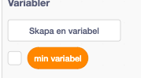

# Rubys smarta garderob

Tycker du att det är jobbigt att välja kläder på morgonen? Vad sägs om en smart garderob som väljer kläder åt dig? Till exempel att på fredagar väljer garderoben randiga kläder och om det är soligt väljer den shorts.   

I den här uppgiften ska du koda en smart garderob åt flickan Ruby, som vill ha hjälp att välja vilka kläder hon ska ha på sig på en viss dag. Det kan du få garderoben att göra genom att bestämma några enkla regler.  

*Denna uppgift är en variant på uppgiften <a href="http://www.helloruby.com/play/8" target="_blank">Dresscode</a> från boken Hello Ruby av Linda Liukas. Du kan använda <a href="http://www.kodboken.se/start/lana-bild-ljud/hej-ruby" target="_blank">Lindas bilder och läsa mer om boken här.</a>*

Ett exempel på hur programmet kan se ut hittar du här:  

MEN TÄNK PÅ ATT DU KOMMER GÖRA ETT PROGRAM SOM KANSKE SER HELT ANNORLUNDA UT.

## 1: Ladda ner bilder

Innan du börjar koda i Scratch behöver du ladda ner **”Ruby med klädslar”** från <a href="http://www.kodboken.se/" target="_blank">kodboken.se</a>. Det är en mapp med olika bilder på Ruby, där hon har olika klädslar, som du kan spara på din dator och sedan ladda upp till Scratch.

  1. Gå till <a href="http://www.kodboken.se/start/lana-bild-ljud/hej-ruby" target="_blank">Låna bild och ljud / Hej Ruby</a>

  2. Högerklicka på Ruby och spara filen **ruby-clothes-360.zip** till din dator.

   _Bilden du ska högerklicka på._

  3. Öppna upp zip-filen på din dator så att du kan titta på de olika bilderna. För att öppna en zip-fil behöver du göra så här:
 
  - Om du använder en Macbook dator är det bara att dubbelklicka på zip-filen och den kommer att öppnas. 
  - Om du använder en Windows dator ska du högerklicka på zip-filen och välj "Extrahera alla" alternativet.

## 2: Bakgrund och en sprajt

Nu ska vi starta vårt projekt i Scratch! Vi börjar med att välja bakgrund och att ladda upp en bild på Ruby som sprajt. Den sprajten ska vi sedan ge flera klädslar som vi kan byta mellan. 

1.	Skapa ett nytt projekt och ta bort katten.

2.	Välj en bakgrund från biblioteket som passar som ett rum. Förslag är **bedroom1** och **bedroom2**, men du kanske tycker att Ruby ska bo på ett slott!

   Steg 1: 
   
   
   
   Steg2: 
      
   

3.	Välj en ny sprajt genom att **ladda upp en sprajt** i menyraden för sprajtar och gå till mappen där du har sparat bilderna på Ruby. Välj bilden som heter **Ruby är i underkläderna**.

    
    
    _Bilden med Ruby i underkläder_

4.	Ändra **namnet** på sprajten till **Ruby**. Sätt ut den på ett lämpligt ställe i rummet.

5.  Du kan förminska sprajten lite om du tycker den är för stor.

6.	Gå in på fliken för sprajtens Klädslar. Lägg till fler klädslar genom att **Lägg till flera klädslar** till sprajten. Välj de bilder på Ruby där hon har kläder som du vill att garderoben ska kunna välja mellan. I nästa steg ska du få bestämma reglerna för när garderoben ska välja vilka kläder!

    
    
    Fliken för klädslar.
    
    
    
    Sprajtens olika klädslar.

7.	Skapa ett skript för **Ruby** som säger:

  *	När START klickas på

  * Under temat UTSEENDE hittar du blocket **Ändra klädsel till **"..."**. klicka på texten som finns i ovala rutan och välj **RUBY_underwear**

  * **Säg** *”Hej mitt namn är Ruby! Jag måste välja kläder. Kan du hjälpa mig?"*

  

> Testa ditt projekt: Ser du alla klädsel som du laddade upp från din dator?

## 3: Bestämma regler

Det första du behöver göra är att bestämma de regler som ska avgöra vilka kläder Ruby ska ha på sig. Här i exemplet vill vi att veckodagen avgör vad Ruby ska ha på sig. Du kan själv välja andra regler som ska gälla för din smarta garderob, det är din fantasi som styr! 

> **Tips!** _Tänk på att kläderna som finns i dina regler också måste finnas tillgängliga som bilder._

Ett förslag är följande:

1.	På måndagar klär sig Ruby i röda eller gröna kläder

2.	På tisdagar klär sig Ruby i kläder med röda prickar

3.	På fredagar klär sig Ruby i kläder som INTE är svarta

4.	På helgen klär sig Ruby i valfria kläder

Du kan också tänka på **olika aktiviteter** som Ruby kan ha för sig som t.ex. lyssna på musik. Vad ska Ruby ha för kläder eller saker ska Ruby ha på sig då?

Du kan också tänka på vad det är för **väder** och om Ruby ska vara **inomhus eller utomhus**. Vad ska Ruby ha på sig om hon ska gå ut och det regnar?

**Tips:** Om du tycker det är svårt att komma på regler kan du utgå ifrån vad du själv brukar ha på dig på olika dagar eller när du gör roliga saker.

## 4: Fråga användaren

När programmet startar ska Ruby fråga användaren om den vill hjälpa till med att välja kläder. Användaren får sedan välja JA eller NEJ genom att klicka på en knapp.

1.	**Lägg till en sprajt** som ser ut som en knapp, till exempel **”Button1”**.

2.	Placera sprajten någonstans i rummet.

3.	Gå till fliken för KLÄDSLAR och använd **textverktyget** för att skriva **”JA”** på knappen.

    

4.	Skapa ett skript för **knappen** som säger

  * När START klickas på

  * **Visa** sprajten

 
 
5.	Skapa ett andra skript för sprajten som säger

  - **När denna sprajt klickas på**.

  - Nu har användaren klickat på JA och valt att hjälpa ruby att välja kläder. Då kan vi skicka ett meddelande om det. 

  - Så här skapar du och skickar ett meddelande. Gå till temat **Händelser** och välj kodblocket **Skicka 'meddelande'** Klicka på texten som finns i en ruta brevid texten "Skicka". Nu kan du klicka på **Nytt meddelande** och skapa ett meddelande. Döp meddelandet till "JA". 

steg 1: 

  
 
steg 2: 

  

  - **Göm** sprajten

  

## 5: Olika sätt att göra projektet

I vårt exempel använder den smarta garderoben veckodagar för att bestämma vilka kläder Ruby ska ha på sig. För att ta reda på vilken veckodag det är, kan du göra på olika sätt:

1.	Fråga användaren vad det är för dag

2.	Slumpa fram en dag

3.	Gör en liten enkel kalender

Du kan bara göra **ett** av alternativen i ett projekt så om du vill koda alla alternativ, ta det stegvis och koda klart ett innan du går vidare till annat alternativ. 

## 6: Alternativ A - Användaren bestämmer veckodag

1.	Skapa en **variabel** som heter **”Idag är det: ”**. Den kan visas på skärmen.Så har skapar du en variable. 

Steg 1:

Steg 2:

2.	Skapa ett skript för **Ruby** som säger:

  * När den tar emot meddelandet **”byt klädsel”**

  * **Fråga** _”Vad är det för dag?”_ och vänta. Du hittar kodblocket under temat **Känna av**

  * Gå till temat **Variabler** och välj kodblocket **Sätt ”Idag är det: till 0”** och **”svar”** från temat **Känna av** bytt den mot 0. 

  _Så här ser koden:_
  
  
  
 **OBS: För att fortsätta med alternativ 1, hoppa till steg 8. Steg 7 har instruktioner för alternativ 2.**
  
## 7: Alternativ B - Slumpa fram en dag:

På alternativ 1 hade du bestämt dagen och nu ska du låta AI(Artificiell intelligens) som finns i smart garderoben bestämma datumet och klädern som Ruby ska ha på sig. 

Ett exempel på hur programmet kan se ut hittar du här:  <a href="https://scratch.mit.edu/projects/514980754/" target="_blank">https://scratch.mit.edu/projects/514980754/</a>

MEN TÄNK PÅ ATT DU KOMMER GÖRA ETT PROGRAM SOM KANSKE SER HELT ANNORLUNDA UT.

1.	Skapa en **variabel** som heter **”veckodag”**. Den ska inte visas på skärmen. Boka av variablen så syns inte den där.

2.	Skapa en **variabel** som heter **”Idag är det: ”**. Den kan visas på skärmen.

3.	Skapa ett skript för **Ruby** som säger:

  * När den tar emot meddelandet **”byt klädsel”**

  * **Sätt ”veckodag”** till ett **slumptal mellan 1 och 7** Kan du gissa värför siffrorna är mellan 1 och 7? Ja, för att det finns 7 dagar i veckan.

  * **Sätt ”Idag är det: ”** till **”Måndag"** OM **”veckodag”** är 1

  * Sätt **”Idag är det: ”** till **"Tisdag"** OM **”veckodag”** är 2

  * Sätt **”Idag är det: ”** till **"Onsdag"** OM **”veckodag”** är 3

  * Sätt **”Idag är det: ”** till **"Torsdag"** OM **”veckodag”** är 4

  * Sätt **”Idag är det: ”** till **"Fredag"** OM **”veckodag”** är 5

  * Sätt **”Idag är det: ”** till **"Lördag"** OM **”veckodag”** är 6

  * Sätt **”Idag är det: ”** till **"Söndag"** OM **”veckodag”** är 7

  

> Testa programmet! Vad händer om du trycker på Ja-knappen? Visas veckodagen på skärmen?  

## 8: Byta kläder på Ruby

Nu är det dags att IMPLEMENTERA dina regler från för Ruby. IMPLEMENTERA betyder att du kodar en regel som du har bestämt innan. I det här fallet handlar det om reglerna för vilka kläder Ruby ska ha på sig.

1.	**Fortsätt på skriptet** i förra steget som startar när sprajten tar emot meddelandet **”byt klädsel”**.

2.	Använd ett **OM-block** och variabeln **”Idag är det: ”** för att utföra ett klädbyte.

  

  _Det är sådana här kodblock du behöver skapa för att utföra de olika klädbytena._

3. Inuti **OM**-blocket lägger du in ett **Ändra klädsel till..."**-block för att byta klädsel. Du kan också lägga in andra block om du vill att något annat ska hända.

  
   

  _Så här kan koden se ut_

4.	**Repetera** med fler OM-block tills du har lagt in alla regler

  

  _Flera OM-block behövs för att implementera alla regler._

5.	När du har kodat alla OM-block kan du avsluta med att Ruby ska säga något. I vårt exempel använder vi säg ”Tack! Nu kan jag börja leka.”

  

## 9: Egna tillägg till uppgiften (valfri)

Nu har du skapat en smart garderob som väljer vilka kläder Ruby ska ha på olika veckodagar. Nu är det fritt fram för dig använda din fantasi och koda andra val! Här är några tips:

1.	Utgå ifrån koden när Ruby tar emot **meddelandet ”byt käder”** och där du har lagt in OM-block för att göra olika saker på olika veckodagar.

2.	Om du vill att något särskilt ska hända på en specifik dag, **skicka ett meddelande** på den dagen.

3.	Skapa ett **nytt skript** för **Ruby** eller en **annan sprajt** som körs när det meddelandet tas emot.

4.	I det skriptet lägger du in all kod som gör att Ruby till sist får rätt kläder

  * Du kan till exempel **fråga användaren** om det är soligt eller regnigt väder

  * Du kan **visa en sprajt** på skärmen och använda den för att få information från användaren. Tänk på hur du kodade knappar **Val1** och **Val2** ovan.

  * När du har fått ett **svar från användaren**, genom variabeln **”svar”** eller genom att **meddelandet** har skickats så **byter du kläder** på Ruby.

  * Självklart kan du **kombinera** de två sätten att få information från användaren om du till exempel först vill fråga om det är regnigt och sedan fråga om Ruby vill vara inne eller ute.

### Exempel

Här kommer ett konkret exempel. Det går ut på att på fredagar så vill Ruby lyssna på musik.

1.	Skapa ett OM-block som kollar om **”Idag är det: ”** är lika med **”Fredag”**

  * **Byt** klädsel till **"RUBY_jeans_tshirt"**

  * **Säg** *”Kan du hitta mina hörlurar?”*

  * **Skicka** meddelandet **”hitta hörlurar”**

2.	Lägg till en sprajt genom att ladda upp bilden för **hörlurarna** från din dator.

3.	Skapa ett skript för **hörlurarna** som ser till att de är **gömda** när START klickas på

4.	Skapa sedan ett skript till för **hörlurarna** som **visar** dem när meddelandet **”hitta hörlurar”** tas emot.

  

5.	**Skicka** meddelandet **”hörlurar”** när sprajten klickas på.

6.	Skapa ett skript för **Ruby** som säger

  * När meddelandet **”hörlurar”** tas emot

  * **Byt** klädsel till **"RUBY_jeans_tshirt_headphones"**

  * **Säg** _”Tack! Nu kan jag börja leka”_

  
  
## Färdig!
Grattis, nu har du gjort klart uppgiften.

**Glöm inte att spara ditt projekt!** Döp det gärna till uppgiftens namn så att du enkelt kan hitta den igen.

> **Testa ditt projekt**  
Visa gärna någon det som du har gjort och låt dem testa. Tryck på DELA för att andra ska kunna hitta spelet på Scratch. Gå ut till projektsidan och låt någon annan testa spelet!

## Utmaningar

### Välja igen

Nu avslutas programmet när du har valt klädsel till Ruby. Gör så att det kommer upp en knapp som frågar användaren om hjälp igen.

**Tips:** Skicka meddelandet **"byt kläder"** när användaren klickar på knappen.

## Frågeställningar

* Vad innebär det att du implementerar regler?

* På vilka olika sätt kan du få information från användaren?

* Vilka för- och nackdelar finns det med de olika sätt att få information från användaren?
