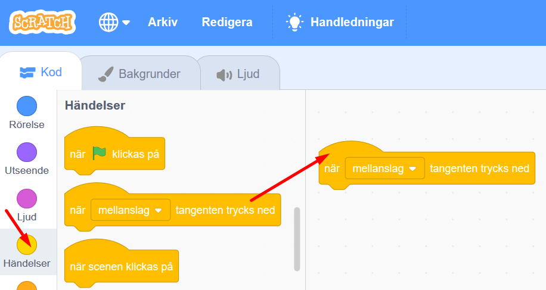
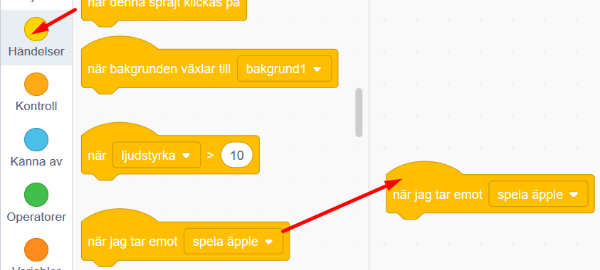
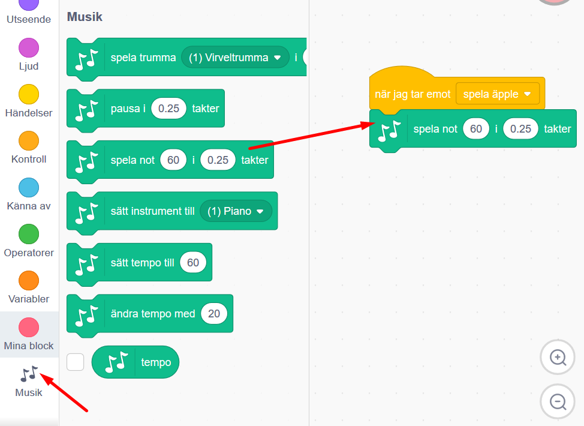
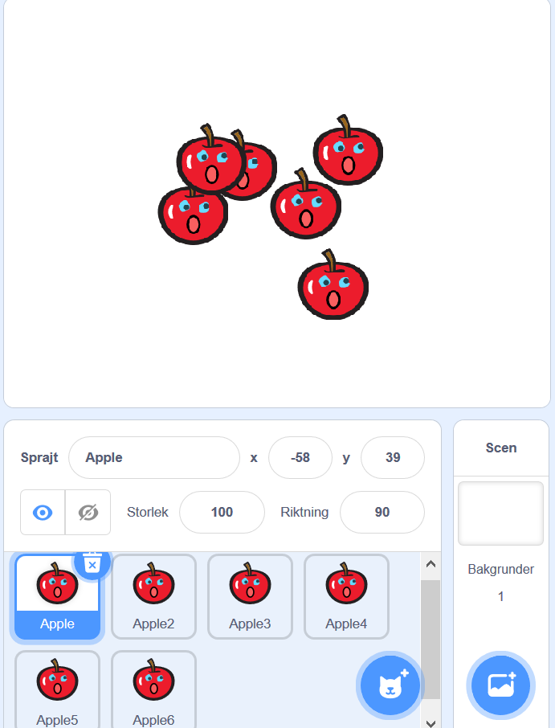

# Fantasisynth

Hur skulle du vilja spela musik? Förr i tiden fanns bara akustiska instrument som piano, fiol eller gitarr som kunde spela klassisk musik. Idag finns datorer som kan spela nästan vilka otroliga ljud som helst som används som digitala instrument.

Om du skapade ditt eget instrument och kunde spela musik på vad som helst, vad skulle du vilja spela på då? I vårt exempel har vi gjort en synth av äpplen, men ditt intrument kan se ut precis hur du vill!

> Bläddra dig fram genom denna guide, steg för steg. <a href="https://scratch.mit.edu" target="_blank">
  Öppna även kodarverktyget Scratch genom att klicka på länken bredvid katt-figuren ovan eller via www.scratch.mit.edu</a>. I Scratch  kodar och skapar du din Fantasisynth utifrån instruktionerna nedan. 

Vi har skapat ett exempelprojekt av Fantasisynth med äpplen som tangenter, som du kan kika på här: <a href="https://scratch.mit.edu/projects/128504924/" target="_blank">https://scratch.mit.edu/projects/128504924/</a>

...och här finns en annan variant med dansande figurer som tangenter som du kan testa: <a href="https://scratch.mit.edu/projects/128504924/" target="_blank">https://scratch.mit.edu/projects/329325873</a> Klicka på den gröna flaggan för att provspela vår synth.

Nu är det din tur att skapa din egen Fantasisynth. Du bestämmer själv hur den ska se ut. 

Gå till nästa sida och följ instruktionen för att börja skapa ditt instrument. Instruktionen följer vår Fantasisynth med äpplen.

## 1: Kom på en idé för ditt instrument
Det första du behöver göra är att komma på hur din Fantasisynth ska se ut! Om du vill kan du såklart välja att göra med äpplen precis som i vårt exempelprojekt.

Du kommer att få göra en synth som du spelar med hjälp av datorns tangenter. Bara din fantasi sätter gränserna hur din synth kan se ut, så länge det finns 6 sprajtar (Scratch-figurer kallas för sprajtar) som kan vara synthens olika "tangenter" att spela på. I vårt exempel använder vi sprajtar som ser ut som äpplen för vår Fantasisynts tangenter.

1.	Ska det vara frukt som du spelar på? Ska det vara djur? Klura ut hur du vill att din synth ska se ut!

2.	Har du fått en idé för din synth? Rita eller skriv ned dina idéer, berätta gärna för någon som kan hjälpa dig med din idé och ge förslag. Tänk på att ingen ide är fel, för i framtiden kan allt vara möjligt! Du bestämmer!

  
  
När du har en grund för din idé, kan du gå vidare oh börja designa och koda din Fantasisynth.

## 2: Välj bakgrund och sprajt

Först behöver du välja en bakgrund som passar som SCEN till din synth och en SPRAJT som passar som tangent. Vi kommer senare att kopiera sprajten för att göra flera tangenter för syntens olika toner.   

3.	Tryck på knappen för **Välj en bakgrund**, finns i nedre högra hörnet i Scratch. Välj vilken bakgrund du vill från bibliotek med bakgrunder som kommer fram.

  

4.	Ta bort katt-sprajten genom att trycka på lilla soptunnan bredvid den lilla kattfiguren som finns under scenen i ditt Sprajt-bibliotek. Då försvinner katt-sprajetn helt ur ditt projekt. 

  

5.	Nu ska du få välja en ny sprajt som ska vara din synthtangent. Tryck på knappen för **Välj en sprajt**, och välj din tangent-sprajt. Klicka på den du vill ha, så läggs den till i ditt projekt.

I vårt exempel är sprajten för tangenter ett äpple, men du kan välja precis vilken sprajt du vill!

    

  

## 3: Välj tillägget Musik i Scratch
När du ska jobba med ljud och musik i Scratch, är det enklast att lägga till Scratch tillägg med temat Musik, så får du bra kodblock med just musik att koda med. Gör såhär:

7. Klicka på blå knappen **Lägg till ett tillägg** längst ned i Scratch vänstra hörn. Då kommer du till de olika tillägg som du kan välja att ta in i Scratch.

  
  
8. Klicka på stora rutan med tillägget Musik, som ser ut såhär:

  
  
Nu har du fått ett nytt Musiktema i ditt bibliotek för kodblock i Scratch och där finns olika gröna kodblock som du kan använda för att koda musik och ljud.

  

## 4: Få äpplet att spela en ton

Nu ska du få göra så att sprajten spelar en ton när en viss tangent trycks ner på datorns tangentbord. Men hur ska sprajten få reda på att den ska spela en ton?

Svaret är genom att använda MEDDELANDEN. Vi vill att när du trycker på datorns tangent ska en viss ton spelas upp i din synth. Om vi gör så att när datortangenten trycks ned skickas ett meddelande till din sprajt-tangent att det är dax att spela upp sin ton, så kommer synten att kunna spelas på, som ett instrument. Fiffigt va?! Dax att koda detta: 

Nu ska du får skapa ett meddelande för din sprajt-tangent i din synth. Gör såhär:

9.	Klicka på SCEN i nedre högra hörnet så att den är markerad istället för din sprajt. Då får SCEN en blå kant runt som sig, som visar att den är vald. 

  

10.	Under det gula kodtemat HÄNDELSER hittar du skriptet för **när mellanslag tangenten trycks ner**. Dra in blocket och lägg på skriptytan till höger.

  

11. Ändra nu **"mellanslag"** i kodblocket till bokstaven **"a"** genom att klicka på lilla triangeln och välja **"a"** i listan. Det gör att när du kodat klart din synth så kommer en av sprajt-tangenterna att spela sin ton när du trycker på datorns a-tangent.

  

11.	Under HÄNDELSER, välj kodblocket **skicka meddelande 1** och dra ut på skriptytan.

  

12. Ändra "meddelande1" genom att klicka på lilla triangeln i kodblocket och välj Nytt meddelande. 

  

13. Döp ditt nya meddelande till exempelvis **"spela äpple"** om det är ett äpple som du valt som sprajt för synthens tangenter. Annars kan du döpa den till vad du vill. Klicka OK för att skapa ditt nya meddelande.

  
  
14.	Koppla ihop kodblocken i rätt ordning på skriptytan. Då ser det ut såhär:

  

15.	Nu ska vi göra ett skript för SPRAJTEN som tar emot meddelandet **"spela äpple"** så den spelar sin ton! Klicka på din tangent-sprajt så att den är markerad och vald. Då får den en blå ring runt som sig. I vårt exmpel är tangent-sprajten ett äpple. Nu är det alltså vår sprajt för syntens tangenter vi ska skapa kodskript för. 

  

12.	Under kodtemat HÄNDELSER, välj kodblocket för **när jag tar emot spela äpple** (alltså tar emot meddelandet vi nyss skapat). Dra ut blocket på skriptytan för sprajten.

  

13.	Välj nu det nya temat Musik som du lade till tidigare,´. Du finner det långt ned till vänster, med bild med noter. Välj det gröna kodblocket för att **spela not 60 i 0.25 takter** och dra ut till skriptytan. Sätt fat det under det gula kodblocket **när jag tar emot spela äpple** .

  
  
14. Klicka på variablen **0.25** för takten i kodblocket, och skriv istället **0.5**. Det gör att tonen spelas upp lite längre stund varje gång du trycker på tangent **A** på datorns tangentbord.

  

> Testa ditt projekt! Klicka på gröna START-flaggan över SCEN för att stta igång projektet. Vad händer när du trycker på tangenten "A" på din dators tangentbord.? Visst spelas det en ton? Om du inte hör en ton - öka volymen på din dators högtalare!

Tips! Vad betyder egentligen siffran 60 för noten i kodblocket? Förenklat kan man säga att när man vill skapa instrument digitalt, exempelvis ett digitalt piano istället för ett vanligt klassiskt akustisk piano, behöver man kunna skriva vilken not man vill att instrumentet ska spela fram. Och då använder man en skala med siffror för de olika noterna, en så kallad MIDI-skala. De lägsta (mörkaste) noterna börjar på MIDI-siffra 1, 2, 3... och sen går skalan uppåt, till 60 och långt förbi för högre (ljusare) noter. (Just siffra 60 är noten C i C-skala 4.) Exempel på en C-skala med not-siffror i MIDI:

  

## 6: Få äpplet att sjunga!

Hur kan vi se att det är äpplet som spelar tonen när du spelar på tangentbordet? Vi vill ändra äpplets utseende så att det ser ut som om äpplet sjunger när tonen spelas! För att göra det ska du ANIMERA sprajten, genom att byta mellan klädslar på den - med en mun som öppnas och stängs. Gör såhär:

15.	Gå till fliken KLÄDSLAR för sprajten. Börja med att rita två ögon på äpplet. 

  
 
Välj vilken **färg** du vill ha genom att klicka på den färgade lilla rutan och dra i färgverktyget tills du är nöjd. Välj sen vilket ritverktyg du vill ha för att måla, exemmeplvis  **pensel**, **cirkel** eller **linje** och rita två ögon på äpplet. 

  
  
  

16.	Nu ska du kopiera klädseln så att det blir två likadana klädslar med ögon på för din sprajt. Högerklicka på sprajtens klädsel och välj **kopiera**. Nu får du ha två likadana klädslar, men de heter sprajtnamnet och en siffra efter. Se bilderna här nedan hur man koperar klädslar om osäker.

  
    

17.	Klicka nu på den första, översta klädseln, (den heter "apple" i vårt exempel), så den blir markerad med en blå ram runt sig. Rita en stängd mun på denna sprajt. Använd exempelvis **pensel** eller **linje**-verktyget. Vårt exempel ser nu ut såhär:

  

18.	Klicka sen på den andra klädseln, (den heter "apple2" i vårt exempel), så den andra blir markerad med en blå ram runt sig istället. Det här andra äpplet ska få en öppen mun så att det ser ut som att den sjunger! Välj en **cirkel** och välj om den ska vara **fylld** eller inte. Dra sedan ut cirkeln mitt i äpplet så att äpplet får en öppen, sjungande mun.

  

**Tips:** Har du valt en annan sprajt som redan har ögon och mun? Eller en sprajt som redan har flera olika klädslar? I så fall får du redigera och göra om bilderna som du vill, så länge som en klädsel har stängd mun och en har öppen! Tänk på att du kan alltid "måla över" en sprajts mun och ögon med en ny färg.

Nu ska vi ANIMERA sprajten, så den ser ut att sjunga när vi trycker på datorns tangenter för att spela noterna. 
Vi ska göra ett skript som säger åt sprajten att byta klädsel när noten i den spelas. Vi måste ju veta vilken sprajt det är som låter när tangenten trycks ned! Vi använder ett likadant skript som för att spela tonen.

19. Klicka på fliken KOD för att komma bort från RIT-verktyget, och tillbaka där du kan koda skript igen. 

  

20. Från gula tema HÄNDELSER drar du ut blocket: **när jag tar emot spela äpple** och lägger det på skriptytan för din sprajt. Dra sedan ut ett block från tema UTSEENDE: **byt klädsel till...** och klicka på lilla triangeln och välj **"apple2"**, klädseln med öppen mun.

  
  
  
  
Nu har du kodat skriptet som gör att din tangent-sprajt kommer öppna munnen när den sjunger sin not. 
  
21. Efter att äpplet har spelat sin not så ska munnen stängas igen. Munnen behöver vara öppen en liten stund innan den stängs, så noten hinner spelas klart. Vi lägger till ett VÄNTA-block i koden, innan sprajten byter klädsel til lstängd mun. Dra ut ett block från orangea temat KONTROLL: **vänta 1 sekunder** och ändra variablen med värdet **1** till det mindre **0.2** sekunder.

  

22. Dra ut ett till block för UTSEENDE: **byt klädsel till...**. Välj klädseln **"apple"** så att äpplet får stängd mun igen.  

  

> Testa ditt projekt! Klicka på gröna START-flaggan ovanför SCEN. Vad händer nu när du trycker på tangenten "a" på datorns tangentbord? Ändras klädseln så att det ser ut som att äpplet sjunger? Spelas tonen? (se till att ljudet är på på din dator.)

## 5: Kopiera sprajten för fler toner

Men vi har ju bara en ton som spelas nu. Lite tråkig synth! Nu ska du kopiera sprajten som spelar noter fem gånger och ändra i skripten för att få fem toner till i synth-instrumentet. Gör såhär:

23. Högerklicka på lilla sprajtbilden av din tangent-sprajt som finns i ditt sprajt-bibliotek under SCEN. Då skapas en kopia av din sprajt som får siffran 2 i sitt namn. 

  

24. Kopiera nu sprajten flera gånger så att du har totalt sex äppel-sprajtar. Alla skript och klädslar som du har skapat åt det första äpplet har också kopierats till de nya sprajtarna.

  

25.	Klicka på den andra kopierade sprajten (**Apple2** i vårt exempel). Nu ska du ändra vilken ton denna andra sprajt ska spela och vilken tangent på datorn du ska trycka på för att den ska börja låta! Byt ut värdet **60** i variabeln i kodblocket **spela not 60 i 0.5 takter** för denna andra sprajt så att not G **67** spelas istället. Klicka på lilla pianot som kommer upp, till du hittar G-67, se bilden nedan:

  

26.	Markera nu SCEN för att skapa en kopia av skriptet för tangent "a" som nu ligger där. Högerklicka på skriptet som finns och välj kopiera. Klicka sen en gång på skriptytan, så fastnar den nya kopian där. 

  
 
  
  
  

I den nya kopian av skriptet ska du ändra så att ett meddelande till sprajt 2 skickas när tangent **"g"** på datorns tangentbord trycks ned. Alltså, trycker du på tangent G så ska noten G spelas och sprajten "Apple2" ska sjunga.

  

27.	Ett nytt meddelande från SCEN behöver skickas så att rätt sprajt spelar rätt ton. Välj **"nytt meddelande"** i rullistan och döp det nya meddelandet till **"spela äpple 2"**.

  
  
  

Nu ska det finnas två skript bredvid varandra, en för tangent A och en för tangent G. Såhär ska det se ut:

  

28.	Sprajtarna måste kunna ta emot rätt meddelande också. Klicka på din sprajt nummer 2 (i vårt exempel är detta **Apple2**) i ditt sprajt-bibliotek under SCEN, så den markeras med en blå ram. Ändra i båda de skript som ligger där, så meddelandet är **när jag tar emot "spela apple2"**. Så här:

  
  
  

> Testa ditt projekt! Klicka på den gröna START-flaggan. Prova nu att trycka på a eller g! Vad händer? Spelas två olika toner?

Nu ska vi göra likadant med alla våra fem sprajtar (eller äpplen, som vi har i vårt exempel.)!

27. Byt ut skripten för alla sprajtar du har kvar att fixa. Glöm inte att skapa ett nytt meddelande för att skicka från SCEN och ta emot till sprajt (sprajt3, sprajt4, sprajt5 och sprajt6). Döp meddelanden till exempelvis **"spela äpple 3"** och så vidare fram till **spela äpple 6"**.

C-skala: 
* Apple ska ha not C **60** och datortangent **a**.
* Apple2 ska ha not G **67** och datortangent **g**.
* Apple3 ska ha not A **69** och datortangent **h**.
* Apple4 ska ha not F **65** och datortangent **f**.
* Apple5 ska ha not E **64** och datortangent **d**.
* Apple6 ska ha not D **62** och datortangent **s**.

> Testa ditt projekt! Klicka på gröna START-flaggan. När du är klar med alla tangenter på din fantasisynth, prova att spela följande tangenter i rad:
 **A A G G H H G F F D D S S A**.
Hör du vilken melodi du spelar? Nu kan du spela Blinka lilla stjärna på din synth!  

## Färdig!
Grattis, nu har du gjort klart uppgiften.

**Glöm inte att spara ditt projekt!** Du måste vara inloggad för att kunna spara. Döp det gärna till uppgiftens namn så att du enkelt kan hitta den igen.

> **Testa ditt projekt**  
Visa gärna din Fantasisynth för en kompis och låt dem testa. Tryck om du vill på DELA för att andra ska kunna hitta spelet på Scratch. 

## Frågeställningar

* Vad är ett meddelande?
* Vad kan du använda ett meddelande till?
* Varför kan det vara användbart att en sprajt har flera klädslar?
* Vad betyder animation?
* Hur kan du använda noter och toner i Scratch?
* Vad händer när du ändrar takt för tonen?

## Tips
Om du har tillgång till **Makey Makey** kan du koppla din Fantasisynth till den och spela musik på riktiga äpplen! Eller vad som helst annat som leder ström, så som metallskedar, foliebitar, kompisars händer och liknande. Makey Makey kan ses som en förlängning av datorns tangentbord, för att skapa egna styrkontroller och knappar till sitt digitala projekt.
Makey Makey är ett litet kretskort för att styra datorn med saker som är elektriskt ledande, som till exempel frukt eller metall.

> Här hittar du en instruktion till att <a href="https://www.kodboken.se/start/skapa-musik/uppgifter-i-scratch/fantasisynth-makey-makey?chpt=0"> koppla in Makey Makey till din Fantasisynth</a> och liknande projekt.
