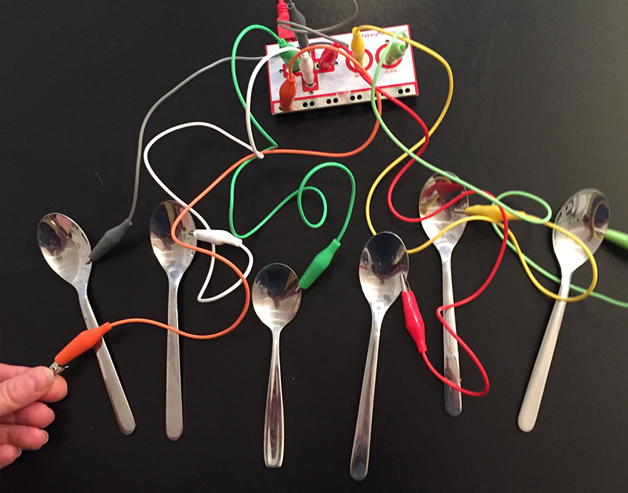
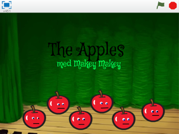
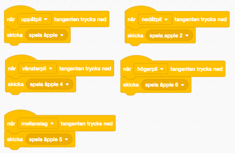
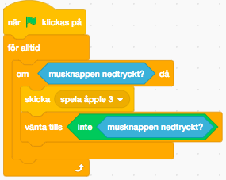
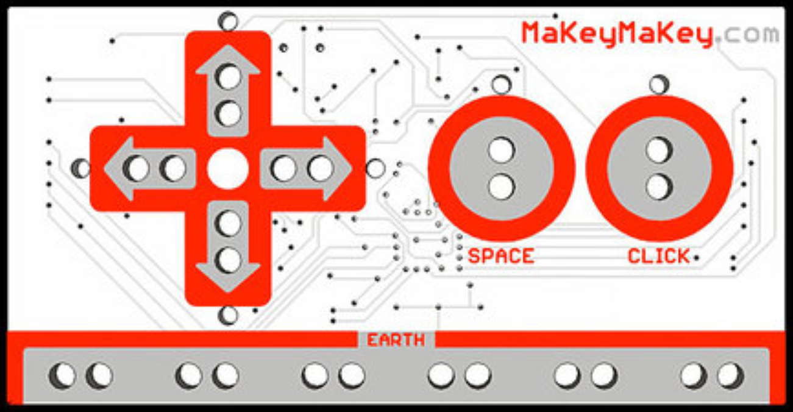
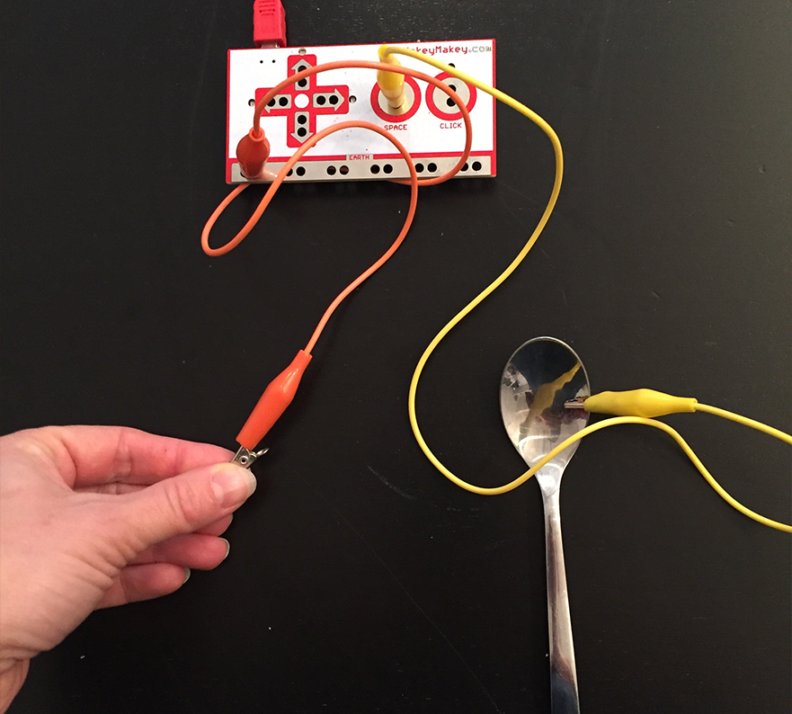

# Fantasisynth med Makey Makey

Om du har tillgång till en Makey Makey kan du koppla den till ditt Scratch-projekt från den föregående uppgiften med din egen <a href="https://www.kodboken.se/start/skapa-musik/uppgifter-i-scratch/fantasisynth" target="_blank"> Fantasisynth </a>. Med en Makey Makey kan du sen spela musik på allt som leder ström, så som frukt, metall eller dina kompisar! Följ instruktionen för att koppla och koda din Fantasisynth med Makey Makey! 

**Vad är en Makey Makey?**

Makey Makey är ett litet programmerbart kretskort som enkelt kan kopplas ihop med saker som är elektriskt ledande så att du kan styra olika program på din dator, exempelvis spel eller andra projekt du kodat i Scratch. Din Fantasisynth som du spelade med din dators tangenter, kan med Makey Makey istället spelas på andra "tangenter" av frukt, skedar och annat som leder ström. 

 

>**Tips!** Vill du se en film om hur du kan använda Makey Makey så finns en här: <a href="https://www.youtube.com/watch?v=ICd7HzurorM&feature=youtu.be&list=PLD0HD_3AJljWqSuZ31DeGi2Iv7Yzp0NRp" target="_blank">  Interactive Institute - introduktion till Makey Makey </a>

 
**Exempelprojekt av en Fantasisynth med Makey Makey**

Om du är nyfiken på hur en **Fantasisynth med Makey Makey** kan tänkas se ut, har vi gjort ett exempelprojekt här nedan som du kan klicka på för att testa. Hur just din Fantasisynth med Makey Makey kommer se ut bestämmer givetvis du själv sen. 

I instruktionen som följer får du lära dig hur du ändrar i Scratch-koden för att koppla om datortangenterna du spelar musiktoner på, till att istället styras med en Makey Makey och exempelvis frukter som tangenter: 

> **Tänk på!** Instruktionen som följer bygger vidare på den föregående uppgiften <a href="https://www.kodboken.se/start/skapa-musik/uppgifter-i-scratch/fantasisynth?chpt=0" target="_blank">Fantasisynth</a> på Kodboken, där du kodar grunden till programmet för din egen Fantasisynth. Om du inte redan skapat ett grundprojekt bör du göra detta först.

Redo att börja koppla och koda musik? Klicka dig vidare i siffermenyn här under.

## 1: Ändra kod i Scratch-projektet

I grundprojektet för Fantasisynth fick du koda för att spela toner med datorns tangentbord och bokstavstangenter. Eftersom en Makey Makey enklast använder **uppåtpil**, **nedåtpil**, **högerpil**, **vänsterpil**, **mellanslag** och **musklick** som sina tangentkopplingar, behöver du nu ändra lite i koden i ditt Scratch-projekt för din Fantasisynth, så det följer Makey Makeyns tangenter. På så sätt kommer du att kunna spela på Fantasisynthen i Scratch med hjälp av Makey Makey och ledande objekt. Gör såhär:

1. **Logga in på Scratch** (https://scratch.mit.edu) och öppna ditt projekt med din egen **"Fantasisynth"** som du gjorde i förra uppgiften. 

2. Klicka på **Arkiv** i övre vänstra hörnet och välj **Spara som kopia**. Nu får du ett nytt projekt av din Fantasisynth. Döp ditt nya projekt till **"Fantasisynth med Makey Makey"**. På så sätt kan du ändra i ditt nya projekt, men samtidigt har du kvar den vanliga synthens projekt också.

3.	Klicka på SCEN i nedre högra hörnet i ditt nya projekt och titta på skripten som finns där som du nu ska ändra i. Börja med skriptet som skickar meddelandet **"spela äpple"**. Ändra i blocket **när _ trycks ned** och byt ut **"a"** till **uppåtpil** i rullistan.

4. Gör på samma sätt med de andra tangenterna, men hoppa över **"äpple3"** tills vidare, för den ska ha ett specialskript. Byt ut koden så att:

    * Skriptet för **"spela äpple 2"** har **mellanslag**.
    * Skriptet för **"spela äpple 4"** har **vänsterpil**.
    * Skriptet för **"spela äpple 5"** har **nedåtpil**.
    * Skriptet för **"spela äpple 6"** har **högerpil**.

    
    
5.	Klicka nu på skriptet för **"spela äpple 3"**. Denna ska skicka meddelandet när du klickar på musknappen. Därför behövs det ett skript som **för alltid** känner av **om musknappen är nedtryckt** och då **skickar meddelandet**.

6.	Du behöver också lägga in att **vänta tills musknappen inte är nedtryckt** innan programmet gör något annat.

    

> Testa ditt projekt! Klicka på START. Använd först bara datorns tangentbord och mus och testa om skriptet fungerar. Händer det något när du klickar med musknappen? Spelas det en ton? Spelas det toner när du använder piltangenter och mellanslag? Om inget ljud hörs, dubbelkolla att högtalarna är på och volymen lagom.

När allt fungerar är det dags att koppla in en Makey Makey!

## 2: Koppla in Makey Makey
Makey Makeyn överför signaler från det ledande objektet (exempelvis en frukt), via kretskortet och in till datorn. De tangenter som finns på en Makey Makey är uppåtpil, nedåtpil, högerpil, vänsterpil, mellanslag och musklick. Precis som om du skulle använda en dators tangentbord och mus. På baksidan av Makey Makey finns även bokstavstangenter, men de använder vi inte i detta projekt.

För att koppla in din Makey Makey och spela din Fantasisynth med den så gör du såhär:

1.	 Ta fram den röda kabeln med **USB** och **mini-USB**, det är den tjockaste kabeln i paketet. Koppla den lilla **mini-USB-kabeln** in i Makey Makeyn och den större **USB-kabeln** in i datorn. Om Makey Makeyn nu börjar blinka så är den rätt inkopplad.

2.	Om det dyker upp meddelanden på skärmen så stänger du bara ner dem.

3.	Koppla in en valfri **alligatorkabel** (en kabel med metallklämmor), längst ner på Makey Makeyn där det står **earth** (det betyder "jord" på svenska"). Kläm fast kabeln ena metallklämma in i två av hålen på metallytan, så sitter den ordentligt. Det spelar ingen roll vilken färg kabeln har, vi använder orange här i vårt exempel se bild nedan)

4.	Koppla sen in en alligatorkabel i Makey Makeyn i hålen där det står **space** ( det betyder "mellanslag" på svenska). Det gör att du kopplar in den till **mellanslag-tangenten** i datorn. Koppla nu metallklämman i den andra änden av denna sladd till någonting som är ledande – en sked till exempel.

> Testa om det fungerar! För att leda strömmen behöver du hålla med ena handen på metallklämman på fria änden av den kabel som är kopplad till **earth**. Det gör du för att **jorda kopplingen** mellan Makey Makeyn och skeden som leder ström. Rör sen vid skeden med den andra handen. Om det lyser på din Makey Makey betyder det att du nu leder strömmen igenom och allt fungerar som det ska!

>Tips! Du kan även **öppna en texteditor** som Notepad eller ett skrivprogram som Word för att testa om det blir **mellanslag** och markören hoppar framåt varje gång du trycker på skeden, då den är kopplad till **space** - alltså mellanslag på svenska.

5.	Koppla nu in alla övriga alligatorkablar i Makey Makeyn! Du kopplar alltså varsin alligatorkabel till hålen för alla fyra **piltangenter** och till **click** (klick på datormusen på svenska), på samma sätt som du gjorde med kabeln till space.

6.	Koppla sen den andra klämman på varje alligatorkabel till något som kan leda ström - flera skedar, foliebitar, bananer eller något annat elektriskt ledande.

> Testa om det fungerar! Prova dig fram och se vad som kan vara tangenter till just din Fantasisynth, du kanske vill spela på äpplen, bestick, folieformar, gem eller på dina kompisar? Människor leder också ström! 

## 3: Spela en melodi på din Fantasisynth
Nu ska du få testa om du kan spela "Blinka lilla stjärna" med dina ledande saker istället för datorns tangentbord!

1.	 Se till så att alla alligatorkablar är inkopplade i Makey Makey, i hålen för alla fyra **piltangenter**, **space** och **click** och att de med andra klämman sitter fast i dina saker som leder ström. Och slå på datorns högtalare.

2.	 Se till så att en alligatorkabel är kopplad till **earth**. Håll i den andra klämman för att jorda kopplingen.

3. Kan du nu spela **Blinka lilla stjärna** på din Fantasisynth genom att röra vid de ledande saker du kopplat till din Makey Makey med den andra handen? Utmana gärna en kompis.

> Testa om det fungerar! Rör nu vid alla de olika saker som du har kopplat via Makey Makeyn till datorn. Vad händer? Kan du spela toner på din synth? Kan du lista ut hur du ska spela "Blinka lilla stjärna" med ditt nya instrument?

> Tips! Ibland kan vissa frukter leda strömmen lite sämmre. Prova dig fram med olika frukter, ibland kan det hjälpa att skrapa bort lite av skalet eller ta lite fukt på fingerspetsarna för att öka den ledande förmågan. Experimentera och testa vad som fungerar bäst.

## Färdig!
Grattis, nu har du gjort klart uppgiften.

**Glöm inte att spara ditt nya projekt!** Döp det gärna till uppgiftens namn så att du enkelt kan hitta den igen.

> **Testa ditt projekt**  
Visa gärna någon det som du har gjort och låt dem testa. Tryck på DELA för att andra ska kunna hitta spelet på Scratch. Gå ut till projektsidan och låt någon annan testa spelet!

## Utmaning
Om du vill komponera egen musik med din Fantasisynth har du här en tabell över MIDI-toner (nummer 60, 62 och så vidare) som du kan använda i Scratch och som motsvaras av bokstavsnoter. Testa dig fram eller sök på nätet efter noter till din favoritmusik!

<a href="https://en.scratch-wiki.info/wiki/MIDI_Notes" target="_blank">Tabellen hittar du även här på Scratch Wiki.  </a>

## Frågeställningar

* Vad betyder att något är ledande?
* Kan du ge exempel på något som leder ström?
* Hur tror du att ström omvandlas till något som datorn kan förstå?
* Hur tror du att ditt program kan förstå när du rör vid dina ledande saker, till exempel skedar eller frukt?
