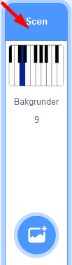
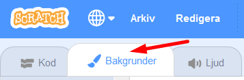
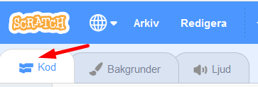
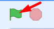

## Koda ditt piano
I denna uppgift kommer du få koda ett spel, som kommer att spela upp en melodi som du ska följa och sen spela samma melodi på ditt piano. Du kommer även att få lära dig lite grundläggande om noter. 

Följ instruktionen på denna sida medan du steg för steg bygger koden för ditt pianoprogram i vertyget Scratch. Dax att börja koda!
<br>
> <a href="https://scratch.mit.edu/projects/311971291/editor/">Starta med att klicka på bilden nedan för att öppna ett startprojekt.
</a>

<br>
01. På scenen i projektet finns en bakgrundsbild av ett piano. Låt oss se närmare på den. Klicka på **Scen** i nedre högra hörnet för att aktivera den och klicka sen på fliken **Bakgrunder** i övre vänstra hörnet. Se bilderna här under, så vet du vad du ska leta efter.

    

<br>
02. Här ser du att det finns 9 bakgrunder för ditt piano. Varje bakgrund representerar en vit tangent på pianot. Namnet på bakgrunden visar  vilken ton den spelar på pianot i en C-skala.

<br>
> C-skalan i ditt piano ska bestå av 8 noter som är: **C D E F G A B C**.

<br>
03. Längst till vänster ser du olika kategorier som heter **"Rörelse"**, **"Utseende"**, **"Ljud"** m.m. Under varje kategori finns olika block du kan programmera med. I denna uppgift kommer du främst att använda block från **"Utseende"**, **"Händelse"** och **"Musik"**.

<br>
Nu är det dax att välja ljud till ditt piano. Klicka på nästa avsnitt med nummer 1 nedan för att gå vidare.

---

## 1 - Välja instrument

Det första du ska göra är att sätta en bakgrund och välja ditt instrument som ska ge ljudet du vill ha. Till att börja med väljer vi piano som instrument, men sedan kan du testa att byta till ett annat instrument och ljud om du vill. 

01. Klicka på fliken **Kod** i övre vänstra hörnet, så kommer du tillbaka till kodarverktyget. 



Den gröna flaggan över ditt piano på Scenen är som en Play-knapp, som sätter igång ditt program som du nu ska koda.




02. Dessa kodblock i bilden nedan behövs för att börja bygga ditt program som styr hur ditt piano ska fungera:


De tre kodbitarna finner du inlagda på ditt projekts kodyta. Kan du koppla ihop dem nu så att de fungerar? De passar ihop som pusselbitar.


När du pusslat klart, kan du klicka dig vidare till nästa steg. Dax att koda så att du kan spela noter på ditt piano. 

---

## 2 - Spela en not

Nu ska du koda så att du kan spela på pianot med hjälp av tangentbordet på datorn. Vi måste lägga in instruktioner med kod för hur pianot ska kunna spelas i programmet du bygger. 

Dessa block behöver du ha för att koppla noter till tangentbordets knappar:


I ditt projekt finner du några av dessa block inlagda på kodytan. Nu ska du pussla ihop dem rätt och göra lite ändringar. 

1. På blocket ``` När mellanslag tangenten trycks ned ``` väljer vi bokstaven **a**.

Nu ska du sätta en bakgrund som ska visa fram vilken ton du spelar när du trycker på **a-tangenten** på datorns tangentbord.

2. På blocket ``` Byt bakgrund till ``` väljer du **Not-C**. Detta betyder att du kommer att spela noten C på pianot.

3. På blocket ``` Spela not 60 i 0.25 takter ``` klickar du på siffran 60. Då får du upp ett litet piano, där du väljer **not C(60)**.

Testa nu ditt program (starta genom att klicka på den **gröna flaggan** ovanför stora pianot på Scenen) och tryck på tangenten för **a** på  datorns tangentbord. 
Ser du att du spelar noten C? Hör du tonen spelas?

Toppen! Då kan du koda färdig ditt piano. Klicka dig vidare för att se hur.

---

## 3 - Resten av noterna

Nu ska du programmera resten av noterna i skalan. Du finner kodbitar att jobba med under de olika teman i vänstra kanten. Tips: håll koll på vilka färger du använt på dina kodblockn, det är en ledtrpd för vart du hittar fler sådana block.

För varje ny not du vill skapa, gör du dessa tre steg:

01. På blocket ``` När mellanslag tangenten trycks ned ``` väljer du en bokstav istället, som du vill spela med på ditt tangentbord.
02.  På blocket ``` Byt bakgrund till ``` väljer du istället **Not-**.
04. På blocket ``` Spela not 60 i 0.25 takter ``` så klicka du på siffran 60. Då kommer du få upp ett litet piano där du kan välj en ny not.

Bokstavstangenterna du ska använda på din dator är **s, f, g, h, j, k** och noterna du ska lägga in är **D(62) E(64) F(65) G(67) A(69) B(71) C(72)**.	

> När du kodat färdigt alla noter och tangenter kan du testa koden. Kan du spela hela C-skalan nu?

---

## 4 - Hemligt meddelande
Med kod kan man skapa massa saker. Nu vill du skapa ett hemligt meddelande som får något att hända i ditt program. 

01. Börja med att klicka på **Scen** i nedre högra hörnet, så att du är säker på att bakgrunden är vald för att kodas. 

02. Klicka på gula kategorin **Händelser** och dra ut blocket ``` Skicka din tur ``` . Klicka på orden din tur och ändra till **hemligt meddelande**. 

03. Dra även ut blocket ``` När gröna flaggan klickas på ``` och koppla ihop de två gula kodblocken. 

Tryck sedan på den gröna flaggan ovanför Scenen och se vad som händer!

> Kan du spela samma melodi som precis spelades upp?

---

## 5 - Extra utmaning

Om du vill ha en extra utmaning kan du testa att göra ditt eget piano med Makey Makey.

Först måste du koda in instruktionern för Makey Makey i ditt program. Gör såhär:

01. Klicka på ikonen som du ser i bilden nedan (den finns under alla kategorier i vänstra nedre hörnet):


02. Välj tillägget Makey Makey genom att klicka på bilden som ser ut som den nedanför här:


Nu har du fått två nya block att programmera med! Kan du byta ut dessa block i din kod i programmet:


...mot dessa block istället:


Koppla sedan in din Makey Makey i en USB-ingång på din dator och testa att spela igen! Fråga en volontär om hur du koppalar in Makey Makey till ditt projekt. 

> För att en Makey Makey ska fungera behöver du koppla ihop sladdarnas krokodilklämnmor med saker och ting som leder ström, exempelvis folie eller en frukt - eller varför inte en kompis hand? Hur vill du att ditt piano ska se ut och låta?

---

## 6 - En till utmaning

Skulle du kunna med blocket som är i bilden nedan fråga efter varje not du spelar och spelaren skriva in notens namn?


 
---

## 7 - Färdig!

Grattulerar! Nu har du gjort ett piano som kan spela en C-skala. Att koda musik är kul! Vilket instrument vill du koda?


