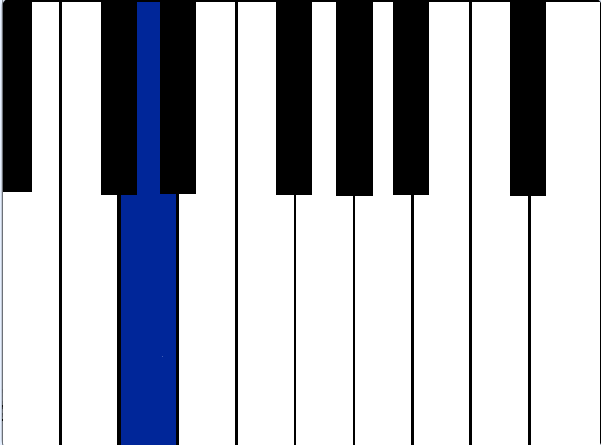

## Koda ditt piano
I denna uppgift kommer du få koda ett spel, som kommer att spela upp en melodi som du ska följa och sen spela samma melodi på ditt piano. Du kommer även att få lära dig lite grundläggande om noter. Dax att börja koda!

1. [https://scratch.mit.edu/projects/311971291/editor/](https://scratch.mit.edu/projects/311971291/editor/)

> <a href="https://scratch.mit.edu/projects/311971291/editor/">Starta med att klicka på bilden nedan för att öppna ett startprojekt.
</a>

I projektet finns en bakgrund av ett piano. Låt oss se närmare på den. Klicka på **Scen** i nedre högra hörnet och sen på fliken **Bakgrunder** som du finner i övre vänstra hörnet. 

Här ser du att det finns 9 bakgrunder för ditt piano.Varje bakgrund representerar en vit tangent på pianot. Namnet på bakgrunden visar  vilken ton den spelar på pianot i en C-skala.

C-skalan i ditt piano består av 8 noter och är: **C D E F G A B C**.

Längst till vänster ser du olika kategorier som heter **"Rörelse"**, **"Utseende"**, **"Ljud"** m.m. Under varje kategori finns olika block du kan programmera med. I denna uppgift kommer du främst att använda block från **"Utseende"**, **"Händelse"** och **"Musik"**.

Dax att välja ljud till ditt piano. Klicka på nästa avsnitt med nummer 1 nedan för att gå vidare.

---

## 1 - Välja instrument

Det första du ska göra är att sätta en bakgrund och välja ditt instrument som ska ge ljudet du vill ha. Till att börja med väljer vi piano som instrument, men sedan kan du testa att byta till ett annat instrument och ljud om du vill. Den gröna flaggan är som en Play-knapp, som sätter igång ditt program.

Dessa block behövs:


Kan du koppla ihop dem så att de fungerar? 

I nästa steg ska vi koppla ihop kodblock så att du kan spela en not på ditt piano.

---

## 2 - Spela en not

Nu ska vi koda så att vi kan spela på pianot med tangentbordet på datorn. Vi måste lägga in instruktioner för det i koden. 

Dessa block behöver vi ha:


1. På blocket ``` När mellanslag tangenten trycks ned ``` väljer vi bokstaven **a**.

Nu ska du sätta en bakgrund som ska visa fram vilken ton du spelar när du trycker på **a-tangenten** på datorns tangentbord.

2. På blocket ``` Byt bakgrund till ``` väljer du **Not-C**. Detta betyder att du kommer att spela noten C på pianot.

3. På blocket ``` Spela not 60 i 0.25 takter ``` klickar du på siffran 60. Då får du upp ett litet piano, där du väljer **not C(60)**.

Testa nu ditt program (starta genom att klicka på den **gröna flaggan** ovanför stora pianot på Scenen) och tryck på tangenten för **a** på sin dators tangentbord. Ser du att du spelar noten C? Här du tonen C?

Toppen! Då kan du koda färdig ditt piano. Klicka dig vidare för att se hur.

---

## 3 - Resten av noterna

Nu ska vi programmera resten av noterna.
För varje not du vill skapa, gör du dessa tre steg:

1. På blocket ``` När mellanslag tangenten trycks ned ``` väljer du en bokstav istället, som du vill spela med på ditt tangentbord.
2. På blocket ``` Byt bakgrund till ``` väljer du istället **Not-**.
3. På blocket ``` Spela not 60 i 0.25 takter ``` så klicka du på siffran 60. Då kommer du få upp ett litet piano där du kan välj en ny not.

Bokstäverna du ska använda för ditt tangentbord är **s, f, g, h, j, k** och noterna är **D(62) E(64) F(65) G(67) A(69) B(71) C(72)**.	

När du kodat färdigt alla noter och tangenter kan du testa koden. Kan du spela hela C-skalan nu?

---

## 4 - Hemligt meddelande
Du ska vara kvar på bakgrunder nu.
Klicka på kategorien "Händelser" och dra ut blocket ``` Skicka din tur ``` och koppla ihop det med ``` När gröna flaggan klickas ```. Ändra sedan meddelandet till **hemligt meddelande**. Tryck sedan på den gröna flaggan och se vad som händer!

Kan du spela samma melodi som precis spelades?

---

## 5 - Extra utmaning

Om du vill ha en extra utmaning kan du testa och göra ditt eget piano med Makey Makey.

Klicka på ikonen som du ser i bilden nedan


Välj tillägget Makey Makey.


Nu har du fått två nya block att programmera med! Kan du byta ut dessa block:


Mot dessa block:


Koppla sedan in din Makey Makey i en USB-ingång och testa att spela igen!

---

## 6 - En till utmaning

Skulle du kunna med blocket som är i bilden nedan fråga efter varje not du spelar och spelaren skriva in notens namn?


 
---

## 7 - Färdig!

Gratulerar nu har du gjort ett piano som kan spela en C-skala.

