# Globalspanaren

Globalspanaren

Redovisa med hjälp av kod!

I det här projektet ska vi koda två Globalspanare som hjälper dig att presentera och redovisa kring de Globala målen.

Välj ett globalt mål och låt Globalspanaren nr 1 först presentera din klass, skola, ställa frågor och berätta vad ni
upptäcker när ni spanar på ert globala mål lokalt där ni bor och globalt i världen.

Låt Globalspanaren nr 2 berätta och ge förslag på en idé eller uppfinning som gör ditt globala mål bättre.

Du lär dig inte bara om Globala målen utan också om programmering. I den här uppgiften får du prova på att koda villkor
och operatorer i Scratch.

Klicka på bilden nedanför för att testa ett exempelprojekt med
Globalspanare: <a href="https://scratch.mit.edu/projects/915787475/" target="_blank">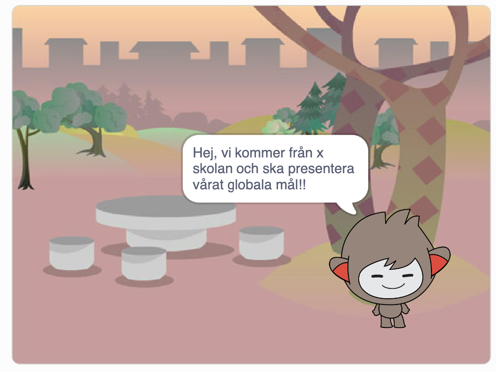

> Bläddra dig fram genom denna guide, steg för steg. <a href="https://scratch.mit.edu" target="_blank">
> Öppna även verktyget Scratch på sajten www.scratch.mit.edu</a> där du kodar och skapar själva Globalspanar-projektet
> utifrån Kodbokens instruktioner.

Dax att börja koda!

## 1: Välj bakgrund och den första Globalspanaren

Här ska du välja en ny bakgrund och välja din första Globalspanare.

> **VAD SKA JAG GÖRA?**

- Ta bort kattfiguren
- Välj ny sprajt
- Ändra sprajtens storlek större eller mindre (om du vill)
- Lägg till en bakgrundsbild

> **INSTRUKTION HUR JAG GÖR STEG-FÖR-STEG:**

1. Logga in på Scratch och öppna ett nytt projekt genom att trycka på **Skapa** på Scratch startsida.

2. Ta bort Katt-sprajten i projektet genom att klicka på soptunnan på den lilla kattbilden under scenen. Då försvinner
   katten ur projektet.

Dax att välja en figur som ska vara din Globalspanare nr 1.

3. Klicka på knappen **Välj ny sprajt**. Klicka på en sprajt du vill ha i sprajtbibioteket som kommer fram, så läggs den
   till i ditt
   projekt.

4. Om din figur är för stor eller för liten kan du ändra storleken på den. Klicka på siffrorna vid **Storlek**. Prova
   dig fram tills du är nöjd.

5. Nu ska du välja en ny bakgrundsbild. I nedre högra hörnet finns en blå ikonen för **Välj en bakgrund**. Klicka på den
   så kommer du till Scratch bakgrunds-bibliotek. Klicka på en bakgrundsbild du gillar så läggs den till i ditt projekt.

Du har nu din Globalspanare nr 1 och din bakgrund. Det är dags att börja koda om vad din Globalspanare nr 1 ska berätta
om.

## 2: Globalspanaren presenterar och frågar klassen

Nu ska du få din globalspanare att:

1. Presentera klassen och berätta vilken årskurs och skola ni går i och vilket Globalt mål ni valt.
2. Ställa en fråga till dig som du ska svara på.

> **VAD SKA JAG GÖRA?**

- Lägg till ett startskript för "När gröna flaggan klickas på"
- Lägg till ett block för Globalspanaren så den säger en hälsning och presenterar vilken årskurs,skola och vilket
  Globalt mål ni valt.
- Lägg till en frågan: "Ska jag spana lokalt eller globalt?" och låt Globalspanaren vänta på ditt svar.

> **INSTRUKTION HUR JAG GÖR STEG-FÖR-STEG:**

1. Se först till att din Globalspanarsprajt är vald, genom att klicka på den lilla sprajt-figuren under scenen så den
   blir blåmarkerad. Nu kan du börja koda din Globalspanare nr 1.

2. Från tema **HÄNDELSER** drar du in kodblocket **När GRÖN FLAGGA klickas på** och lägger det på skriptytan för din
   Globalspanare. Det här är koden för startknappen på ditt projekt.

3. Från tema **UTSEENDE** drar du in kodblocket **säg hej i 2 sekunder** Lägg det direkt under **När GRÖN FLAGGA klickas
   på**.

4. Klicka på ordet *Hej* i det lila kodblocket du just lade till och ändra texten till så att din robot presenterar
   vilken årskurs, vilken skola och vilket Globalt mål ni valt.I vårt exempel har vi gjort en Globalspanare som säger:
   *Hej! Vi är från åk 5 i XXXskolan. Vi har valt att spana på det Globala målet nr 6!*.

   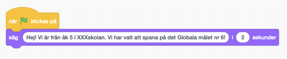

> **Testa koden!** Klicka på den lilla flaggan ovanför scenen och testa koden. Presenterar sig Globalspanaren?

5. Globalspanaren ska ställa en fråga som vi ska skriva in svaret på. Då behöver vi ett annat block.
   Under tema **KÄNNA AV** finns blocket **fråga** *Vad heter du?* **och vänta**. Dra in blocket och sätt ihop det
   underst med de andra kodblocken på skriptytan.

6. Klicka på texten i kodblocket du lade till och ändra texten *Vad heter du?* till frågan: Vill du jag ska spana lokalt
   eller globalt? som din Globalspanare ska fråga dig.

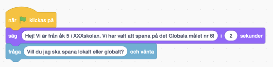

> **Tänk på!** Det är viktigt att skriva rätt i det svar ger till er Globalspanare, då svaret måste vara exakt det samma
> som roboten efterfrågar,lokalt eller globalt? Tänk på att stava exakt så som Globalspanaren frågar.

> **Tips!** Har ni en egen ide till fråga som passar er Globalspanare? Självklart kan ni välja den. Tänk på att välja en
> fråga som man kan svara så man får svar på vad ni spanat på lokalt eller globalt. Frågan måste kunna ha två svar som
> alternativ.

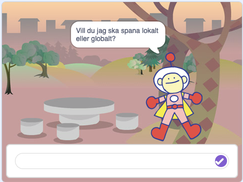

> **Testa ditt projekt!** Klicka på START-flaggan. Frågar Globalspanaren din fråga? Vad händer om du skriver ett svar i
> nedre textrutan?

Nu har vi en Globalspanare nr 1 som presenterar er klass och skola, vilket globalt mål och som ställer frågor. Men hur
ska den veta ditt svar? Vi måste koda vidare.

## 3: Globalspanaren berättar om sin spaning

För att din Globalspanare ska kunna hjälpa dig att berätta om vad klassen lärt sig om ert Globala mål måste den veta vad
du svarar på frågan. Dessutom behöver den instruktioner om vad den ska berätta om beroende på vilket svar du ger
den. Då använder vi kod för att skapa ett villkor som säger att OM svaret är exempelvis lokalt så berättar
globalspanaren det här.

> **VAD SKA JAG GÖRA?**

Se i videon ovan hur du ska:

- Lägg till ett villkors-block för "Om__Då"
- Lägg till en operator för "__ = ___ "
- Lägg till blocket för frågans svar i operatorn
- Skriv in ett av frågans svarsval i operatorn
- Lägg till så Globalspanaren svarar tillbaka

> **INSTRUKTION HUR JAG GÖR STEG-FÖR-STEG:**

1. Under tema **KONTROLL** finns kodblocket **om __ då**. Dra in blocket och lägg det direkt under din Globalspanares
   frågor i koden.

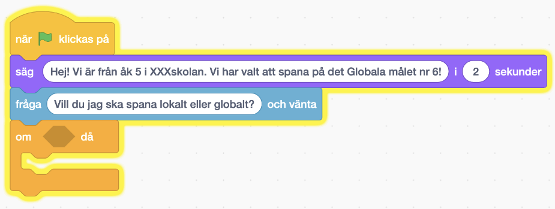

2. Ser du det kantiga hålet mellan **om** och **då** i kodblocket du just lade till? Nu ska vi lägga in kod där som
   säger att **om** *Svar = lokalt* **då**. Gör såhär: Gå först till det gröna temat **OPERATORER** och leta fram
   kodblocket som har tecknet för "lika med" i sig ( = ). Dra in blocket och lägg det inuti det kantiga hålet mellan *
   *om __ då**. Då ser skriptet ut såhär:

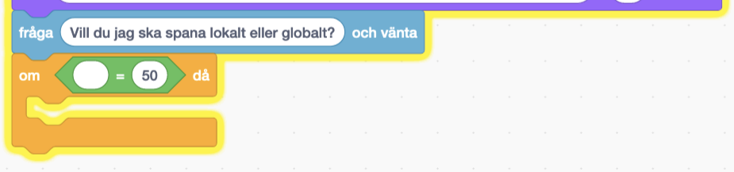

3. Nu ska vi lägga in vad det gröna operatorblocket ska hantera för variabler. Vi vill att det ska stå kod som ger
   **om** *Svar = lokalt* **då**. Koden ska **känna av** vilket svar som skrivs in i textrutan för svaret. Gå därför
   till
   tema **KÄNNA AV** och hitta kodblocket **svar**. Dra in blocket så det lägger sig inuti den första tomma vita cirkeln
   i den gröna operator-blocket, så det ser ut såhär:

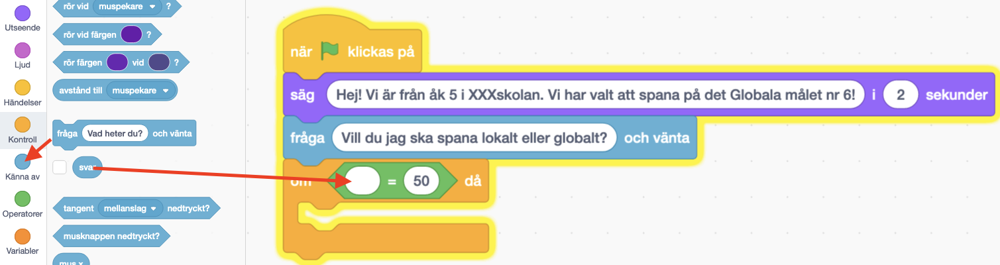

4. Skriv sedan in det första av de svarsval du gav i Globalspanarens fråga, exempelvis svaret **lokalt** så som vår
   Globalspanare efterfrågar i exemplet i denna instruktion. (*"Vill du att jag berättar om vår spaning för mål nr 6
   lokalt eller globalt?"*).

5. Nu ska vi ändra så att svaret blir lika med ett av Globalspanarens givna svarsval i det gröna operatorblocket. Klicka
   på variabelsiffran 50 och skriv istället ett av Globalspanarens två svarsval, lokalt eller globalt. I vårt exempel
   med vår Globalspanare skriver vi svarsvalet *lokalt*.

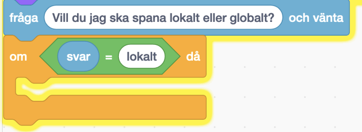

6. Nu vet Globalspanaren vilket svar vi valt och kan hjälpa dig, dax att lägga till Globalspanarens egna svar. Under
   tema **UTSEENDE** finns blocket **säg Hej! i 2 sekunder**. lägg in det blocket inuti den gula villkors-loopen. Ändra
   texten till Globalspanarens svar som berättar mer om det val du skrivit till den. I vårt exempel blir koden med
   svaret såhär:

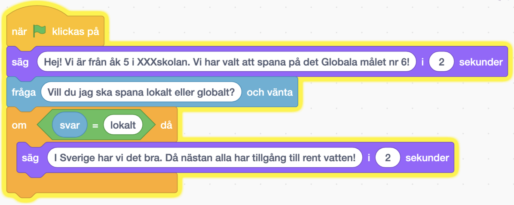

7. Gör nu en exakt likadan kod till som den du just gjort. Väl ett nytt  **om** *Svar = lokalt* **då**, men som istället
   styr vad som händer om du svarar det andra svarsvalet. Exempelvis om vi svarar Globalroboten att vi vill höra den
   berätta om
   *globalt* istället för *lokalt*. Repetera steg 1-6 ovan för att bygga en likadan kodbit till. Sätt in hela kodbiten
   direkt under det förra, så det ser ut såhär:

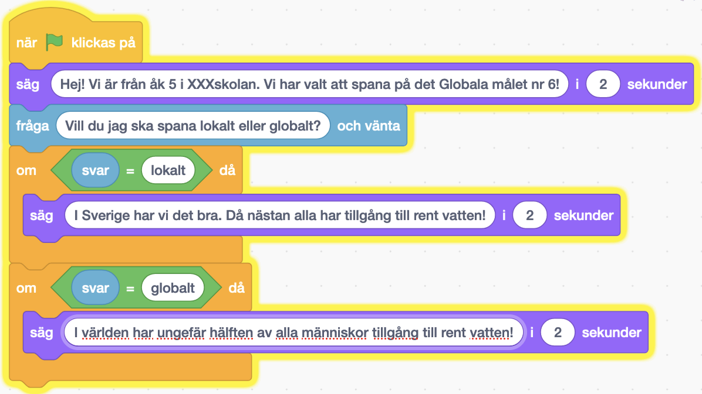

> **Testa koden!** Vad händer när du svarar Globalspanaren ett av svarsvalen? Fungerar de olika svaren?

Nu har vi en Globalspanare som kan hjälpa dig och berätta om klassens spaningar lokalt och globalt kring det Globala
målet klassen valt!

## 4: Skapa en robot som presenterar GlobalSpanaren

Först ska vi skapa en ny sprajt för vår presenterar robot. Detta kan vi göra på samma sätt som förut, välj en passande
sprajt. Jag valde en flygande robot!

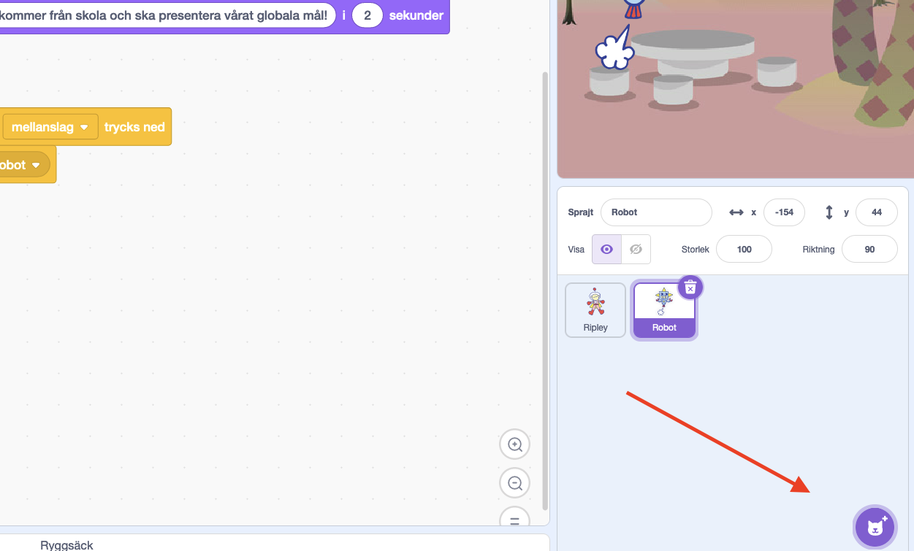

När du har valt en passande sprajt så kommer den ha egen kod som vi nu ska programmera.
Först vill vi att den ska visa sig när vi startar klickar på grön flagga. Vi vill även att den ska presentera vilken
skola och vilket mål ni har utforskat.

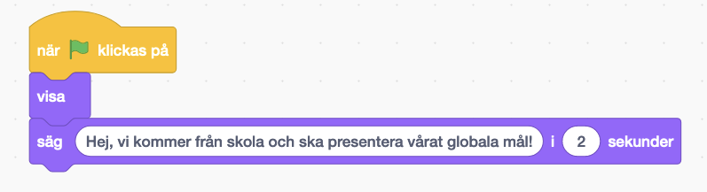

Nu vill vi att denna spajt ska presentera och visa er globalspanare när vi klickar på mellanslag. Först behöver vi så
att denna sparjt ska reagera när en tagenten mellanslag trycks ner. Se bilden nedan

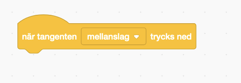

Nu ska vi göra så att presenteraren ska prata med er globalspanare. Detta kan vi göra genom att presenteraren ska skicka
ett meddelande till globalspanaren när ni trycker på mellanslag.
Först dra ut ett "skicka meddelande" kloss och placera den under "när mellanslag trycks ned". Skriv sedan ett meddelande
som ni vill att globalspanaren ska få. I vårt fall skrev vi "visa globalspanare".
Vi vill även att presenteraren ska gömma sig när vi trycker på mellanslag igen. Detta kan vi göra genom att
presenteraren ska skicka ett meddelande till globalspanaren när ni trycker på mellanslag.

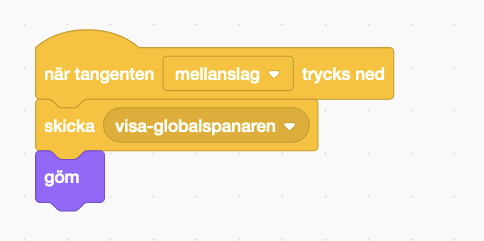

Nu vill vi gå tillbaka till vår globalspanare och lägga till en kod som gör att den ska reagera när den får ett
meddelande från presenteraren. Först behöver vi så att denna sparjt ska reagera när den får ett meddelande. Se bilden
nedan.
Vi behöver ett block "När jag tar emot meddelanden" och ett block "om meddelande = visa globalspanare". Vi vill även att
globalspanaren ska visa sig när den får meddelandet. Detta kan vi göra genom att lägga till ett block "visa" under "om
meddelande = visa globalspanare".

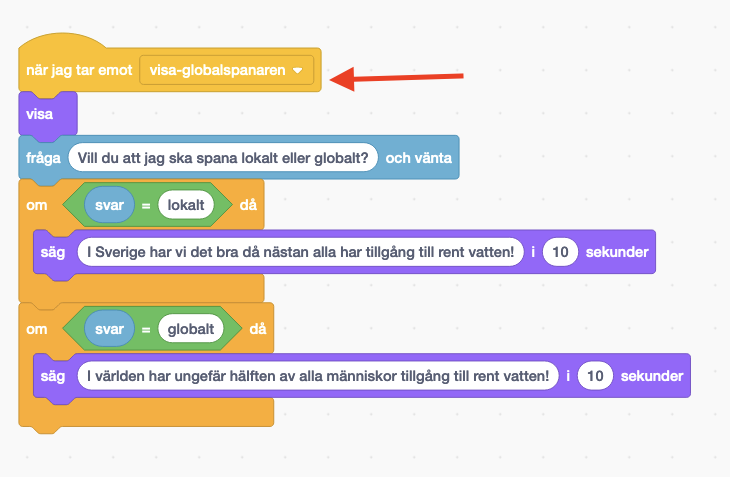

Sedan vill vi även att globalspanaren ska gömma sig när vi startar spelet. Detta kan vi göra genom att lägga till ett
block "göm" under "när gröna flaggan klickas på".

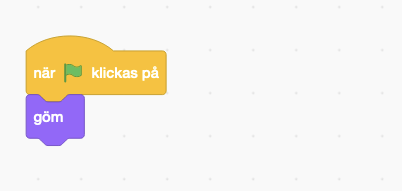

Nu kan du testa din kod genom att trycka på gröna flaggan. Fungerar allt? Om inte, gå tillbaka och kolla igenom koden.
Om allt fungerar kan du gå vidare till nästa steg.

## 5: Ändra bakgrund beroende på fråga!

Först vill vi ha samma bakgrund varje gång vi startar presentationen! Detta kan vi göra med att sätta bakgrund i starten
av koden. Se bilden nedan. Välj en bakgrund som passar er presentation.

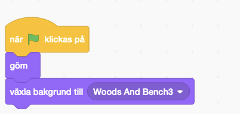

Nu vill vi att bakgrunden ska ändras när globalspanaren dyker fram! Detta kan vi göra genom att lägga till samma block
som innan då globalspanaren visar sig. Se bilden nedan.
Välj en passande bakgrund, eller varför inte slumpa en bakgrund?
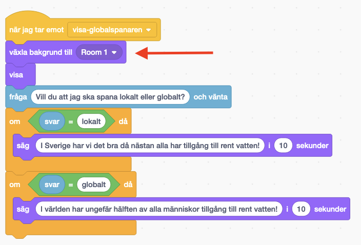

Testa gärna koden! Fungerar det?

Nu kan vi även lägga till så att bakgrunden ändras beroende på om vi svarar lokalt eller globalt. Placera in samma block
i om-satsen som innan. Se bilden nedan.
Välj en passande bakgrund. Fungerar det?
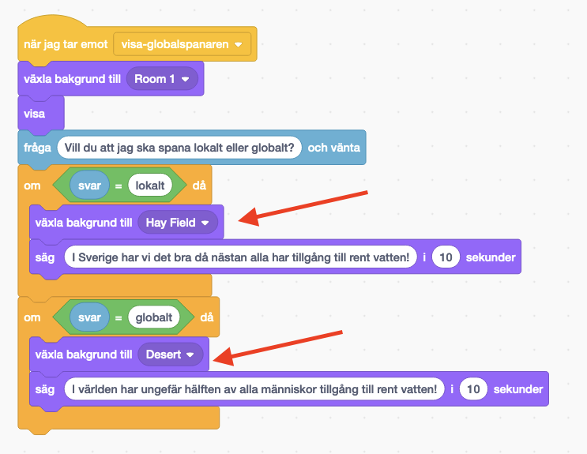

