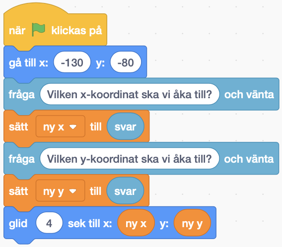
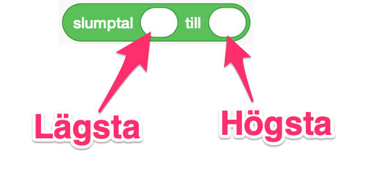
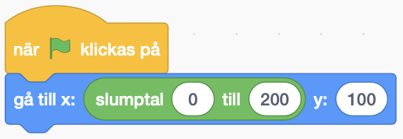

# Månfärden

Nu är det dags för uppskjutning till månen! Har du förberett dig genom att sätta ut saker i ett koordinatsystem på papper? Det kommer vi få användning av.

Vi ska bygga en avfyrning där vi försöker åka till månen genom att skriva in de koordinater vi vill åka till och sedan åka dit.

<video src="./0_1.mp4" loop autoplay muted />

Vi börjar med att starta från ett startprojekt. Detta kallas att *remixa*.

1. Öppna din webbläsare och gå till
		
	<a href="https://scratch.mit.edu/projects/304677361/" target="_blank">https://scratch.mit.edu/projects/304677361/</a>
	
2. Klicka på knappen **Se inuti** så att du kan se koden.
3. Klicka på knappen **"Remix"** så att du får din egen version av projektet.

Nu har du ett projekt som innehåller ett koordinatsystem, en rymdbakgrund, en jordsprajt och en månsprajt.

> Det finns flera varianter av koordinatsystem att välja mellan. Klicka på fliken **Klädslar** uppe till vänster. Klicka på fliken **Skript** för att se sprajtens skript. Det är viktigt att du behåller det här skripter för sprajten. Den placerar koordinatsystemet i mitten av scenen.

##  1 – Placera ut sprajtar

Vi börjar med att lägga ut alla våra sprajtar så att de får rätt koordinater.

Tryck på en sprajt i biblioteket för att välja den. Vi kan se att den är vald för att den får en blå ram runt sig.

Vi sätter ut våra sprajtar så exakt vi bara kan. För att göra det så kan vi programmera dem genom att använda blocken **När grön flagga klickas på** och **gå till x: ` ` y: ` `**.

Lägg till de här blocken på alla sprajtar och skriv in de exakta koordinaterna från ditt koordinatsystem på papper.

Testa: Tryck på den gröna flaggan. Hamnar alla sprajtar där du trodde att de skulle hamna? Är det någon som inte stämmer?

## 2 – Använda frågor och svar

Välj sprajten ”Raket”.

Vi kan berätta för vår raket vart den ska åka genom att använda blocket **fråga `     ` och vänta**. Då öppnas en textruta där vi kan skriva in en x-koordinat. Vårt svar hamnar sedan i variabeln **svar**.

Koda raketen så att den frågar vilken x-koordinat den ska gå till och att den sedan sätter x till svaret.

<video src="./2_2.mp4" loop autoplay muted />

Testa: Frågar raketen vilken x-koordinat du ska åka till? Om du skriver in en siffra – flyttas då raketen åt vänster eller höger?

## 3 – Fråga efter y-koordinat

Fortsätt koda på sprajten ”Raket”. 

För att kunna åka till månen behöver vi veta både en **x-koordinat** och en **y-koordinat**.

Så vi behöver en fråga till. Men denna gång frågar vi ”Vilken y-koordinat ska vi gå till?”. Lägg frågan under vårt block där vi går till x.

 

Testa: Frågar raketen nu först vilken x-koordinat den ska gå till? Och sedan vilken y-koordinat den ska gå till?

## 4 – Spara x och y i variabler

I stället för att hoppa till x- och y-koordinaten så skulle vi vilja använda blocket **glid 1 sek till x: ` ` y: ` `**. Då kommer vår raket att glida till koordinaten i stället för att hoppa. Det kommer se roligare ut.

Men för att kunna glida så behöver vi veta både x och y. Och variabeln **svar** vet bara svaret på den senaste frågan. Den håller inte reda på tidigare svar. Det betyder att vi inte vet vilken x-koordinat vi ska åka till efter att vi har svarat på frågan om y-koordinat.

Vad vi kan göra är att spara svaret i en egen variabel. Som vi själva kan hålla reda på.

Skapa en ny variabel som heter ”ny x”. 

Använd blocket **sätt ”ny x” till `svar`** i stället för att använda blocket ”sätt x till `svar`”. Då sparar vi svaret på frågan i vår variabel ”ny x”.

Gör samma sak med y. Skapa en ny variabel som heter ”ny y” och sätt den till ”svar”.

<video src="./4_5.mp4" loop autoplay muted />

Testa: Svara på frågorna. Ändras siffrorna i variablerna när du skriver in svaren?

> Du kan se variablerna längst upp till vänster på din scen. De borde få samma siffra som du skrev in i textrutan.

## 5 – Glid till variabler

Ser din kod för raketen ut ungefär så här?

Nu ska vi använda blocket **glid `4` sek till x: ` ` y: ` `**. 

Testa: Starta spelet, svara på frågorna. *Glider* raketen till de koordinater som du har skrivit in?

<video src="./5_3.mp4" loop autoplay muted />

## 6 – Berätta hur det har gått

Ser din kod för raketen ut ungefär så här?

Efter att vår raket har glidit så vill vi att den säger ”Jippie! En perfekt uppskjutning” om den rör vid månen. Och annars så vill vi att den säger ”Ajdå. Inte så bra som vi hoppades”.

Det gör vi med blocket **om då annars**:

Tillsammans med blocket **rör vid Månen?**:

Om vi rör vid månen då ska vi säga ”Jippie! En perfekt uppskjutning!”:

Annars så ska vi säga ”Ajdå. Inte så bra som vi hoppades.”.

Testa: Starta spelet, svara på frågorna. Säger raketen rätt sak när den har glidit klart?

<video src="./6_5.mp4" loop autoplay muted />

## 7 – Slumpmässig position

Tryck på månen. Nu ska vi ändra så att den får en *slumpmässig* position i den högra och övre delen av scenen. Det ska vi göra med blocket **slumptal**. 

Vi vill att månen ska byta plats varje gång vi spelar så att vi inte bara kan memorera vilken koordinat den har. 

Blocket **slumptal** fungerar lite som en tärning. Precis som att vi får olika svar när vi slår en tärning så får vi olika tal varje gång vi använder blocket.

Till skillnad från en vanlig tärning (där det minsta talet vi kan slå är 1 och det högsta är 6) så kan vi i scratch välja vad det minsta- och högsta talet ska vara.

Markera sprajten ”Månen” och ersätt x-koordinaten med **slumptal**.

Om vi vill att vår måne ska hamna på högersidan av vår scen – **vilken är den lägsta x-koordinaten som månen kan få?**

**Och vilken är den högsta x-koordinaten som månen kan få?**

Skriv in den lägsta i det vänstra fältet och den högsta i det högra fältet.

Testa: Tryck på den gröna flaggan. Hamnar månen på olika positioner varje gång du trycker? Hamnar den i det övre högra hörnet varje gång du trycker?

<video src="./7_6.mp4" loop autoplay muted />

## 8 – Slumpmässig y-koordinat

Ser din kod för månen ut så här?

På samma vis som vi slumpade fram en x-koordinat så ska vi nu slumpa fram en y-koordinat. Det är för att månen också ska kunna röra sig upp och ned.

Om vi vill att vår måne ska hamna på den övre delen av vår scen – **vilken är den lägsta y-koordinaten som månen kan få?**

**Och vilken är den högsta y-koordinaten som månen kan få?**.

Lägg till ett fält för slumptal även på y-koordinaten. Skriv in den lägsta i det vänstra fältet och den högsta i det högra fältet.

<video src="./8_2.mp4" loop autoplay muted />

Testa: Tryck på den gröna flaggan. Hamnar månen på olika positioner även i höjdled varje gång du trycker på den gröna flaggan?

<video src="./8_3.mp4" loop autoplay muted />

## Färdig!

Glöm inte att spara ditt projekt! Döp det gärna till uppgiftens namn så att du enkelt kan hitta den igen.

<video src="./0_1.mp4" loop autoplay muted />

> **Testa ditt projekt**
> Visa gärna någon det som du har gjort och låt dem testa. Tryck på DELA för att andra ska kunna hitta spelet på Scratch. Gå ut till projektsidan och låt någon annan testa spelet!

## Utmaningar

## Frågeställningar
