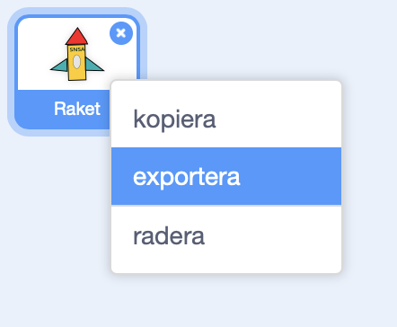
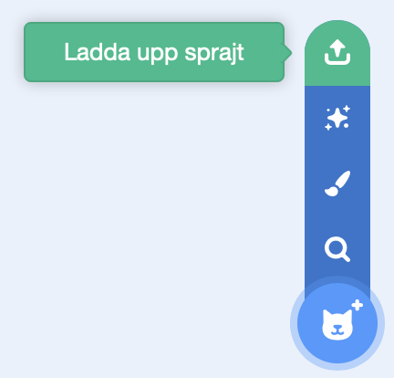
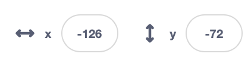

# Marslandningen

Det är farligt att åka till Mars. Rätt var det är så kan det dyka upp ett asteroidfält. 

För att ta reda på när det är säkrast att åka så kan vi bygga en *simulator*. En simulator är ett datorprogram som kan testa saker. Vi kan till exempel testa att landa vid olika tidpunkter på dagen för att kunna se vilken tid som är bäst.

<video src="./0_1.mp4" loop autoplay muted />

## 1 – Remixa simulatorn

Vi har hittat ett projekt för simulatorn men det ser ut att vara ofärdigt. Vi skulle behöva göra klart det.

Låt oss remixa det.

1. Öppna din webbläsare och gå till
		
	<a href="https://scratch.mit.edu/projects/304677675/" target="_blank">https://scratch.mit.edu/projects/304677675/</a>
	
2. Klicka på knappen **Se inuti** så att du kan se koden.
3. Klicka på knappen **"Remix"** så att du får din egen version av projektet.

Nu har du ett projekt som innehåller en raketsprajt, en jordsprajt, en marssprajt, en asteroidsprajt och en rymdbakgrund.

### Vill du använda din egna raket?

> Detta steg är valfritt men roligt.

Har du byggt din egna raket i Scratch? Det går att lägga till den i det här projektet.

1. Gå till "mina grejer" i Scratch och öppna ditt raketprojekt
2. Tryck och håll ett par sekunder på raketen i biblioteket och tryck på "exportera".

  

3. Gå tillbaka till "mina grejer" och öppna Marslandningsprojektet
4. Tryck på knappen "Ladda upp sprajt"

  

5. För att raketen ska åka åt rätt håll så behöver vi rotera klädseln för raketen så att den pekar åt höger.

  <video src="./1_3.mp4" loop autoplay muted />

6. Placera din raket på samma koordinater som den raketen som kom med projektet

  

7. Rotera din sprajt så att den får samma vinkel som den raketen som kom med projektet

  
        
8. Ta bort kod från din raket så att det är helt tomt.
9. Färdigt! Nu kan vi gå vidare till nästa steg.

## 2 – Beskrivning

Vi kommer behöva:

- Två variabler
	- En som räknar lyckade landningsförsök
	- En som räknar misslyckade landningsförsök
- Ett skript som avfyrar raketen mot mars
	- Om raketen nuddar asteroidfältet så ska variabeln "misslyckade landningsförsök" ändras med 1
	- Om raketen nuddar Mars så ska "lyckade landningsförsök" ändras med 1
- Ett skript som sätter variablerna till 0 och sedan avfyrar raketen 100 gånger

Låt oss bygga det tillsammans.

## 3 – Avfyra raketen

Vi vill att raketen ska avfyras när vi startar simulatorn. Alltså när vi trycker på den gröna flaggan.

När vi trycker på den gröna flaggan så ska raketen:

- **gå till** koordinaten där den ska starta
- **för alltid** röra sig framåt med **gå 5 steg**.

<video src="./3_1.mp4" loop autoplay muted />

Testa: Tryck på den gröna flaggan. Åker raketen iväg? Tryck på den gröna flaggan igen. Startar den från jorden igen? 

## 4 – Känn av om vi nuddar Mars

Ser din kod ut ungefär såhär?

Men om vi bara åker framåt utan att stanna så kommer raketen bara att fortsätta att åka och åka. Och då kommer vi åka förbi Mars.

Efter varje steg framåt så måste vi kolla **om** vi **rör vid Mars**. Och om vi gör det så vill vi **stoppa detta skript** eftersom vi då har kommit fram till Mars. 

<video src="./4_2.mp4" loop autoplay muted />

Testa: Tryck på den gröna flaggan. Stannar din raket när den nuddar Mars?

## 5 – Skapa en variabel

Nu stannar raketen vid Mars men vi skulle behöva hålla räkningen på hur många gånger vi lyckas landa.

För det behöver vi en *variabel*. Variabler är bra för de kan hålla reda på saker åt oss. Till exempel hur många gånger vi lyckas landa.

Skapa en variabel som heter ”lyckade landningsförsök”.

## 6 – Ändra variabeln

I vårt skript så vill vi nu **ändra "lyckade landningsförsök" med 1** när vi rör vid mars men innan vi stoppar vårt skript.

Då kommer vår variabel att plussas med 1 varje gång vi rör vid Mars. Så om vi trycker på den gröna flaggan flera gånger så kommer vår variabel att hålla räkningen för hur många gånger vi har rört vid Mars.

<video src="./6_2.mp4" loop autoplay muted />

Testa: Räknar din variabel "lyckade landningsförsök" upp varje gång som vår raket nuddar Mars?

## 7 – Åk till Mars med ett meddelande

När vi kör vår simulator så körs den bara en gång. Så om vi vill köra 100 simulationer så måste vi trycka på den gröna flaggan 100 gånger. Det är det väl ingen som orkar!? Tur att det finns ett bättre sätt!

Vi kan använda *meddelanden* för att avfyra vår raket flera gånger. Så i stället för att avfyra vår raket 1 gång genom att trycka på den gröna flaggan så kan vi avfyra vår raket 100 gånger genom att skicka ett meddelande 100 gånger.

Lägg ut blocket **När jag tar emot ”uppskjutning”**.

Flytta sedan alla block från **När grön flagga klickas på** till **När jag tar emot ”uppskjutning"** genom att dra dem.

Om vi skulle testa att starta simulatorn så skulle ingenting hända för vi skickar aldrig meddelandet ”uppskjutning".

Lägg till ett block **skicka "uppskjutning" och vänta** och lägg det under **När grön flagga klickas på**.

Om vi testar programmet nu så fungerar det precis som tidigare. Raketen flyger mot Mars.

## 8 – Skjut upp 100 gånger

Ser din kod ut ungefär så här?

Vi skjuter fortfarande bara upp raketen 1 gång. Men vi vill testa att skjuta upp raketen 100 gånger.

Lägg till blocket **repetera 100 gånger** runt vårt block **skicka "uppskjutning" och vänta**. 

Nu kommer raketen att skjutas upp 100 gånger. Utan att vi behöver avfyra den själva. Den bara åker och åker.

<video src="./8_2.mp4" loop autoplay muted />

Testa: Skjuts din raket upp 100 gånger när du trycker på den gröna flaggan?

> Har du lagt märke till att det dyker upp asteroider mellan jorden och Mars? De ska vi göra något åt i nästa steg.

## 9 – Räkna misslyckade landningar

Nu åker vi till Mars varje gång vi trycker på den gröna flaggan men vi åker rätt igenom asteroidfältet. Det måste vi fixa!

Vi behöver **skapa en ny variabel** som heter ”misslyckade landningar”.

Efter varje steg framåt så ska vi på samma sätt som vi räknade antalet "lyckade landningar" räkna "misslyckade landningar". **Om vi rör vid Asteroider** så ska vi **ändra "misslyckade landningar" med 1**.

Och precis som när vi rör vid Mars så vill vi också **stoppa detta skript** efter att vi har ändrat vår variabel.

<video src="./9_2.mp4" loop autoplay muted />

Testa: Räknar din variabel "misslyckade landningar" upp när raketen rör vid asteroiderna?

## 10 – Sätt variabler till 0 vid start

Våra variabler bara fortsätter att räkna och räkna. De börjar aldrig om från början. Vi skulle behöva sätta dem till 0 varje gång vi trycker på den gröna flaggan.

Lägg de här blocken **mellan** blocket ”när grön flagga klickas på” och ”repetera 100”.

## 11 – Ändra klockslag

Åh! Det finns en variabel som har legat gömd hela tiden. Har du sett den? Den heter ”klockslag”. Den måste ha funnits med sedan vi remixade den.

Det verkar som att vi kan köra simulatorn vid olika klockslag. För att se om det är någon skillnad att till exempel åka på morgonen eller på eftermiddagen. 

För att byta klockslag så lägger vi till blocket **sätt "klockslag" till "15"** precis i början av vårt skript. Efter att den gröna flaggan har klickats på. Då kommer vi testa att landa 100 gånger när klockan är 15:00. Alltså tre på eftermiddagen.

Det finns tre olika klockslag att testa:

- 12
- 15
- 18 

> Om du vill se vilket klockslag simulatorn är inställd på så kan du bocka för den lilla rutan som ligger framför variabeln.
> 

## Färdig!

Nu är simulatorn färdig och det är dags för er att analysera slutresultatet.

Glöm inte att spara ditt projekt! Döp det gärna till uppgiftens namn så att du enkelt kan hitta den igen.

> **Testa ditt projekt**
> Visa gärna någon det som du har gjort och låt dem testa. Tryck på DELA för att andra ska kunna hitta spelet på Scratch. Gå ut till projektsidan och låt någon annan testa spelet!

## Utmaningar

### Snabba upp simulatorn

Tycker du att simulatorn går långsamt? Det går att snabba upp den genom att gå fler steg framåt. Testa att skriva in en högre siffra i blocket **gå 3 steg framåt**.

