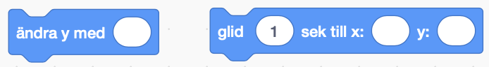

# Rymdraketen

Vi börjar vårt rymdäventyr med att bygga en raket i [Scratch](http://scratch.mit.edu). Vi ska rita vår raket med olika geometriska figurer och sedan programmera den att fara ut i rymden!

## 1 – Skapa ett nytt projekt i Scratch

Börja med att öppna Scratch genom att trycka på den här länken: https://scratch.mit.edu/

I toppen av sidan finns en meny med olika alternativ. Tryck på alternativet *Skapa*.

Alla nya projekt i Scratch innehåller en katt. Vi börjar med att ta bort den. 

Det gör vi genom att trycka på krysset på katten i biblioteket.

## 2 – Måla en ny sprajt

Skapa en ny sprajt genom att trycka på knappen ”Måla ny sprajt”. Döp din sprajt till ”Raket”.

Nu är det dags att börja. 

## 3 – Toppen av raketen

Vi vill att toppen av raketen ska vara en liksidig triangel. En liksidig triangel betyder att alla sidor är lika långa. Det finns inget verktyg i Scratch för att rita trianglar så vi ritar den med hjälp av verktyget för att rita linjer.

1. Välj linjeverktyget.
2. Tryck och dra för att rita en linje.
3. Rita en triangel med tre lika långa linjer. Det finns ingen linjal i Scratch men om du har en linjal i närheten så kan du hålla upp den mot skärmen för att se om dina linjer är lika långa.

> Om du vill ta bort din senaste linje så kan du trycka på knappen ”ångra”.

Nu när vi har ritat konturerna av vår triangel så kan vi färglägga den. Välj verktyget ”fyll” som ser ut som en målarburk. Välj sedan en färg som du vill färglägga din triangel med. Tryck i din triangel. Får triangeln den färgen som du har valt?

> Fungerar det inte? Fyllverktyget fungerar bara om det inte finns några hålrum i triangeln. Fortsätt rita linjer så att du blir av med alla hålrum. Sedan kan du fylla den med färg.

## 4 – Raketens kropp

Raketens kropp består av en rektangel. Vi kan rita rektangel med hjälp av linjeverktyget om vi vill. Eller så använder vi rektangelverktyget.

1. Välj rektangelverktyget
2. Välj en fyllningsfärg
3. Tryck och dra för att rita en rektangel

> Om du vill flytta din rektangel eller ändra storlek på den så beöver du inte göra om den. Du kan välja verktyget ”välj” som ser ut som en muspekare och sedan trycka på rektangeln för att flytta den eller ändra storlek på den.

## 5 – Vingar

En raket behöver små vingar längst ned för att kunna åka rakt i luften. Vi kommer behöva två vingar. En på varje sida om raketen. 

En vinge består av en **rätvinklig** triangel. Fråga din lärare om du är osäker på vad en rätvinklig triangel är.

Flytta vingarna till botten av rektangeln. Nu börjar det likna en raket!

## 6 – Använd textverktyget

För att andra rymdfarkoster ska se att vår raket kommer från Sverige så ska vi märka vår raket med textverktyget. 

1. Välj textverktyget
2. Tryck inuti rektangeln för att välja vart du ska börja skriva
3. Skriv texten ”SNSA”. SNSA betyder Swedish National Spage Agency och det är var rymdstyrelsen heter på engelska.

Skriv SNSA (Swedish National Space Agency) på sidan av raketen. Det är vad ”Rymdstyrelsen” heter på engelska. 

> Om du inte är nöjd med vart texten är placerad så kan du flytta den genom att välja flyttverktyget.

## 7 – Gör raketen till din egen raket

Nu är grunderna till raketen klar. Nu har du möjlighet att göra den till din egen genom att dekorera den som du vill. 

Du får dekorera raketen genom att använda dig av de geometriska figurerna; Rektangel, triangel, cirkel och kvadrat. 

> Har du sett att det finns ett cirkelverktyg som fungerar likadant som rektangelverktyget?

Och om du vill skriva något mer på din raket så får du använda textverktyget också.

### Tips och inspiration!

Du kan till exempel:

- Göra fönster genom att rita ut cirklar, trianglar eller kvadrater.
- Ge din raket ett namn och skriva namnet någonstans på raketen
- Rita en stjärna på raketen genom att rita ut två stycken trianglar.

… eller något helt annat. Du får välja helt fritt.

## 8 – Välj en rymdbakgrund från biblioteket

Tryck på knappen ”Välj bakgrund” längst ned i högra hörnet.

Välj sedan en av alla rymdbakgrunder som finns i biblioteket.

## 9 – Programmera raketen att röra sig

Nu ska vi programmera vår första algoritm. Vi ska få vår raket att fara rakt upp i rymden.

En algoritm, eller skript som det kallas för här, måste vara exakt, i rätt ordning och fullständig för att datorn ska kunna förstå instruktionen. Du kan prova att svara på frågorna: *När?* *Vad?* *Hur?* när du skapar ditt skript.

### När?

Välj när raketen ska fara iväg. När startflaggan klickas på? När du klickar på raketen? När du trycker på en tangent på tangentbordet?

Utforska kategorin *Händelser* för att hitta ett block som säger *när* något ska hända.

### Vad?

Raketen ska åka uppåt, ut i rymden. Den ska alltså röra på sig – titta i kategorin *Rörelse*. Vilket skriptblock vill du använda här?

> Tips: Du kan inte använda ”gå” för det blir åt fel håll... vad vill du använda? Glid? Ändra?

### Hur?

Hur vill du att raketen ska röra på sig? Vilken riktning ska den åka i? 

Vi vill att den ska åka uppåt! Då behöver vi använda koordinater. Raketen har en koordinat för att hålla reda på vilken plats den har. En koordinat består av en siffra för X och en siffra för Y. Du kanske redan har lagt märke till att din raket har en koordinat?

Om du ändrar på X så flyttas raketen till höger eller vänster. Ett större tal flyttar den till höger och ett mindre tal flyttar den till vänster.

Om du ändrar på Y så flyttas raketen uppåt och nedåt. Ett större tal flyttar den till uppåt och ett mindre tal flyttar den till nedåt.

**Vi vill att raketen ska åka uppåt.** Hittar du ett block för att **ändra y**?

Tryck på blocket. Rör sig raketen uppåt?

### Andra saker att testa:

- Hur långt vill du åka? Ändra värdet i blocket och testa vad som händer när du använder ett stort tal eller ett litet tal.
- Det finns ett block som heter **för alltid**. Testa att lägg in ditt block ändra **y** inuti det blocket.

## Färdig!

Nu har du gjort en rymdraket. Snyggt jobbat!

Den här rymdraketen kan du plocka med dig till de andra rymduppgifterna som finns här på kodboken.

Glöm inte att spara ditt projekt! Döp det gärna till uppgiftens namn så att du enkelt kan hitta den igen.

> **Testa ditt projekt**
> Visa gärna någon det som du har gjort och låt dem testa. Tryck på DELA för att andra ska kunna hitta spelet på Scratch. Gå ut till projektsidan och låt någon annan testa spelet!

## Utmaningar

## Frågeställningar
