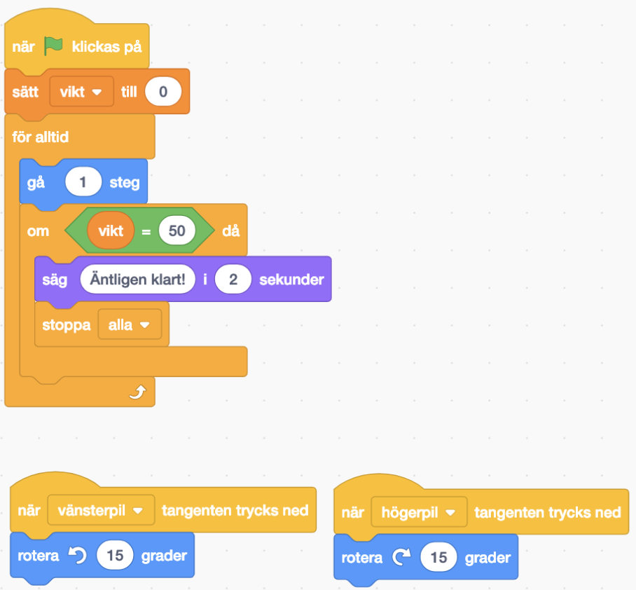
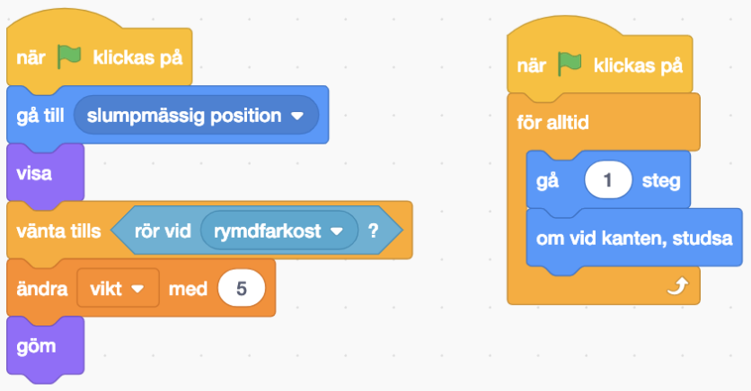
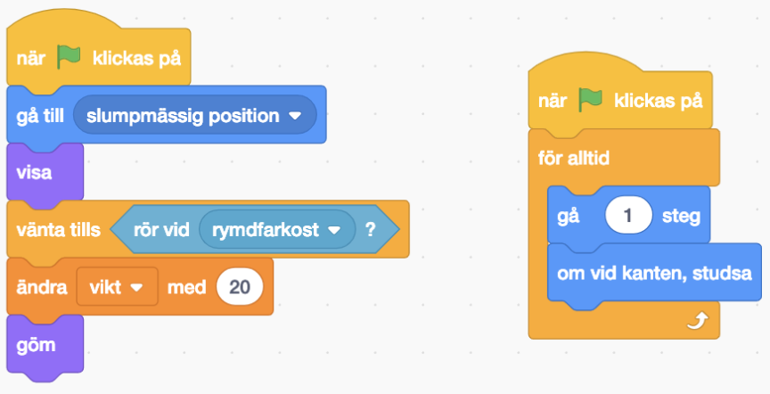
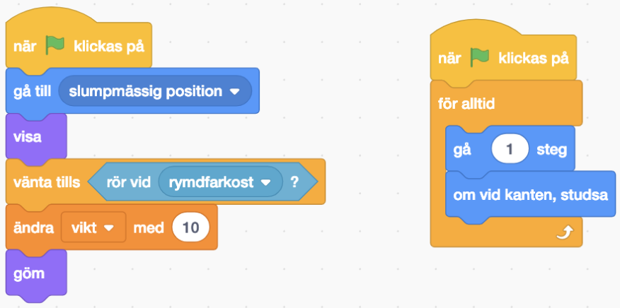
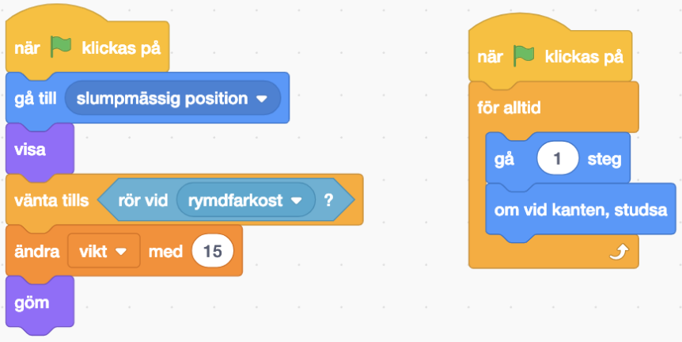
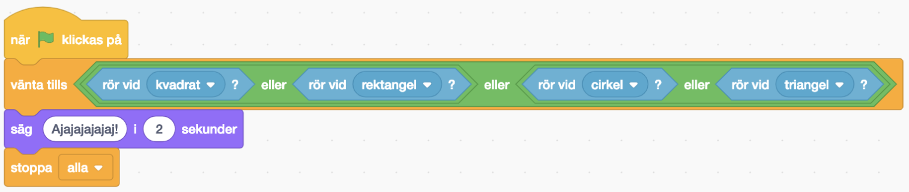

# Rymdskrot

Satelliten Mats är i fara! Det flyger runt en massa rymdskrot ute i rymden och en del av det kanske träffar Mats. Både stora- och små bitar kan vara farliga. Det är bäst att vi försöker städa undan så mycket som möjligt.

Vi ska bygga ett projekt i Scratch där vi får möjlighet att rädda Mats från rymdskrotet. Vi lyckas rädda Mats om vi samlar ihop 50 poäng och vi får poäng varje gång vi plockar upp rymdskrot. Om rymdskrotet röd vid Mats så får vi ”Game Over” och behöver börja om.

## Facit:

### Kod för Rymdfarkost:

### Kod för Kvadrat:

### Kod för Rektangel:

### Kod för Cirkel:

### Kod för Triangel:

### Kod för Mats:

