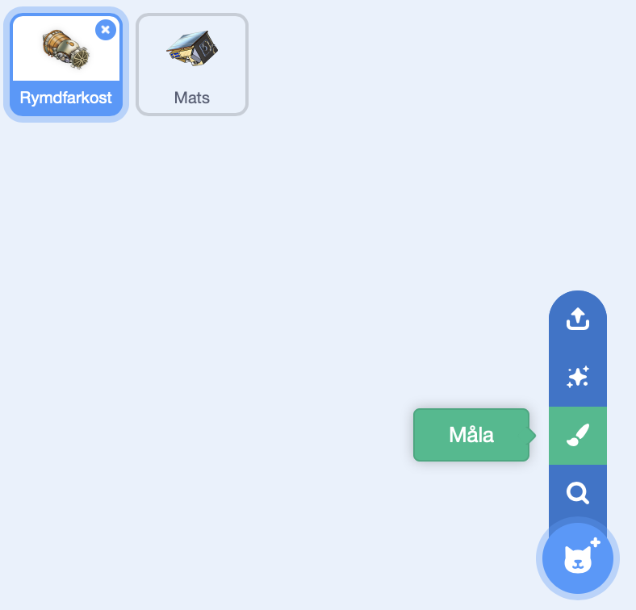
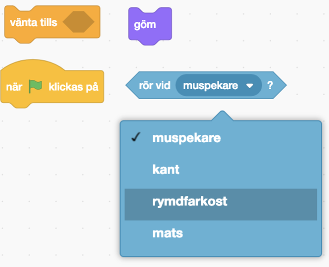

# CODA 2 – Städa rymdskrot

Vi måste rädda satelliten Mats och för att göra det så behöver vi städa rymden från rymdskrot.

// TODO: Lägg till instruktioner för remix eller för att skapa sprajtar med bilder

##  1 – Hoppa framåt

Vi ska börja med att röra oss framåt i rymden. Vi behöver två block från biblioteket. Ett block ”När grön flagga klickas på” och ett block ”gå 10 steg”.

Kan vi koppla ihop dem så att vår farkost hoppar framåt varje gång vi trycker på den gröna flaggan?

## 2 – Åka framåt

Rymden är en märklig plats för det är svårt att stå helt stilla. Oftast så fortsätter vi att sväva framåt. Det finns ett block som heter ”för alltid”. Kan vi koppla ihop det med de förra blocken så att vår farkost fortsätter att åka framåt när vi trycker på den gröna flaggan?

## 3 – Svänga

Nu när vi åker framåt i rymden så behöver vi också kunna svänga. Det finns ett block som heter ”när mellanslag-tangenten trycks ned” och två block som svänger. Ett block svänger vänster och ett block svänger höger.

Kan du ändra och sätta ihop dessa block så att när ”vänsterpil” tangenten trycks ned så ska farkosten svänga vänster? Och när ”högerpil” tangenten trycks ned så ska farkosten svänga höger?

## 4

Nu när vi kan styra vår farkost så är det dags att ge vårt projekt ett namn. Ge ditt projekt namnet ”Städa rymdskrot”.

// TODO: Fler och utförligare instruktioner för hur man sparar och namnger sitt projekt.

## 5 – Skapa rymdskrot

Men vart är allt rymdskrot? Rymden ser ju helt ren ut? Låt oss lägga till lite rymdskrot i vår rymd så att vi har något att städa.

Tryck på knappen för att måla en ny sprajt.

Rita en kvadrat genom att välja kvadratverktyget och rita en kvdrat på den rutiga ytan. Vi kan välja vilken färg vi vill.

Döp din sprajt till ”kvadrat”.

## 6 – Koda rymdskrot

Nu ska vi lägga till kod för vårt rymdskrot så att rymdskrotet försvinner när vår farkost rör vid det. Klicka på fliken ”kod” för att komma till koden för kvadraten.

> Ser det tomt ut? Din kod för din farkost har inte försvunnit. All kod som vi lägger ut är kopplade till en sprajt. Eftersom vi skapade en ny sprajt för vårt rymdskrot så har inte den fått någon kod ännu. Om vi väljer vår farkost i biblioteket så kommer vi se vår kod igen.

Tryck på ”kvadrat” i ditt bibliotek så att den är vald. Vi kan se att den är vald genom att den har en blå ram runt sig. Nu ska vi koda vad kvadraten ska göra.

Nu vill vi koda kvadraten så att när vi trycker på den gröna flaggan så ska den vänta på att den rör vid vår farkost. Och sedan ska den gömma sig själv. För det så kommer vi behöva dessa block:

## 7 – Visa rymdskrotet igen

Märker du att vårt rymdskrot aldrig visas igen? Även om vi trycker på den gröna flaggan?

Det är för att vi inte har lagt till det i vår kod. Kvadraten gör bara precis som den har blivit tillsagd.

Det finns ett block som heter ”visa”. Vi skulle kunna lägga det så att det händer precis efter vi har klickat på den gröna flaggan och precis innan vårt block ”vänta tills …”.

Vi vill att vår kvadrat ska visas så fort vi trycker på den gröna flaggan.

## 8 – Förflytta rymdskrotet

Nu visas vårt rymdskrot igen när vi trycker på den gröna flaggan. Men det visas alltid på samma ställe och det är lite tråkigt. Vi skulle vilja att det dyker upp på ett *slumpmässigt* ställe.

> Slumpmässigt betyder att det kan dyka upp vart som helst och på en ny plats varje gång.

Det finns ett block ”gå till slumpmässig position”. Lägg det mellan blocket ”när grön flagga klickas på” och ”vänta tills …”.

När det ligger rätt så lägger sig rymdskrotet på en ny plats varje gång vi trycker på den gröna flaggan.

## 9 – Rör på rymdskrotet

Nu har vi skapat ett rymdskrot i form av en kvadrat som dyker upp på en ny plats varje gång vi trycker på den gröna flaggan. Men rymdskrotet står ju helt still! Och det är ju helt fel. Det ska ju flyga runt.

Vi kan få det att flyga runt på samma sätt som vår farkost. Vi lägger till ett nytt block **När grön flagga klickas på** och **för alltid** så ska vi **gå 1 steg framåt**.

Men om vi testar nu så fastnar vårt rymdskrot i kanterna för vi kan inte styra rymdskrotet. Det finns ett block som kan hjälpa oss. Det heter **om vid kanten, studsa**. 

Vi vill att vårt rymdskrot skall studsa vid kanten efter att det ha **gått 1 steg framåt**. Vart tror du att det här blocket ska ligga? 

## 10 – Håll räkningen på rymdskrotet

Vi skulle vilja hålla reda på hur många delar rymdskrot vi har plockat upp. Det skulle vi kunna använda en *variabel* till. Variabler är väldigt användbara när vi vill räkna saker.

Använd knappen **skapa en variabel** och ge den namnet ”antal”.

Nu kan vi använda blocket **ändra antal med 1**. Vi vill ändra variabeln **antal** med 1 *efter* att vi har rört vid rymdfarkosten.

## 11 – Visa rymdskrotet igen

Det är lite tråkigt att rymdskrotet försvinner helt när vi plockar upp det. Det finns ju trots allt mer rymdskrot i rymden. Vi kan använda blocket **för alltid** och lägga det *runt* våra andra block. Efter att vi har gömt vårt rymdskrot så vill vi hoppa upp till **gå till slumpmässig position**.

## 12 – Lägg till mer rymdskrot

Nu har vi skapat ett rymdskrot i form av en kvadrat som dyker upp på en ny plats varje gång vi fångar den. Och vi håller räkningen på hur många vi har plockat upp. 

Rymdskrot kan ha olika former och olika storlekar.

På samma sätt som vi ritade och programmerade vår kvadrat – skapa vi nu två nya figurer:

- En rektangel
- En cirkel

> Kan du komma på fler typer av figurer som skulle kunna passa som rymdskrot? Lägg till dem om du kommer på fler.

Varje gång vi trycker på den gröna flaggan så dyker varje rymdskrot upp på en slumpmässig plats.

## TODO: Möjliga extrauppgifter

- Rymdskrotet kan skicka meddelande som farkosten tar emot och säger ”Bra städat!”
- Lägg till variabler till rymdskrotet med en ”vikt” och låt farkosten ha en variabel ”plats”.
- Rymdskrotet ska röra på sig och studsa vid kanterna.

