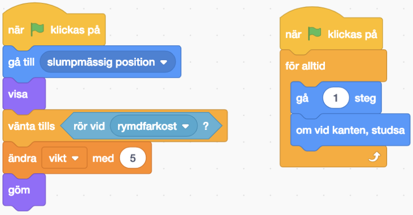
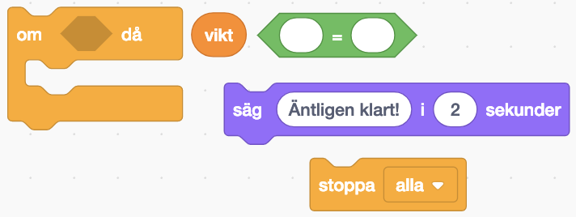

# Rymdskrot

Satelliten Mats är i fara! Det flyger runt en massa rymdskrot ute i rymden och en del av det kanske träffar Mats. Både stora- och små bitar kan vara farliga. Det är bäst att vi försöker städa undan så mycket som möjligt.

Vi ska bygga ett projekt i Scratch där vi får möjlighet att rädda Mats från rymdskrotet. Vi lyckas rädda Mats om vi samlar ihop 50 poäng och vi får poäng varje gång vi plockar upp rymdskrot. Om rymdskrotet rör vid Mats så får vi ”Game Over” och behöver börja om.

Vi börjar med att starta från ett startprojekt. Detta kallas att *remixa*.

1. Öppna din webbläsare och gå till
		
	<a href="https://scratch.mit.edu/projects/282942221/" target="_blank">https://scratch.mit.edu/projects/282942221/</a>
	
2. Klicka på knappen **Se inuti** så att du kan se koden.
3. Klicka på knappen **"Remix"** så att du får din egen version av projektet.

Nu har du ett projekt som innehåller en rymdfarkost, satelliten Mats och en rymdbakgrund.

##  1 – Hoppa framåt

Vi ska börja med att röra oss framåt i rymden. Vi behöver två block från biblioteket. Ett block ”När grön flagga klickas på” och ett block ”gå 10 steg”.

Kan du koppla ihop dem så att vår farkost hoppar framåt varje gång vi trycker på den gröna flaggan?

<video src="./1_3.mp4" autoplay loop muted />

## 2 – Loopa

Så här ska din kod se ut nu:

Nästa steg är att lägga till en loop så att vår rymdfarkost fortsätter att åka framåt.

Det finns ett block som heter ”för alltid”. 

Kan du koppla ihop det med de förra blocken så att vår farkost fortsätter att åka framåt utan att stanna när vi trycker på den gröna flaggan?

<video src="./2_3.mp4" autoplay loop muted />

> 10 steg framåt går lite för fort. Testa att ändra till 1 steg framåt så att vår rymdfarkost åker lite långsammare.

## 3 – Svänga

Så här ska din kod se ut nu:

Nästa steg är att lägga till styrning.

Det finns ett block som heter ”när mellanslag-tangenten trycks ned” och två block som svänger. Ett block svänger vänster och ett block svänger höger.

Kan du ändra och sätta ihop dessa block så att när ”vänsterpil” tangenten trycks ned så ska farkosten svänga vänster? Och när ”högerpil” tangenten trycks ned så ska farkosten svänga höger?

<video src="./3_3.mp4" autoplay loop muted />

## 4 – Spara

Så här ska din kod se ut nu:

Nästa steg är att spara projektet.

### Är du inloggad?

Om du är inloggad så sparas ditt projektet automatiskt men om du vill vara säker så kan du trycka på **Arkiv** och sedan **Spara nu**.

### Har du inget konto?

Om du inte har ett konto eller inte vill logga in så kan du spara ned ditt projekt som en fil till datorn.

Tryck på **Arkiv** och sedan **Spara till din dator**.

## 5 – Skapa rymdskrot

Men vart är allt rymdskrot? Rymden ser ju helt ren ut? Låt oss lägga till lite rymdskrot i vår rymd så att vi har något att städa.

Tryck på knappen för att måla en ny sprajt.

Rita en kvadrat genom att välja kvadratverktyget från palletten till vänster och sedan rita en kvadrat på den rutiga ytan. Välj vilken färg du vill.

> Tips! För att rita en *perfekt* kvadrat så håll ned tangenten **shift** när du ritar ut din kvadrat.

Döp din sprajt till ”kvadrat”.

## 6 – Koda kvadrat

Tryck på ”kvadrat” i ditt bibliotek så att den är vald. Vi kan se att den är vald genom att den har en blå ram runt sig. Nu ska vi koda vad kvadraten ska göra.

Nu ska vi lägga till kod för vår kvadrat så att den försvinner när vår farkost rör vid det. Klicka på fliken ”kod” för att komma till koden för kvadraten.

> **Ser du inte din kod?** Din kod för din farkost har inte försvunnit. All kod som vi lägger ut är kopplade till en sprajt. Eftersom vi skapade en ny sprajt för vårt rymdskrot så har inte den fått någon kod ännu. Om vi väljer vår farkost i biblioteket så kommer vi se vår kod igen.

Nu vill vi koda kvadraten så att när vi trycker på den gröna flaggan så ska den vänta på att den rör vid vår farkost. Och sedan ska den gömma sig själv. 

För det så kommer vi behöva dessa block:

Kan du sätta ihop dem i rätt ordning så att kvadraten försvinner när vi rör vid den med vår rymdfarkost?

<video src="./6_3.mp4" autoplay loop muted />

## 7 – Visa kvadraten igen

Så här ska din kod se ut nu:

Nästa steg är att visa kvadraten igen när vi trycker på den gröna flaggan.

Kvadraten gör bara precis som den har blivit tillsagd och vi har inte sagt till den att visa sig igen när vi trycker på den gröna flaggan.

Det finns ett block som heter ”visa”. Vi skulle kunna lägga det så att det händer precis efter vi har klickat på den gröna flaggan och precis innan vårt block ”vänta tills …”.

Vi vill att vår kvadrat ska visas så fort vi trycker på den gröna flaggan.

## 8 – Förflytta kvadraten

Så här ska din kod se ut nu:

Nu visas vår kvadrat igen när vi trycker på den gröna flaggan. Nästa steg är att ge den en *slumpmässig* position.

> Slumpmässigt betyder att det kan dyka upp vart som helst och på en ny plats varje gång.

Det finns ett block ”gå till slumpmässig position”. Lägg det mellan blocket ”när grön flagga klickas på” och ”vänta tills …”.

När det ligger rätt så lägger sig rymdskrotet på en ny plats varje gång vi trycker på den gröna flaggan.

## 9 – Rör på rymdskrotet

Så här ska din kod se ut nu:

Nu har vi skapat ett rymdskrot i form av en kvadrat som dyker upp på en ny plats varje gång vi trycker på den gröna flaggan. Men rymdskrotet står ju helt still! Och det är ju helt fel. Det ska ju flyga runt.

Nästa steg är att få kvadraten att röra på sig.

Vi lägger till ett nytt block **När grön flagga klickas på** och **för alltid** så ska vi **gå 1 steg framåt**.

Men om vi testar nu så fastnar vårt rymdskrot i kanterna för vi kan inte styra rymdskrotet. Det finns ett block som kan hjälpa oss. Det heter **om vid kanten, studsa**. 

Vi vill att vårt rymdskrot ska studsa vid kanten efter att det ha **gått 1 steg framåt**. Vart tror du att det här blocket ska ligga? 

## 10 – Håll räkningen på poäng

Så här ska din kod se ut nu:

Nästa steg är att räkna poäng.

Vi skulle vilja hålla reda på hur mycket rymdskrotet väger som vi har plockat upp. Det skulle vi kunna använda en *variabel* till. Variabler är väldigt användbara när vi vill räkna saker.

Använd knappen **skapa en variabel** och ge den namnet ”vikt”.

Nu kan vi använda blocket **ändra vikt med 5**. Vi vill ändra variabeln **vikt** med 5 *efter* att vi har rört vid rymdfarkosten.

## 11 – Lägg till mer rymdskrot

Så här ska din kod se ut nu:

Nu har vi skapat ett rymdskrot i form av en kvadrat som dyker upp på en ny plats varje gång vi trycker på den gröna flaggan. Och vi håller räkningen på hur mycket den väger. 

Nästa steg är att lägga till fler former av rymdskrot.

På samma sätt som vi ritade och programmerade vår kvadrat – skapa nu tre nya figurer:

- En rektangel
- En cirkel
- En triangel

> Tips! Det verkar inte finnas ingen färdig form för att rita en triangel. Vi måste nog rita den själva.

Glöm inte att också lägga in all kod från vår första sprajt.

Efter det här steget så ska det vara en massa rymdskrot som dyker upp på slumpmässiga platser varje gång vi trycker på den gröna flaggan.

## 13 – Rymdskrotet väger olika mycket

Bitarna av rymdskrot väger olika mycket beroende på vilken form de har. Därför behöver vi ändra hur mycket ”vikt” vi ändrar vår variabel med när vi rör de olika rymdskroten.

- Kvadrat väger **5** ton
- Cirkel väger **10** ton
- Triangel väger **15** ton
- Rektangel väger **20** ton

Skriv in den nya vikten i blocket **ändra vikt med 5** för varje sprajt som är ett rymdskrot.

## 14 – Nollställ variabel

Nu väger de olika bitarna olika mycket.

Men vår variabel bara fortsätter att räkna. Den börjar aldrig om.

För att kunna hålla räkningen ordentligt så skulle vi vilja *nollställa* vår variabel. Det betyder att vi sätter den till 0. Vi vill nollställa den varje gång vi startar trycker på den gröna flaggan.

Välj sprajten ”rymdfarkost”. Precis efter blocket ”När grön flagga klickas på” – lägg till ett block **sätt vikt till 0**. 

Nu borde variabelns värde sättas till 0 varje gång vi trycker på den gröna flaggan. Testa genom att fånga lite rymdskrot och sedan trycka den gröna flaggan. Sätts variabeln till 0?

## 15 – Avsluta när vi har städat färdigt

Nu nollställs vår variabel varje gång vi startar om. 

Som nästa steg så vill vi att vår rymdfarkost ska ropa ”Äntligen klart! när vi har plockat upp allt rymdskrot. Om vi har plockat upp all rymdskrot så betyder det att vi har plussat ihop allas vikter i vår variabel.

I sprajten ”rymdfarkost” så ska vi lägga till ett par block inuti vårt ”för alltid”-block. Vi vill kolla om variabeln ”vikt” är lika mycket som *summan* av alla blockens vikt. Och om den är det – då säger vi ”Äntligen klart!” och sedan stoppar vi alla skript med blocket ”stoppa alla”.

> Vi kan räkna ut summan genom att plussa ihop alla vikterna från de olika rymdskroten. Använd papper och penna och skriv ned vikterna från sprajtarna och plussa sedan ihop dem.

## 16 – Game over när vi nuddar Mats

Nu när vi har städat bort allt rymdskrot så kan vi pusta ut. Men vi har inte kodat vad som ska hända om rymdskrotet nuddar Mats. 

Markera sprajten Mats. Det är där vi ska lägga till vår kod.

Efter att grön flagga klickas på så ska vi vänta tills vi rör vid kvadrat **eller** rör vid rektangel **eller** rör vid cirkel **eller** rör vid triangel. 

Efter det vill vi säga ”Ajajajaj!” i 2 sekunder. Och sedan vill vi använda blocket ”stoppa alla” för att avsluta vårt skript.

> Visste du att det går att lägga ett ”eller”-block i ett annat ”eller”-block?

Det kan bli väldigt svårt att hinna städa undan allt rymdskrot om Mats är väldigt stor. Vi kan ändra storleken på Mats om vi vill göra det lite lättare för oss:

## Färdig!

Snyggt jobbat! Nu kan vi städa rymden från rymdskrot och rädda Mats från ett hemskt öde.

Glöm inte att spara ditt projekt! Döp det gärna till uppgiftens namn så att du enkelt kan hitta den igen.

> **Testa ditt projekt**
> 
> Visa gärna någon det som du har gjort och låt dem testa. Tryck på DELA för att andra ska kunna hitta spelet på Scratch. Gå ut till projektsidan och låt någon annan testa spelet!

## Utmaningar

## Frågeställningar

