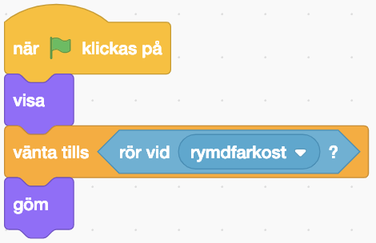
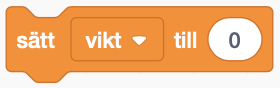
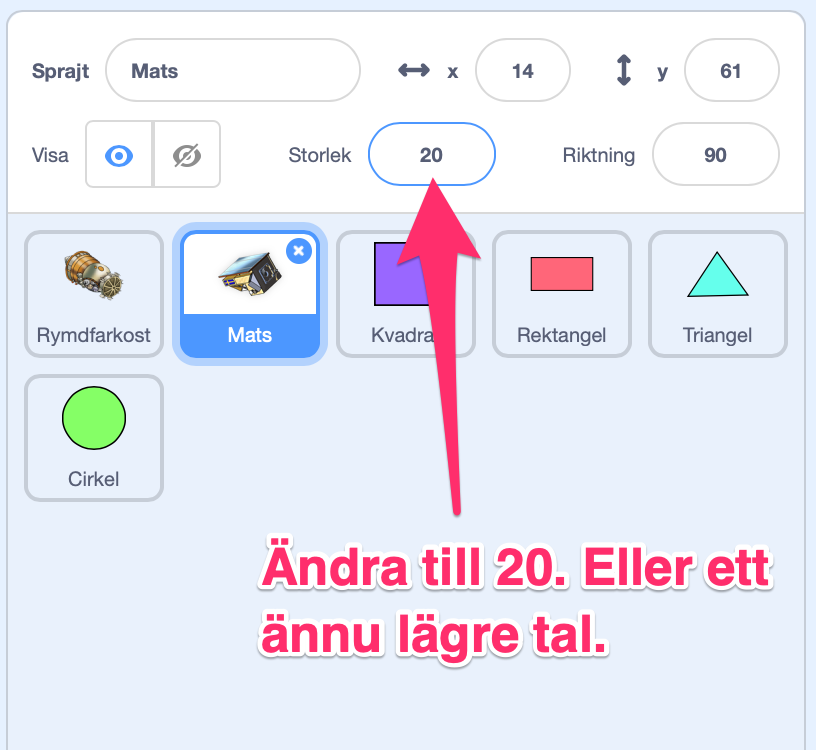

# Rymdspel för barnhack

Satelliten Mats behöver din hjälp - kan du rädda den från rymdskrot?! Vi ska skapa ett spel där du fångar upp rymdskrot med din rymdfarkost. Om Mats blir träffad av rymdskrot blir det "Game Over!". 

<video src="./0_1.mp4" autoplay loop muted />

Vi börjar med att starta med ett projekt som redan innehåller en rymdfarkost, satelliten Mats och en rymdbakgrund. Detta kallas att *remixa*.

1. Klicka på denna länk för att öppna startprojektet: <a href="https://scratch.mit.edu/projects/298331110/" target="_blank">https://scratch.mit.edu/projects/298331110/</a>
	
2. Klicka på knappen **Se inuti** så att du kan se koden. 

3. Klicka på knappen **"Remix"** så att du får din egen version av projektet. Du måste vara inloggad för att kunna remixa.

> Tips! Om du inte har konto på Scratch kan du ändra direkt i projektet och välja **Spara till din dator** (under Arkiv) när du vill spara ditt projekt.

Nu kan du börja skapa ditt spel!

##  1 – Åk framåt

Vi ska börja med att röra oss framåt i rymden. Vi behöver blocket ”När grön flagga klickas på” och blocket ”gå 10 steg”.

Testa att trycka på den gröna flaggan och se om vad som händer.

<video src="./1_3.mp4" autoplay loop muted />

## 2 – Loopa för alltid framåt

Nästa steg är att lägga till en loop så att vår rymdfarkost fortsätter att åka framåt.

Det finns ett block som heter ”för alltid”. 

Koppla ihop det med de förra blocken så att vår farkost fortsätter att åka framåt utan att stanna när vi trycker på den gröna flaggan.

<video src="./2_3.mp4" autoplay loop muted />

> Tips: 10 steg framåt går kanske lite för fort? Testa att ändra antalet steg framåt, t ex till 1 steg, så att rymdfarkosten åker långsammare.

## 3 – Svänga rymdfarkosten

Nästa steg är att lägga till styrning.

Det finns ett block som heter ”när mellanslag-tangenten trycks ned” och två block som svänger. Ett block svänger vänster och ett block svänger höger.

Kan du ändra och sätta ihop dessa block så att när ”vänsterpil” tangenten trycks ned så ska farkosten svänga vänster? Och när ”högerpil” tangenten trycks ned så ska farkosten svänga höger?

<video src="./3_3.mp4" autoplay loop muted />

Så här ska din kod se ut nu:

## 4 – Rita rymdskrot

Låt oss lägga till lite rymdskrot i vår rymd så att vi har något att städa.

Tryck på knappen för att måla en ny sprajt.

Rita en kvadrat genom att välja kvadratverktyget från palletten till vänster och sedan rita en kvadrat på den rutiga ytan. Välj vilken färg du vill.

> Tips! För att rita en *liksidig* kvadrat så håll ned tangenten **shift** när du ritar ut din kvadrat.

Döp din sprajt till ”kvadrat”.

## 5 – Gömma rymdskrot

Tryck på ”kvadrat” i ditt sprajtbibliotek så att den är vald.

Nu ska vi lägga till kod för vår kvadrat så att den försvinner när vår farkost rör vid det. Klicka på fliken ”kod” för att komma till koden för kvadraten.

När vi trycker på den gröna flaggan ska kvadraten vänta på att den rör vid rymdfarkosten - då ska den gömma sig. 

För det behöver vi dessa block:

Kan du sätta ihop dem i rätt ordning så att kvadraten försvinner när vi rör vid den med vår rymdfarkost?

<video src="./6_3.mp4" autoplay loop muted />

> Oroa dig inte för att kvadraten har försvunnit. Vi programmerar så att den visas igen i nästa steg.

## 6 – Visa rymdskrot igen

Så här ska din kod se ut nu:

Nästa steg är att visa kvadraten igen när vi trycker på den gröna flaggan.

Det finns ett block som heter ”visa”. Vi skulle kunna lägga det så att det händer precis efter vi har klickat på den gröna flaggan.

Testa! Visas vår kvadrat när du trycker på den gröna flaggan?

<video src="./7_3.mp4" autoplay loop muted />

## 7 – Slumpa startposition

Det blir mer spännande om du inte vet var rymdskrotet dyker upp! För att göra det ska vi ge kvadraten en *slumpmässig* position för var den ska visa sig.

Det finns ett block ”gå till slumpmässig position”. Lägg det efter blocket ”när grön flagga klickas på”.

Nu ska rymdskrotet hamna på en ny plats varje gång vi trycker på den gröna flaggan.

<video src="./8_3.mp4" autoplay loop muted />

## 8 – Rymdskrotet rör sig

Sista steget för ett färdigt spel är att få kvadraten att röra på sig.

Vi lägger till ett nytt block **När grön flagga klickas på** och **för alltid** så ska vi **gå 1 steg framåt**.

Men om vi testar nu så fastnar vårt rymdskrot i kanten på scenen, eftersom vi kan inte styra det. Men det finns ett block som kan hjälpa oss! Det heter **om vid kanten, studsa**. 

Vi vill att vårt rymdskrot ska studsa vid kanten efter att det ha **gått 1 steg framåt**, inuti loopen.

> **Grattis! Nu har du skapat ett spel**
>
>Snyggt jobbat! Nu kan du städa rymden från rymdskrot och rädda Mats från ett hemskt öde.

> **Testa ditt projekt**
>
> Visa gärna någon det som du har gjort och låt dem testa. Tryck på DELA för att andra ska kunna hitta spelet på Scratch. Gå ut till projektsidan och låt någon annan testa spelet! Om du vill kan du sedan fortsätta med en utmaning...

## Utmaning - Skapa en poängräknare

Vill du fortsätta med ditt spel? Då kan du skapa en poängräknare som räknar hur många ton skrot du samlar in!

Här behöver vi hålla reda på hur mycket rymdskrotet väger. Det kan vi använda en *variabel* till.

Använd knappen **skapa en variabel** (under Variabler) och ge den namnet ”vikt”.

Nu får du bestämma vad rymdskrotet ska väga. Vad väger kvadraten? Vi använder blocket **ändra vikt med** och anger kvadratens vikt som värde. Vi vill ändra variabeln **vikt** *efter* att vi har rört vid rymdfarkosten.

Är det lite tråkigt med bara ett rymdsrkot? Då kan du skapa flera!

## Ännu mer rymdskrot!

För att samla fler poäng behövs det mer rymdskrot! Nu ska vi lägga till fler former som alla väger olika mycket.

På samma sätt som du ritade och programmerade din kvadrat – skapa nu tre nya figurer:

- En rektangel
- En cirkel
- En triangel

> Tips! Det verkar inte finnas ingen färdig form för att rita en triangel. Du måste nog rita den själva med hjälp av streck.

När du har ritat ditt rymdskrot får du programmera alla former så att de har samma kod för att röra sig, gömma sig och visa sig, som för kvadraten.

Nu ska du ha en massa rymdskrot som dyker upp på slumpmässiga platser varje gång du trycker på den gröna flaggan, och som gömmer sig när rymdfarkosten nuddar skrotet. Funkar det?

<video src="./11_2.mp4" autoplay loop muted />

Bitarna av rymdskrot ska väga olika mycket beroende på vilken form de har. Därför behöver vi ändra hur mycket vår ”vikt”-variabel ändras när vi rör de olika rymdskroten.

- Kvadrat väger **5** ton
- Cirkel väger **10** ton
- Triangel väger **15** ton
- Rektangel väger **20** ton

Skriv in vikten i blocket **ändra vikt med** för varje sprajt som är ett rymdskrot.

# Starta med 0 poäng

Nu väger de olika bitarna olika mycket. Men vår poängräknare, variabeln, bara fortsätter att räkna... Den börjar inte om från 0 när vi startar spelet!

För att kunna hålla räkningen ordentligt så behöver vi *nollställa* vår variabel, sätta den till 0, varje gång vi trycker på den gröna flaggan.

Välj sprajten ”rymdfarkost”. Precis efter blocket ”När grön flagga klickas på” – lägg till ett block **sätt vikt till 0**. 

Testa genom att fånga lite rymdskrot och sedan trycka på den gröna flaggan. Sätts variabeln till 0?

<video src="./13_2.mp4" autoplay loop muted />

# Vinst när skrotet är uppfångat

Hur vet vi att vi vinner spelet? Vi vill att vår rymdfarkost ska ropa ”Äntligen klart!" när vi har plockat upp allt rymdskrot. 

Men hur vet spelet att vi har gjort det? Jo, om vi har fångat upp allt rymdskrot så betyder det att vi har adderat ihop alla olika formers vikter i vår variabel.

Välj sprajten ”rymdfarkost”. Nu ska vi lägga till ett par block inuti vårt ”för alltid”-block. Vi vill känna av om variabeln ”vikt” är lika mycket som *summan* av alla blockens vikt. Om den är det säger vi ”Äntligen klart!” och sedan stoppar vi alla skript med blocket ”stoppa alla”.

> Vi kan räkna ut summan genom att addera ihop vikterna från de olika rymdskroten. Använd papper och penna och skriv ned de olika formernas vikt och addera sedan ihop dem. 

# Game over om rymdskrotet nuddar Mats

Nu när vi har fångat upp allt rymdskrot så kan vi pusta ut. Men vi har inte kodat vad som ska hända om något rymdskrot träffar Mats. 

Markera sprajten Mats. Det är där vi ska lägga till vår kod.

När grön flagga klickas på ska sprajten Mats vänta tills den rör vid kvadrat **eller** rör vid rektangel **eller** rör vid cirkel **eller** rör vid triangel. Det är viktigt att Mats undersöker alla formerna!

Efter det vill vi att Mats säger ”Ajajajaj!” i 2 sekunder. Och sedan vill vi använda blocket ”stoppa alla” för att avsluta vårt skript.

> Visste du att det går att lägga ett ”eller”-block i ett annat ”eller”-block?

> Tips: Det kan bli svårt att hinna städa undan allt rymdskrot om Mats är väldigt stor. Du kan minska storleken på Mats om du vill göra det lite lättare att vinna spelet:

## Färdig! Nu är du klar med spelet

Snyggt jobbat! Nu kan vi rädda Mats från att träffas av rymdskrot - och få poäng för varje ton skrot vi samlar in!

Glöm inte att spara ditt projekt! Döp det gärna till uppgiftens namn så att du enkelt kan hitta den igen.

> **Testa ditt projekt**
> 
> Visa gärna någon det som du har gjort och låt dem testa. Tryck på DELA för att andra ska kunna hitta spelet på Scratch. Gå ut till projektsidan och låt någon annan testa spelet!
