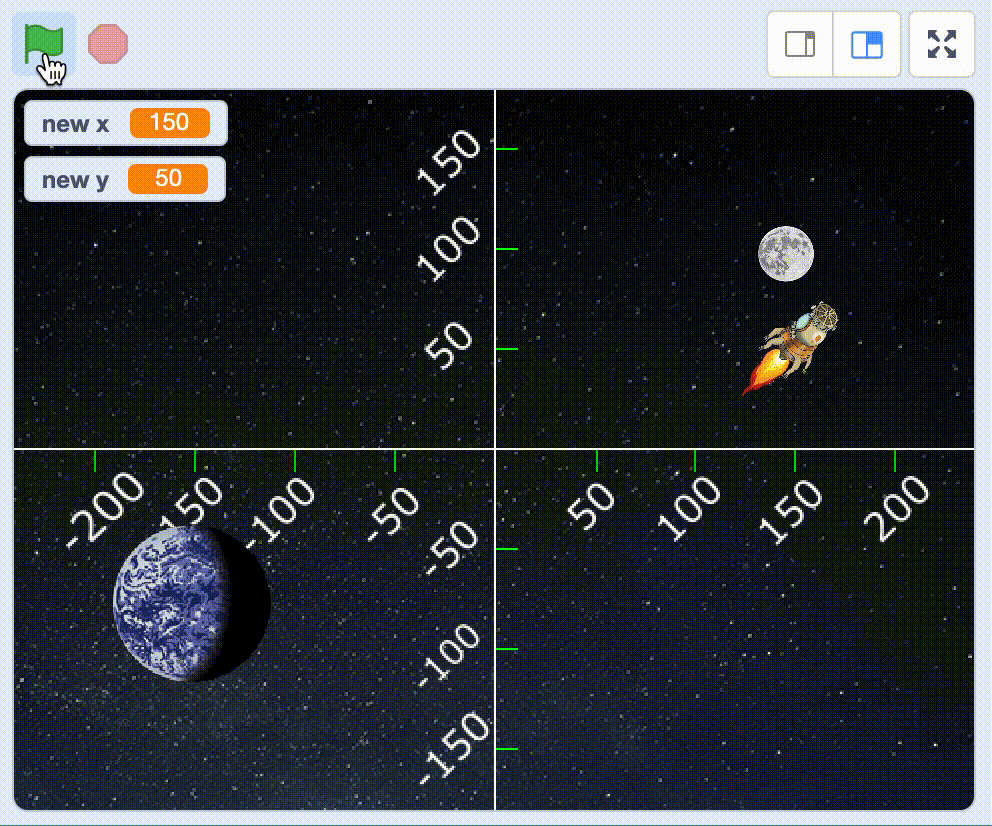

# Journey to the Moon 

Now it’s time to launch your mission to the Moon!  

Have you prepared for this task by placing things in a coordinate system on a paper? You will be using the answers in this task. You are going to decide a coordinate to travel to and travel there. 

The result could look something like this: <a href="https://scratch.mit.edu/projects/460197668/" target="_blank">https://scratch.mit.edu/projects/460454296//</a> 

You will now begin your project. This time too, instead of creating a new project, you will **remix** instead. 

1.Open your browser and go to this link. The link will take you to a project that has few things to get you started like the satellite Mats and a rocket. 

https://scratch.mit.edu/projects/304677361/ 
<a href="https://scratch.mit.edu/projects/460454296/" target="_blank">https://scratch.mit.edu/projects/460454296//</a> 

2. Click on the **See inside** button, so you can see the code. 
3. Click on **Remix** so that you can duplicate the code and start add your own code. You must be logged into Scratch to able to remix a project. 

> **Tips!** If you do not have a Scratch account, you can change things in the project and select **Save to your computer** (below File) when you want to save your project. 

You now have a project that includes a coordinate system, a space backdrop, an Earth sprite and a Moon sprite. 

There are several versions of coordinate systems to choose between. Click on the **Costumes** tab, in the top left tab of the menu. Click on the **Code** tab to see the sprite’s script. It is important that you write this script for this specific sprite, so that the coordinate system is at the centre of the stage. 

## 1- Position the sprites 

Start by placing all your sprites so they have the correct coordinates. 

There is a storage box on the right bottom of the screen. That is where all the sprites that we will use in the code are stored. Click on a sprite from the storage if you want to select it. You can see that it is selected, if it has a blue frame around it. 

Try placing the sprites as accurately as you can. In order to achieve this, use the code blocks **When green flag clicked** and **go to x:___ y:___**. 

Add these blocks to all your sprites and write in the exact coordinates from your paper coordinate system. 

Test: Click the green flag. Make all the sprites move to where you thought they should be? Are any of them in the wrong position? 

## 2 - Use questions and answers 

Choose the "Rocket" sprite. 

You can tell your rocket where to go by using the **ask and wait** block. This opens a textbox, where you can write an x-coordinate. Your answer will end up in a variable that you can call **answer**. 

Code the rocket so that it asks which x-coordinate it should go to and then adds x to the answer variable. 

Test: Does the rocket ask which x-coordinate you are travelling to? If you enter a number, does the rocket move to the left or right? 

## 3 - Ask for a y-coordinate 

Carry on coding the "Rocket" sprite. 

To be able to travel to the moon, you’ll need some **x-coordinate** and **y-coordinate**. So, you’ll need to ask one more question to get the y-coordinator. This time you can ask, “Which y-coordinate will you move to?”.  

Place this question under the block which asks to move the x coordinator. 

Test: Does the rocket first ask which x-coordinate it should move to? And then which y-coordinate it should move to?

## 4 - Save x and y as variables 

Instead of the rocket jumping to the x and y coordinates, it looks better if it moves more smoothly. To achieve this, you can use the code block **glide 1 secs to x:__ y:__**. This will make your rocket glide to the coordinates instead of jumping. 

To be able to glide we need to know both x and y, but the answer variable only knows the answer to the most recent question. It doesn’t keep track of previous answers, which means that we don’t know which x-coordinate we are going to after we have answered the question about the y-coordinate. 

What we can do to avoid this problem is, save the answer in separate variables. Create two variables, one called "new x" and one called "new y".  

Use the block for **set “new x”** to answer instead of using the one for “set x to ´answer´”. Then we save the answer from the question in our “new x” variable. 

Do the same thing for y. Create a new variable called “new y” and set it to “answer”. 

Try: After answering the two questions, check if the numbers in the variables change. 

> You can see if it is on the top left of your scene. They numbers there should be the same as the numbers you entered in the textbox. 

## 5 - Glide to variables 

Does your code for the rocket look like this? 

Now we are going to use the **glide `4` secs to x: ` ` y: ` `** block. 

Try: Start the game, answer the questions. Does the rocket glide to the coordinates you entered? 

## 6 - Describe what happend?
Does your code for the rocket look like this? 

After your rocket has glid, you can make it say “Yippee! A perfect launch” if it touches the Moon. And if it doesn’t, make it say “Oh dear. Not what we hoped for”. 

You can do this with the help of something called an **if-statement**. An if-statement is like a statement that needs to be fulfilled for something to happen. For example, let’s say you want to eat. The if-statement that needs to be fulfilled in this case is hunger. We can rewrite this in a way that a computer could understand. That is, if I am hungry, then I can eat else I will drink water.  

In Scratch, there is an if-statement code block in the *Control* category called **if then else**: 

Along with the **touched the Moon?** block from the category *Sensing*. 

If the rocket touches the Moon, it will say “Yippee! A perfect launch!”: 

Otherwise, it will say “Oh dear. Not what we hoped for”. 

Try: Start the game, answer the questions. Does the rocket say the right thing when it has finished gliding? 

## 7 - Random position 

The next step is to change the position of the moon, so it appears in *random* positions in the upper right area of the scene. The code block **pick random** is used for this purpose. Firstly, start by clicking on the Moon from the sprite storage so that you are coding on the correct sprite.  

It is good if the Moon to changes place every time you start the game. That way you can’t type the same coordinates as you did during the last game. 

The **pick random** block works a little like a die. Just as you get different answers when you roll a die multiple times, you will get different numbers every time you use this block. 

Unlike an ordinary die (where the smallest number you can roll is 1 and the highest is 6), in Scratch you can choose the highest and lowest number yourself. 

Mark the "moon" sprite and replace the x-coordinate with the **pick random** block. 

If you want your Moon to end up on the right of the scene, **what is the lowest x-coordinate the Moon can have?** 

**And what is the highest x-coordinate the Moon can have?** 

Enter the lowest in the left field and the highest in the right field. 

Try: Does the Moon end up in different places every time you click the green flag? 
Does it end up in the upper right corner every time you click?

## 8 - Randomise the y-coordinate 

Does your code for the Moon look like this? 

Now you are going to get a random y-coordinate in the same way you got a random x-coordinate. 
This is so the Moon can move up and down as well. 

If you want your Moon to end up in the upper part of the scene, **what is the lowest y-coordinate the Moon can have?**

**And what is the highest y-coordinate the Moon can have?**

Add a field for “pick random” for the y-coordinate too. Enter the lowest in the left field and the highest in the right field. 

Test: Click the green flag. Does the Moon end up in different places, up or down, every time you click? 

## Finished! 

Nice work! You’ve now created a new game. 

> **Try your project** 
> Show it to someone and let them try playing your game. Click on SHARE to let others can find your game on Scratch. Go to the project page and let someone else try the game! 

### Save 

Don’t forget to save your project! You can give it the same name as this task, so it is easier for you to find it again some other time. 
