# Landing on Mars

Travelling to Mars is dangerous. Asteroids can suddenly appear! 

You can build a simulator to help you find out when it is safest to travel. A simulator is a computer program that can test things without actually doing them. For example, we can test landing at different times of day to discover which time is best. 

The end result could look like this: <a href="https://scratch.mit.edu/projects/460456074/" target="_blank">https://scratch.mit.edu/projects/460456074/</a>

  
  
  ## 1 - Remix the simulator
There’s an incomplete simulator project that you can get from here. You’ll need to finish it by adding some of your code.  

1. Open your browser and go to this start project: 

  <a href="https://scratch.mit.edu/projects/460201069/" target="_blank">https://scratch.mit.edu/projects/460201069/</a>

2. Click on the **See inside** button, so you can see the code. 
3. Click on **Remix** so that you can duplicate the code and start to add your own code. You must be logged into Scratch to able to remix a project. 

> **Tips!** If you do not have a Scratch account, you can change things in the project and select **Save to your computer** (below File) when you want to save your project. 

You now have a project with a rocket, an Earth, a Mars, an asteroid and a space backdrop as your sprites. 

### Do you want to use your own rocket? 

> The next step is optional – but fun. 

Have you built your own rocket using Scratch in task 1? If so, then you can add it to this project and use that. To do that,  

1. Go to “My Stuff” in Scratch and open your rocket project. 
2. Click and hold the rocket for a couple of seconds in the sprite storage and click on “export”. 

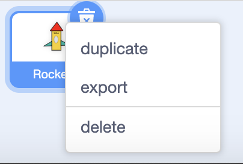

3. Go back to “My Stuff” and open the Landing on Mars project 
4. Click the button for “Upload Sprite” 

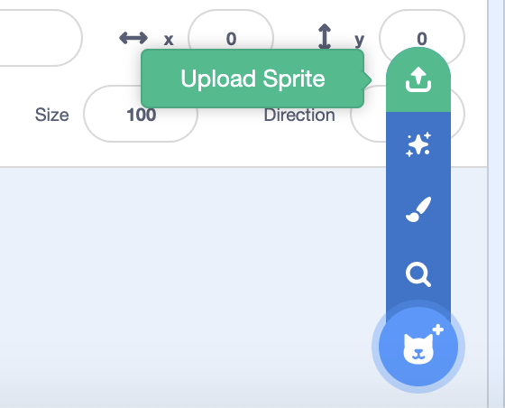

5. In order for the rocket to travel in the right direction, you need to rotate the rocket’s costume so that it points to the right. 

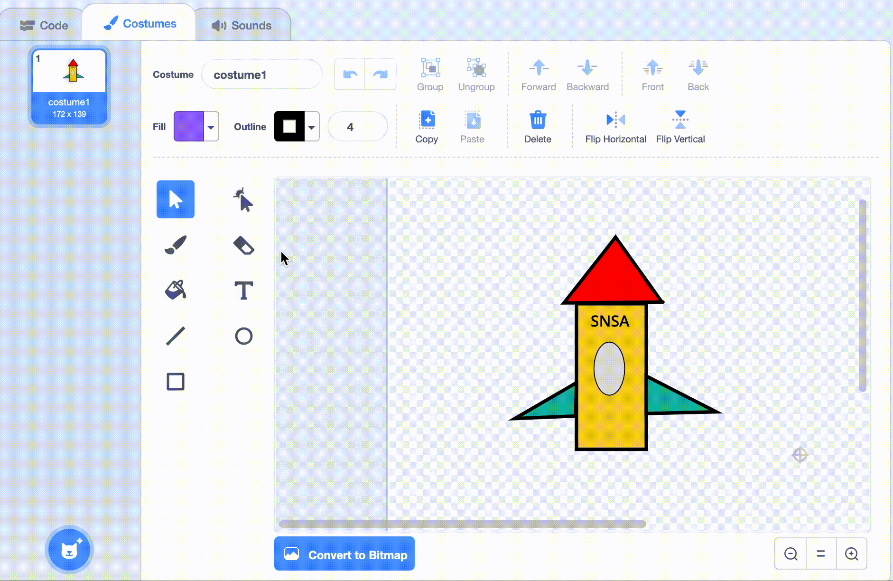

6. Position your rocket on the same coordinates as the rocket that came with the project 

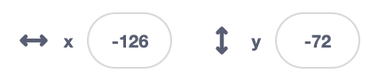

7. Rotate your sprite so that it has the same angle as the rocket that came with the project 

8. Remove any code from your rocket that may have followed from the previous task. The script area should be completely empty and ready for adding new code.
9. Done! Now you can go further to the next step. 

## 2 - Description 

For this task you will need: 

- Two variables 
  - One that counts successful attempts to land 
  - One that counts failed attempts to land 
- A script that launches the rocket towards Mars 
  - If the rocket touches the asteroids, the “failed landing” variable changes by 1.  
  - If the rocket touches Mars, the “successful landing” variable changes by 1. 

- A script that sets the variables to 0 and then launches the rocket 100 times. 

Let’s build it together. 

## 3 - Launch the rocket 

You want to the rocket to launch when you start the simulator, that is when you click the green flag. 

When you click on the green flag, the rocket should: 

- **move to** the coordinate where it will start 
- **forever** move forward using **move 5 steps**. 

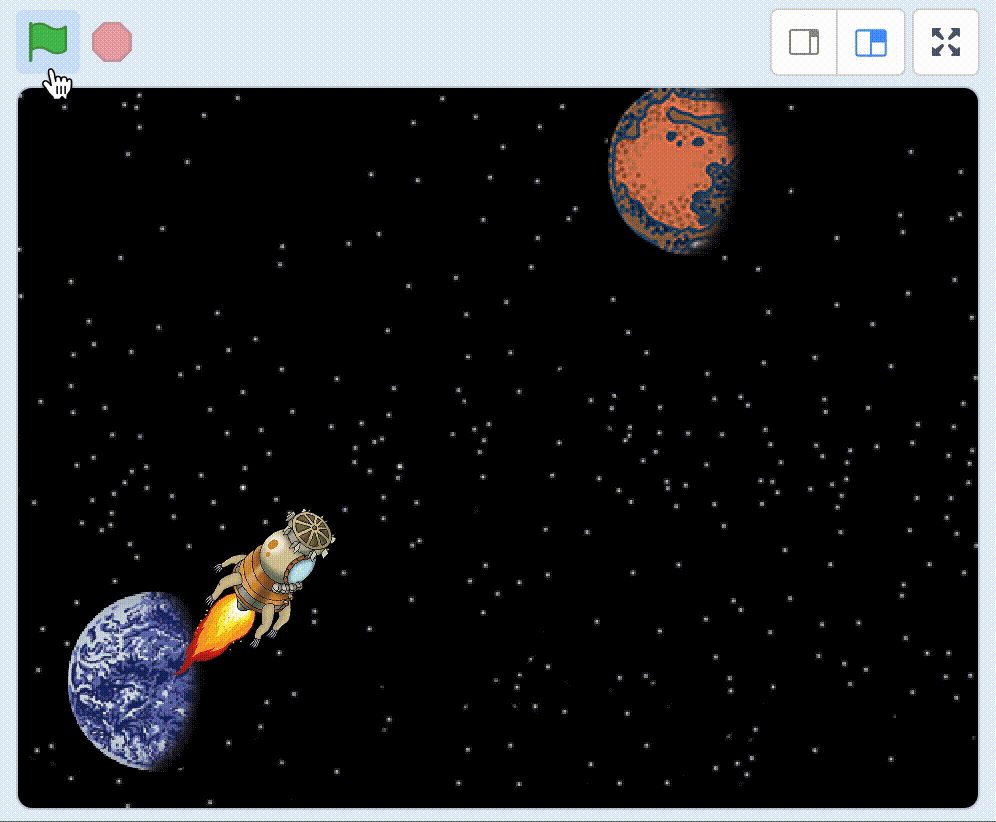

Try: Click the green flag. Does the rocket move?  Click the green flag again. Does it start from Earth again? 
 
## 4 - Sense whether you touch Mars 

Does your code look like this? 

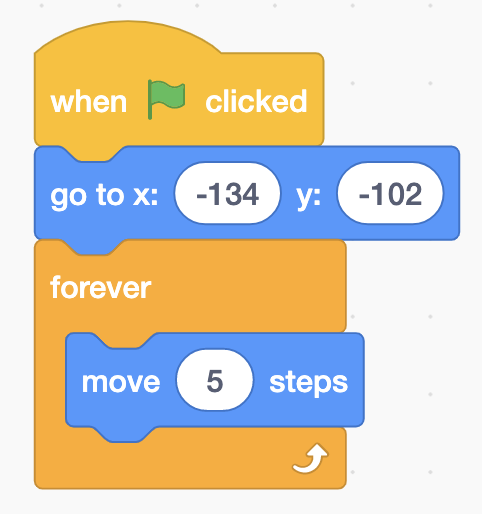

If you only travel forwards without stopping, the rocket will just keep on going forever and we will probably travel beyond Mars. 

After every step forward, you must check **if** you **touch Mars**. And, if you do, you want to **stop this script**, because then you have arrived on Mars. 

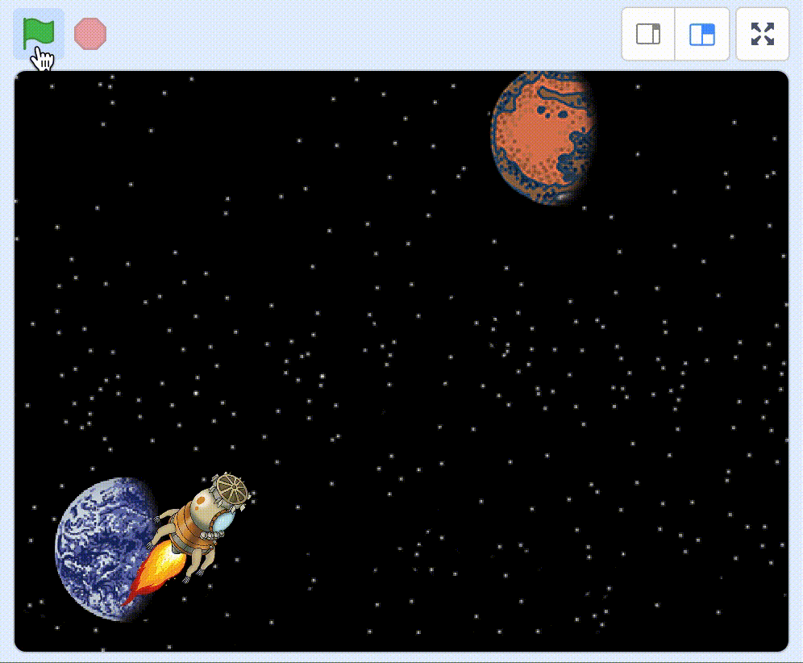

Try: Click the green flag. Does your rocket stop when it touches Mars? 

## 5 - Create a variable 

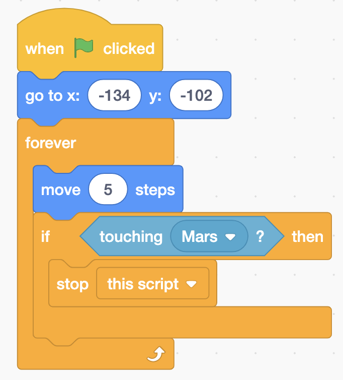

Now the rocket stops on Mars, but you will need to keep track of how many times you’ve managed to land successfully. 

For this purpose, you need to use a variable. Variables are good, because they can keep track of things for you, such as how many times you land successfully. 

Create a variable called “successful landings”. 

## 6 - Change the variable 

In your script, you now want to **change “successful landings” by 1** when you touch Mars but before you stop your script. 

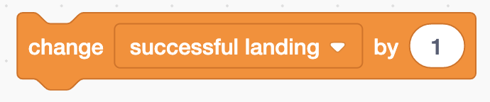

Then 1 will be added to the variable every time we touch Mars. So, if you were to click on the green flag several times, the variable will keep track of how many times you have touched Mars. 

Test: Does your variable count a “successful landing” every time your rocket touches Mars? 

## 7 - Take a message to Mars 

When you try to run your simulator, you may have noticed that it only runs once. So, if you want to run 100 simulations you will have to click the green flag 100 times. But who has the time and energy for that!? Luckily, there’s a better way to do that! 

You can use *messages* to launch your rocket multiple times. So instead of launching the rocket once by clicking on the green flag, you can launch it rocket 100 times by sending a message 100 times. 

Position the block for **When I receive “launch”**. 

Then move all blocks from **When green flag clicked** to **When I receive “launch”** by dragging them. 

If you were to try starting the simulator, nothing will happen because you haven’t sent the “launch” message yet. 

Add the **send “launch” and wait** block and place it below **When green flag clicked**. 

If you try the program now, it should work just as it did before. The rocket lauches to Mars. 

## 8 - Launch 100 times 

Does your code look like this? 

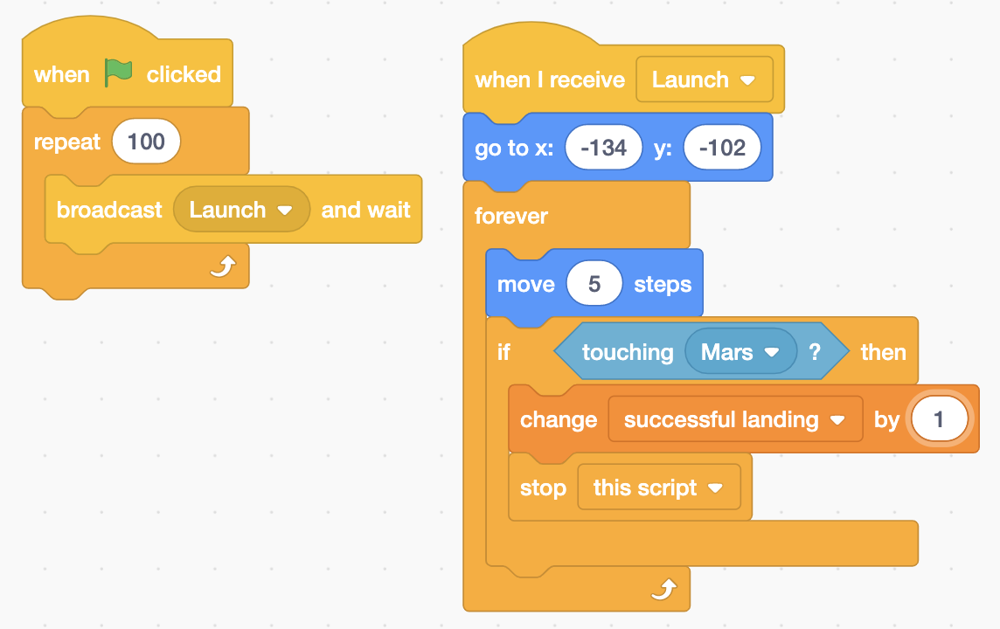

You are still only launching the rocket once, but of course, you want to try launching it 100 times. 

Add the **repeat 100 loop** block around the block for **send “launch” and wait**.  

Now the rocket will launch 100 times, without you needing to do it each time.  

Try: Does your rocket launch 100 times when you click the green flag? 

> Have you noticed that asteroids appear between Earth and Mars? We are going to do something about this in the next step.

## 9 - Count failed landings 

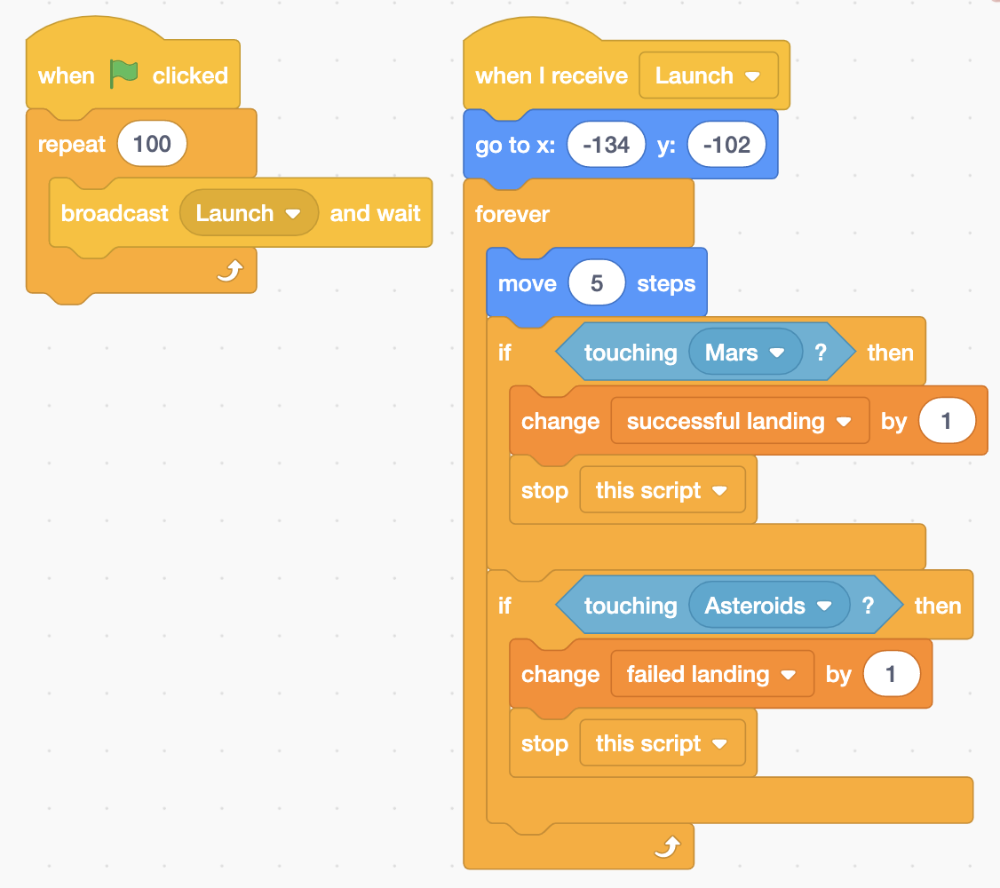

Now you are able to go to Mars every time you click the green flag, but you fly straight through the asteroids. This needs to be fixed!  

You will need to **create a new variable** called “failed landings”. 

After every step forward, in the same way as you counted “successful landings” you need to count “failed landings”. **If you touch Asteroids** it will **increase “failed landings” by 1**. 

And just like when you touch Mars, you also want to **stop this script** after you have updated the variable. 

Try: Does your variable count “failed landings” when the rocket touches the asteroids? 

## 10 -  Set variables to 0 at start 

Your variables just keep on adding to the number they had during the previous game. They never start over from the beginning. You need to set them to 0 every time you click the green flag. 

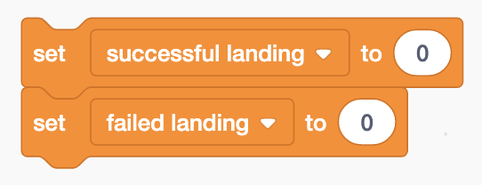

Add the blocks “set successful landings to 0” and “set failed landings to 0” between the code blocks we have for “when green flag clicked block” and “repeat 100”. 

## 11 -  Change the time 

Oh! There’s a variable that has been hidden the entire time. Have you seen it? It’s called “time”. It must have been there since you remixed the code. 

It looks like you can run the simulation at different times, to see whether there is a difference between launching in the morning or in the afternoon. 

To change the time, add the **set “time” to “15”** right at the start of your script and after the green flag has been clicked. Then you will test landing 100 times when the time is 15:00 – three o’clock in the afternoon. 

There are three different times to test: 

- 12 
- 15 
- 18 

> If you want to see which time the simulator is set for, check the little box in front of the variable.
> 

## Finished!

Now your simulator is complete and it’s time to analyse the final result. 

Don’t forget to save your project! You can give it the same name as this task, so it is easier for you to find it again some other time. 

> **Try your project**
> Show someone else what you have created and let them try it. Click on SHARE so that others can find your game on Scratch. Go to the project page and let someone try the game! 

## Challenges 

### Speed up the simulator 

If you think the simulator is too slow, You can speed it up by taking more steps forward. Try replacing the number in **move 3 steps** block to a higher number. 
