# Space Junk

Mats the satellite is in danger! There is loads of space junk flying around in space and some of it could crash into Mats. Even small pieces can be dangerous so, we should try to clean up as much as possible. 

You are going to create a project using Scratch, one where you are able to save Mats from space junk. You will succeed in saving Mats if you can collect 50 points. You collect the points every time you pick up some space junk. If the space junk touches Mats, you will get a “Game Over” message and will need to start again. 

The end result could look something like this: <a href="https://scratch.mit.edu/projects/460478570/" target="_blank">https://scratch.mit.edu/projects/460478570/</a>

Time to start with your project. This time, instead of creating a new project, you will remix instead. 

Time to start with your project. This time, instead of creating a new project, you will *remix* instead. 

1. Open your browser and go to this link. The link will take you to a project that already contains a few things to get you started like the satellite Mats and a rocket.  

<a href="https://scratch.mit.edu/projects/460199251/" target="_blank">https://scratch.mit.edu/projects/460199251/</a>

2. Click on the **See inside** button, so you can see the code. 
3. Click on **Remix** so that you can duplicate the code and start adding your own code. You must be logged into Scratch to able to remix a project. 

> **Tipa!** If you do not have a Scratch account, you can change things in the project and select **Save to your computer** (under File) when you want to save your project. 

Now you have created a project that includes a spaceship, Mats the satellite and a space backdrop. 

## 1 - Jump forward 

You can start the game by making the spaceship move in one direction. You will need two blocks: one code block that says, “when the green flag is clicked” and another code block that says, “move 10 steps”. 

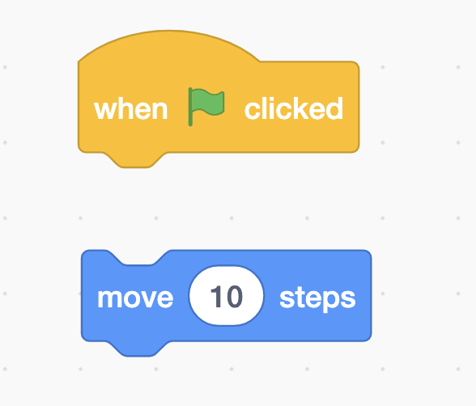

Can you join the code blocks together so that your spaceship moves every time you click on the green flag? 

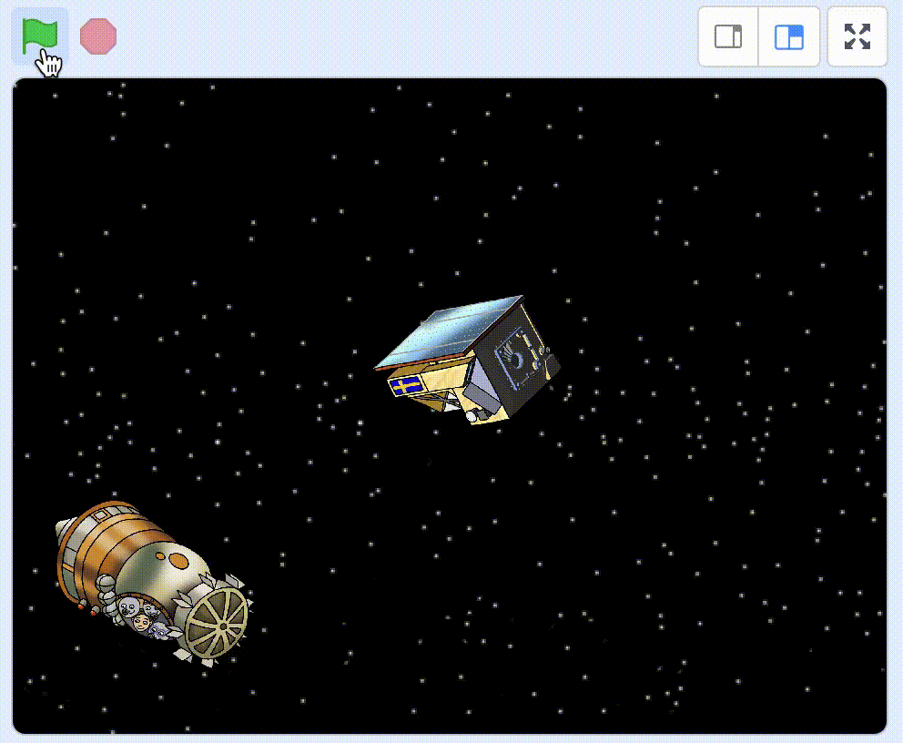

## 2- Loop

Your code should look like this: 

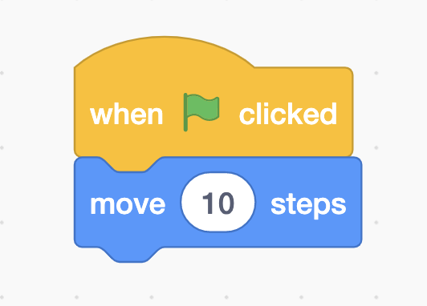

The next step is to add a loop so that our spaceship continues moving forward. 

A LOOP is a repetition of a task. That task can be repeated for a set number of times such as 10, 40, 1000 or infinity.  

There is a block called “forever”. It repeats a task an infinite number of times. 

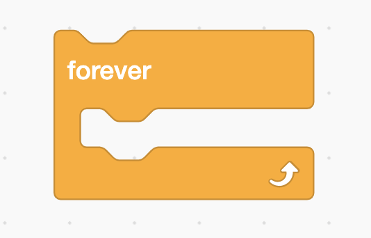

Can you join this block to the previous blocks so that your spaceship travels forward non-stop when you click the green flag? 

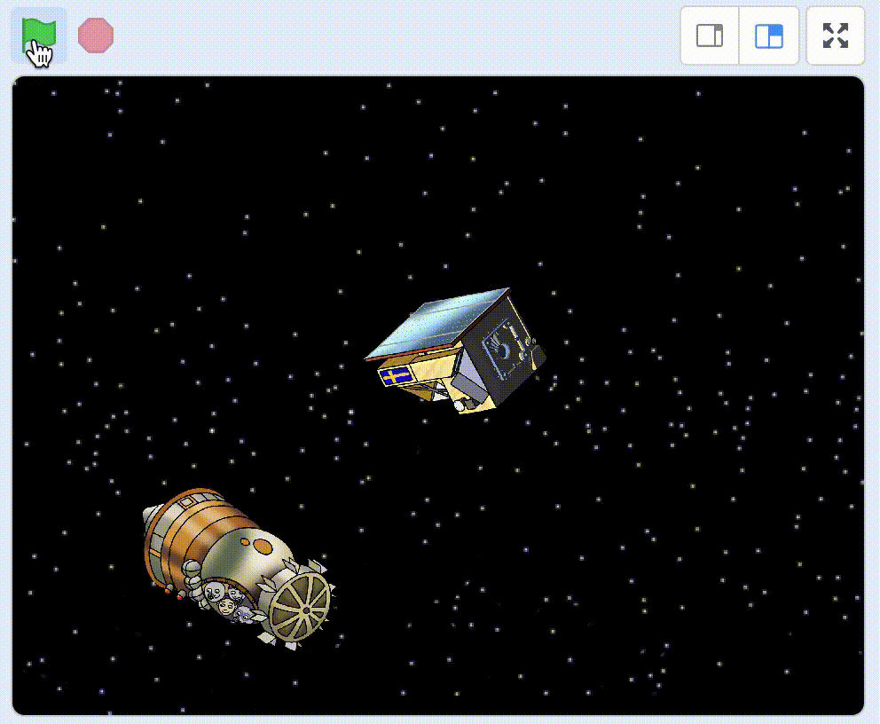

> 10 steps might be a little too fast. Try changing this to a lower number, so that your spaceship moves a bit slower. 

## 3 - Turn 

Your code should look like this: 

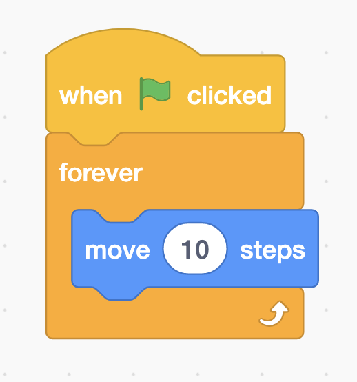

The next step is to add steering. 

In the “Events” category, you’ll find the code block “when space key is pressed”. Choose two of these blocks to be able to steer the spaceship right and left. Click on the text “space” to change one of them to “left arrow” and the other one to “right arrow”. 

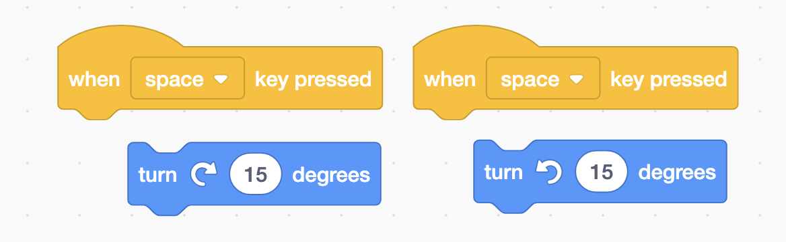

From the “Motion” category, choose the code blocks “turn left 15 degrees” and “turn right 15 degrees”. 

Can you change these blocks and join them so that when the “left arrow” key is pressed the spaceship turns left? And when the “right arrow” key is pressed the spaceship turns right? 

## 4 - Save

Your code should look like this: 

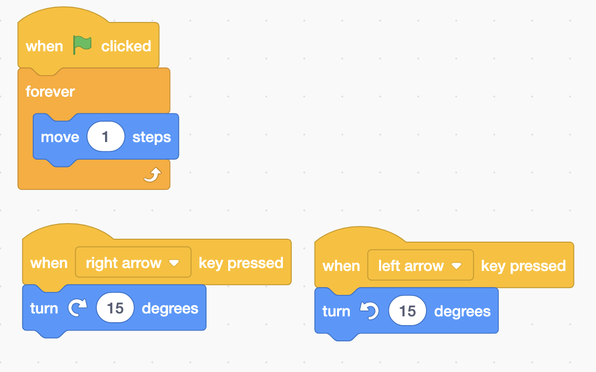

The next step is to save the project. 

### Are you logged in? 

If you are logged in, your project should be saved automatically. If you want to make sure, click on **File** and then **Save now**. 

### Don’t have an account? 

If you don’t have an account or don’t want to log in, you can save your project to your computer. 

Click **File** and then **Save to your computer**. 

## 5 - Create some space junk

But where is all the space junk that you want Mats to collect? Space looks nice and clean! So let’s add some space junk in order to have something to tidy up. 

Click on the button for painting a new sprite. 

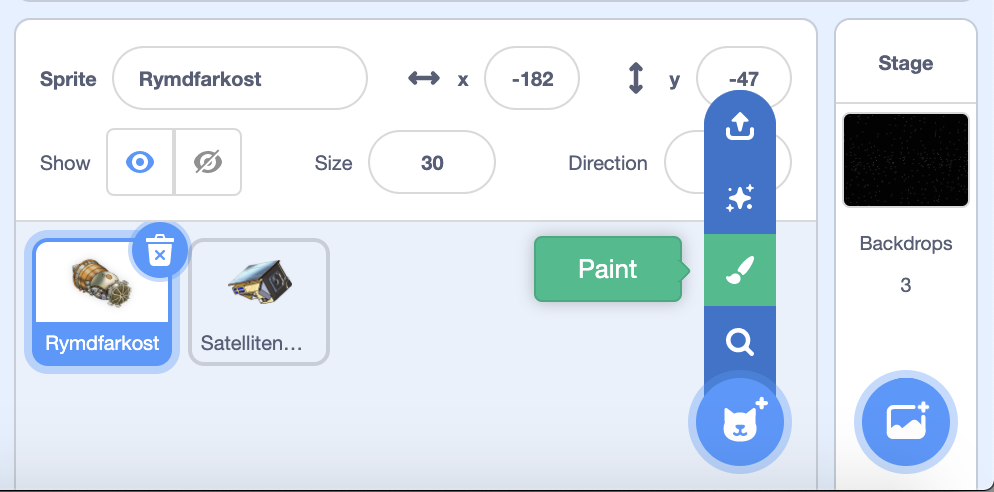

Click on the button Convert to Bitmap under the drawing area. Now draw a square by choosing the Rectangle tool from the list to the left and draw a square on the grid. Choose any colour you want. 

> Tips! To make sure all the sides are the same length, hold down the **shift** key when you are drawing it. 

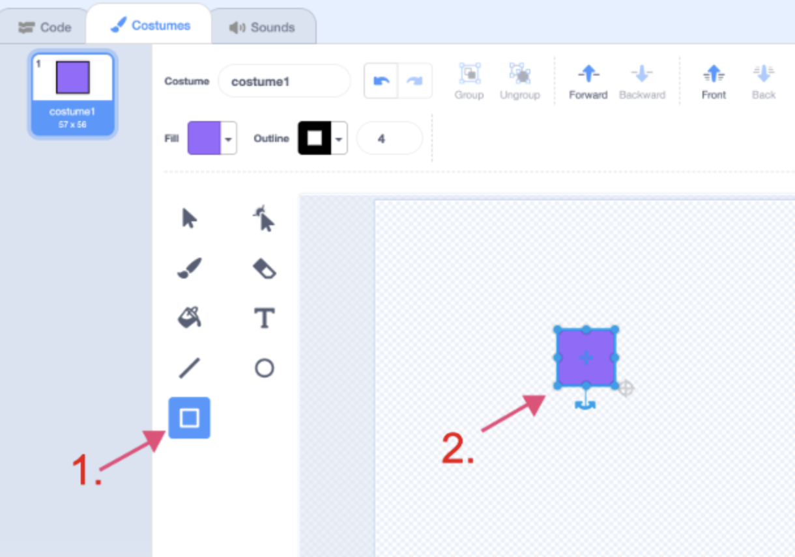

Name your sprite “square”. 

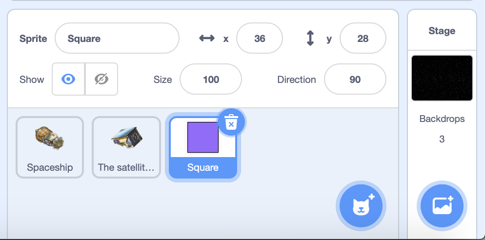

## 6 - Code the square 

To select the square, click on it in the sprite area which is located at the bottom right of the screen. When you click on the sprite it will have a blue frame around it to show that it has been selected. Now you are going to code what the square should do. 

You are going to add code to your square so that it disappears when the spaceship touches it. Click on the “Code” tab to get back to the coding area. 

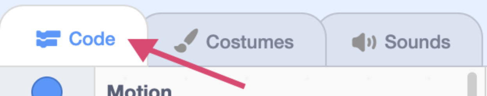

> **Can’t you see your code?** The code for your spaceship has not disappeared. All the code that you create is linked to a specific sprite. Because you have created a new sprite as your space junk, it doesn’t have any code yet. If you choose your spaceship from the sprite area, you will be able to see your code again. 

Now you are going to code the square so that when you click the green flag it waits until it touches the spaceship then it will hide. 

You will need these blocks to do this: 

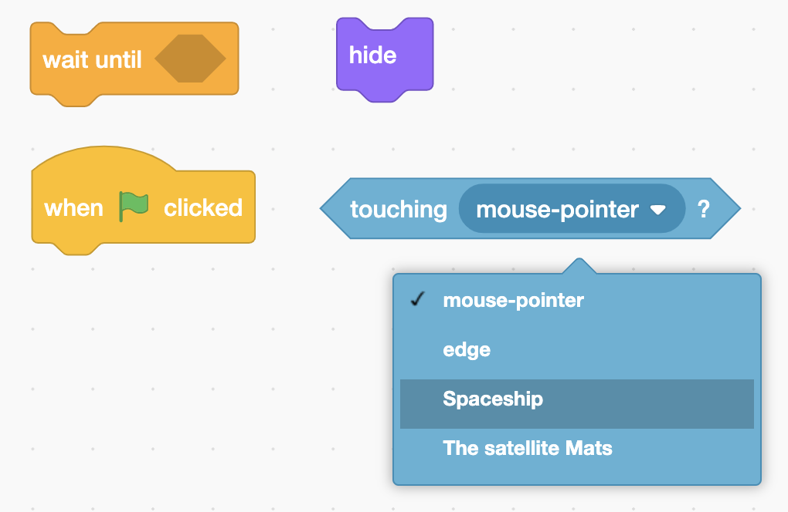

Can you put the code blocks together in the correct order, so the square disappears when you touch it with the spaceship? 

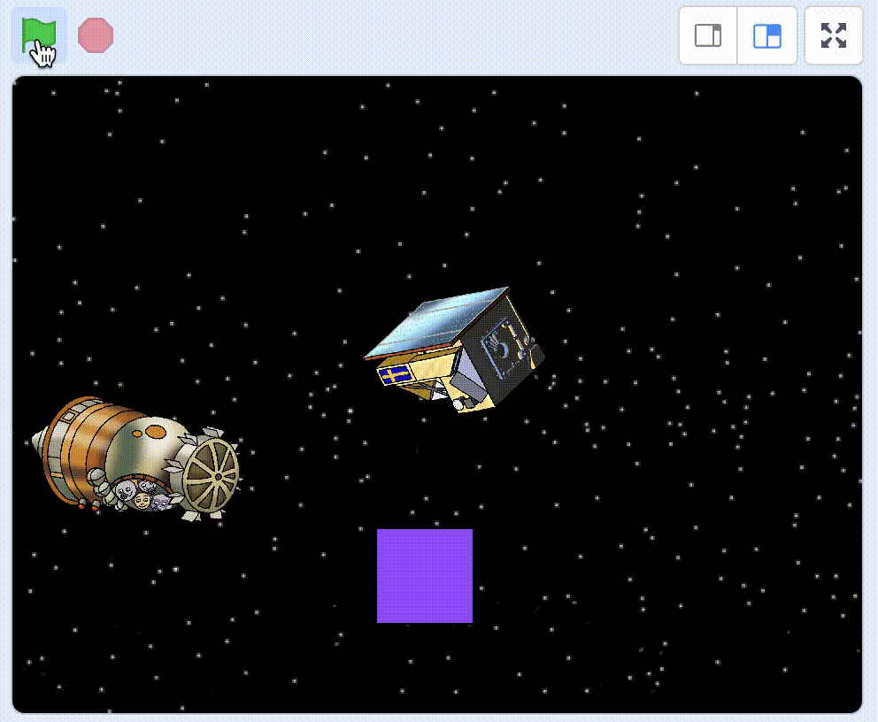

> Don’t worry if the square has disappeared. You will soon add some code so that it appears again in the next step. 

## 7 - Show the square again 

Your code should look like this: 

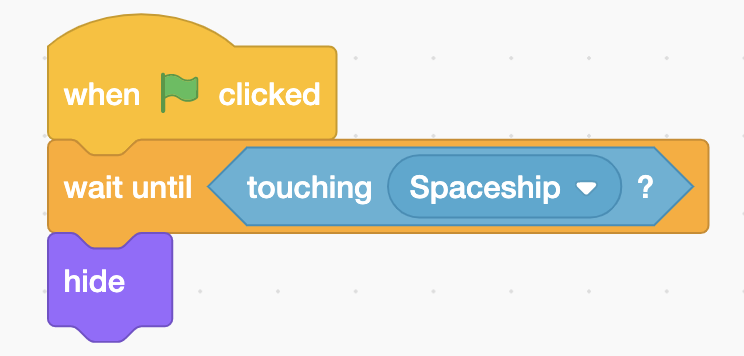

The next step is to show the square again when you click on the green flag. 

The square does what it’s been told by you and you haven’t told it to reappear when you click on the green flag. 

There is a block called “show” under the category “Looks”. You can place it beneath the code block “when green flag clicked” and above the “wait until...” block. 

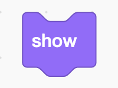

Run the code and see what happens! Does the square reappear when you click on the green flag? 

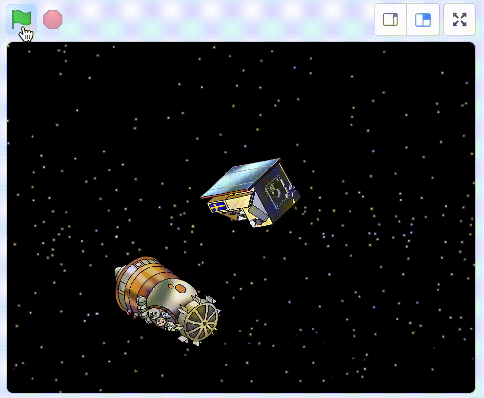
