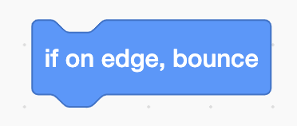

# Space Junk

Mats the satellite is in danger! There is loads of space junk flying around in space and some of it could crash into Mats. Even small pieces can be dangerous so, we should try to clean up as much as possible. 

You are going to create a project using Scratch, one where you are able to save Mats from space junk. You will succeed in saving Mats if you can collect 50 points. You collect the points every time you pick up some space junk. If the space junk touches Mats, you will get a “Game Over” message and will need to start again. 

The end result could look something like this: <a href="https://scratch.mit.edu/projects/460478570/" target="_blank">https://scratch.mit.edu/projects/460478570/</a>

Time to start with your project. This time, instead of creating a new project, you will remix instead. 

Time to start with your project. This time, instead of creating a new project, you will *remix* instead. 

1. Open your browser and go to this link. The link will take you to a project that already contains a few things to get you started like the satellite Mats and a rocket.  

<a href="https://scratch.mit.edu/projects/460199251/" target="_blank">https://scratch.mit.edu/projects/460199251/</a>

2. Click on the **See inside** button, so you can see the code. 
3. Click on **Remix** so that you can duplicate the code and start adding your own code. You must be logged into Scratch to able to remix a project. 

> **Tipa!** If you do not have a Scratch account, you can change things in the project and select **Save to your computer** (under File) when you want to save your project. 

Now you have created a project that includes a spaceship, Mats the satellite and a space backdrop. 

## 1 - Jump forward 

You can start the game by making the spaceship move in one direction. You will need two blocks: one code block that says, “when the green flag is clicked” and another code block that says, “move 10 steps”. 

Can you join the code blocks together so that your spaceship moves every time you click on the green flag? 

## 2- Loop

Your code should look like this: 

The next step is to add a loop so that our spaceship continues moving forward. 

A LOOP is a repetition of a task. That task can be repeated for a set number of times such as 10, 40, 1000 or infinity.  

There is a block called “forever”. It repeats a task an infinite number of times. 

Can you join this block to the previous blocks so that your spaceship travels forward non-stop when you click the green flag? 

> 10 steps might be a little too fast. Try changing this to a lower number, so that your spaceship moves a bit slower. 

## 3 - Turn 

Your code should look like this: 

The next step is to add steering. 

In the “Events” category, you’ll find the code block “when space key is pressed”. Choose two of these blocks to be able to steer the spaceship right and left. Click on the text “space” to change one of them to “left arrow” and the other one to “right arrow”. 

From the “Motion” category, choose the code blocks “turn left 15 degrees” and “turn right 15 degrees”. 

Can you change these blocks and join them so that when the “left arrow” key is pressed the spaceship turns left? And when the “right arrow” key is pressed the spaceship turns right? 

## 4 - Save

Your code should look like this: 

The next step is to save the project. 

### Are you logged in? 

If you are logged in, your project should be saved automatically. If you want to make sure, click on **File** and then **Save now**. 

### Don’t have an account? 

If you don’t have an account or don’t want to log in, you can save your project to your computer. 

Click **File** and then **Save to your computer**. 

## 5 - Create some space junk

But where is all the space junk that you want Mats to collect? Space looks nice and clean! So let’s add some space junk in order to have something to tidy up. 

Click on the button for painting a new sprite. 

Click on the button Convert to Bitmap under the drawing area. Now draw a square by choosing the Rectangle tool from the list to the left and draw a square on the grid. Choose any colour you want. 

> Tips! To make sure all the sides are the same length, hold down the **shift** key when you are drawing it. 

Name your sprite “square”. 

## 6 - Code the square 

To select the square, click on it in the sprite area which is located at the bottom right of the screen. When you click on the sprite it will have a blue frame around it to show that it has been selected. Now you are going to code what the square should do. 

You are going to add code to your square so that it disappears when the spaceship touches it. Click on the “Code” tab to get back to the coding area. 

> **Can’t you see your code?** The code for your spaceship has not disappeared. All the code that you create is linked to a specific sprite. Because you have created a new sprite as your space junk, it doesn’t have any code yet. If you choose your spaceship from the sprite area, you will be able to see your code again. 

Now you are going to code the square so that when you click the green flag it waits until it touches the spaceship then it will hide. 

You will need these blocks to do this: 

Can you put the code blocks together in the correct order, so the square disappears when you touch it with the spaceship? 

> Don’t worry if the square has disappeared. You will soon add some code so that it appears again in the next step. 

## 7 - Show the square again 

Your code should look like this: 

The next step is to show the square again when you click on the green flag. 

The square does what it’s been told by you and you haven’t told it to reappear when you click on the green flag. 

There is a block called “show” under the category “Looks”. You can place it beneath the code block “when green flag clicked” and above the “wait until...” block. 

Run the code and see what happens! Does the square reappear when you click on the green flag? 

## 8 - Randomize the square's position

Your code should look like this: 

Now the square should reappear when you click on the green flag. The next step is to give it a random position. That means it will show up in a *random* position every time you click on the green flag. 

There is a block called “go to random position” in the “Motion” category. Place it between the blocks for “when green flag clicked” and “wait until”. 

After placing this block, your spaceship will appear in new places everytime you click the green flag. 

## Move the space junk

Your code should look like this: 

You have created some space junk. You have a square which appears in a new position every time you click the green flag. But it is standing still which misses the point of the game. According to the game, the square should fly around. 

So, the next step will be to make the square move. 

Just like you did for the spaceship, add a new **When green flag clicked** block and **forever loop** and **move 1 steps** blocks. 

But if you test the code now, the space junk will get stuck at the edge because you can’t steer it anymore. There is a code block that can help you with this. It is called **If on edge, bounce**. 

You want your space junk to bounce at the edge after it has move 1 steps. Where do you think this block should go? 

## 10 - Keep track of the points

Your code should look like this: 

The next step is to count the points. The weight of the geometrical objects will be used as points.  

Therefore, it is important that you to keep track of the weight of the space junk as you collect them. You can use a variable to do this. Variables are extremely useful when we want to store things that you want to use later.  

Click on the **Make a variable** button and call it “weight”. 

Now you can use the block **change weight by 5**. The variable **weight** should change by 5 *after* the spaceship touches the space junks. 

## 11 - Add more space junk

Your code should look like this: 

 

Now, you have created a square shape as your space junk which appears in a new position every time you click the green flag. You have also started to keep track of how much it weighs. 

The next step is to add more shapes as space junk. 

Make three new shapes in the same way that you drew and coded your square: 

- A rectangle 
- A circle 
- A triangle 

> Tips! It doesn’t appear to have a set shape for drawing a triangle. You will have to draw it yourself. 

Don’t forget to add all the code that you used for your first sprite. 

After this step, there should be lots of space junk appearing in random places every time you click on the green flag. 

## 12 - The space junk has different weights

The pieces of space junk weigh differing amounts depending on their shape. So, you will need to update the variable “weight” every time the spaceship catches different space junk.  

 - The square weighs **5** tons 
 - The circle weighs **10** tons 
 - The triangle weighs **15** tons. 
 - The rectangle weighs **20** tons. 

Enter the new weight in the **change weight by 5** block for every space junk sprite.

## 13 - Reset the variable 

Now the different pieces weigh different amounts, but the variable just keeps on counting. It never resets back to zero. 

To be able to properly count, you need to reset the variable. This means that you will have to set it to 0. You want it to start from zero every time you click on the green flag. 

Select the "spaceship" sprite. Just after the “When green flag clicked” block – add a new block **set weight to 0**. 

Now the value of the variable should be set at 0 every time you click the green flag. Put the code to test by catching some space junk and then clicking the green flag. Does the variable “weight” start at 0? 

## 14 - You win when we have finished tidying up 

Now the variable is reset to 0 every time you restart the game. 

For the next step, you’ll make the spaceship say, “All finished!” when it has collected all the space junk. If it has, it should also have added up all the weight in the variable. 

Select the spaceship sprite. You are going to add a couple of blocks inside the “forever” loop. The game will be over if the satellite Mats catches all space junk and collects a total of 50 points. Therefore, you will need to check if the “weight” variable is the same amount as the total weight of all the blocks. If it is, then you can make it say, “All finished!” and stop all the code using the “stop all” block. 

> To calculate the total weight, use a pen and paper and write down the weight of the different sprites and add them up. 

## Finished! 

Nice work! You can clean space from space junk and save Mats from a terrible fate. 

Don’t forget to save your project! You can give it the same name as this task, so it is easier for you to find it again some other time. 

> **Try your project**
> 
> Show someone what you have created and let them try it. Click on SHARE so that others can find your game on Scratch. Go to the project page and let someone else try the game! 

## Challenges 

### Game over when we touch Mats 

Mark the sprite called Mats. This is where you are going to add your code.  

You can relax now that you have helped Mats clean up all the space junk. But you haven’t coded what will happen if the space junk touches Mats. 

After the green flag is clicked, you must wait until you touch the square **or** touch the rectangle **or** touch the circle **or** touch the triangle. 

After this, you want to say “Ow ow ow!” for two seconds. And use the “stop all” block to end and stop the code from running. 

> Did you know that you can place an “or” block in another “or” block? 

It is very difficult to clean up all the space junk if Mats is very big. You can change the size of Mats if you want to make things a little easier: 

